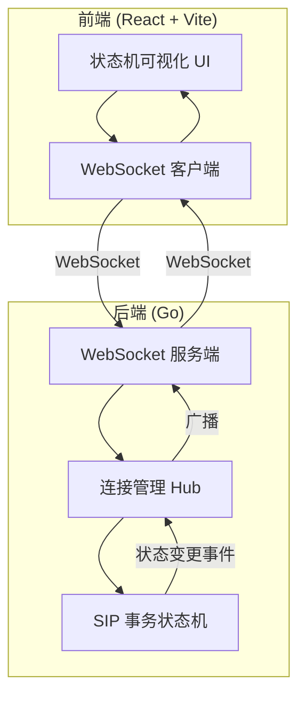
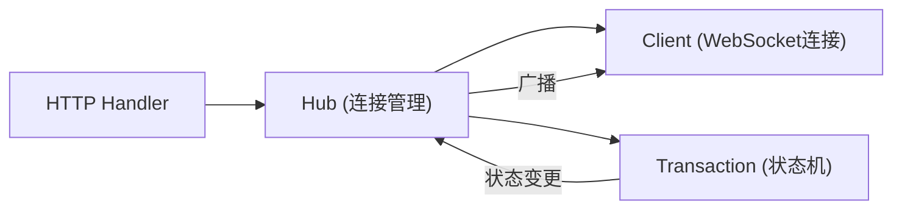

## 1. 架构设计



## 2. 技术说明

- 前端：React@18 + TypeScript + Tailwind CSS + Vite
- 后端：Go 1.22+ (net/http + gorilla/websocket)
- 通信协议：WebSocket（实时双向通信）
- 初始化工具：前端使用 vite-init

## 3. 路由定义

| 路由 | 用途 |
|------|------|
| / | 模拟器主页 |
| /ws | WebSocket 连接端点 |

## 4. API 定义

### 4.1 WebSocket 消息协议

所有消息均为 JSON 格式：

```typescript
interface WSMessage {
  type: "event" | "state_change" | "log" | "error" | "reset";
  payload: EventPayload | StateChangePayload | LogPayload | ErrorPayload | ResetPayload;
}

interface EventPayload {
  event: "send_invite" | "recv_1xx" | "recv_2xx" | "recv_3xx_6xx" | "timer_b" | "timer_d" | "ack_sent";
  sipMessage?: string;
}

interface StateChangePayload {
  from: string;
  to: string;
  event: string;
  timestamp: number;
}

interface LogPayload {
  direction: "send" | "recv" | "internal";
  messageType: string;
  content: string;
  timestamp: number;
}

interface ErrorPayload {
  message: string;
}

interface ResetPayload {
  state: string;
}
```

### 4.2 前端 → 后端事件

| 事件名 | 说明 | 合法状态 |
|--------|------|----------|
| send_invite | 发送INVITE请求 | Idle |
| recv_1xx | 收到1xx临时响应 | Calling, Proceeding |
| recv_2xx | 收到2xx最终响应 | Calling, Proceeding |
| recv_3xx_6xx | 收到3xx-6xx最终响应 | Calling, Proceeding |
| timer_b | Timer B超时 | Calling |
| timer_d | Timer D超时 | Completed |
| ack_sent | 发送ACK | Completed |
| reset | 重置状态机 | 任意 |

### 4.3 后端 → 前端消息

| 消息类型 | 说明 |
|----------|------|
| state_change | 状态转换通知（含from/to/event） |
| log | SIP消息日志（含方向和内容） |
| error | 非法操作错误提示 |
| reset | 状态机已重置 |

## 5. 服务端架构



### Go 后端核心结构

- `Hub`：管理所有WebSocket连接，广播状态变更
- `Client`：封装单个WebSocket连接，读写消息
- `Transaction`：SIP INVITE客户端事务状态机，维护状态和转换逻辑
- `StateMachine`：定义状态转换表，验证事件合法性

### 状态机定义

```
状态: Idle, Calling, Proceeding, Completed, Terminated

转换表:
Idle       + send_invite → Calling
Calling    + recv_1xx    → Proceeding
Calling    + recv_2xx    → Terminated
Calling    + recv_3xx_6xx → Completed
Calling    + timer_b     → Terminated
Proceeding + recv_1xx    → Proceeding (自循环)
Proceeding + recv_2xx    → Terminated
Proceeding + recv_3xx_6xx → Completed
Completed  + timer_d     → Terminated
Completed  + ack_sent    → Completed (自循环)
```

## 6. 项目目录结构

```
sp1/
├── backend/
│   ├── main.go              # 入口，HTTP服务器
│   ├── hub.go               # WebSocket连接管理
│   ├── client.go            # WebSocket客户端封装
│   ├── transaction.go       # SIP事务状态机
│   └── message.go           # 消息类型定义
├── frontend/
│   ├── src/
│   │   ├── components/      # UI组件
│   │   ├── hooks/           # 自定义hooks
│   │   ├── pages/           # 页面
│   │   ├── utils/           # 工具函数
│   │   └── App.tsx
│   ├── package.json
│   └── vite.config.ts
└── .trae/documents/
```
