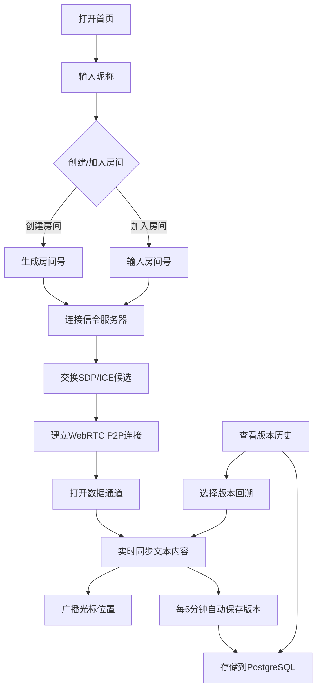

## 1. 产品概述

Co-Code是一个基于WebRTC的实时协作编辑器，支持多用户在同一房间内进行P2P连接，实时同步文本内容并显示各自的光标位置。每5分钟自动保存版本历史，支持回溯到任意历史版本。目标用户是需要进行远程协作编程、文档编写和头脑风暴的开发团队和创作者。

产品价值在于提供低延迟、高隐私的P2P协作体验，无需中央服务器中转编辑内容，同时通过自动版本保存确保数据安全。

## 2. 核心功能

### 2.1 用户角色
| 角色 | 注册方式 | 核心权限 |
|------|----------|----------|
| 房间创建者 | 无需注册，输入昵称即可 | 创建房间、设置房间密码、管理房间成员 |
| 协作者 | 无需注册，输入昵称和房间号即可加入 | 编辑文本、查看光标、切换版本 |

### 2.2 功能模块
1. **房间管理**：创建房间、加入房间、房间列表、成员管理
2. **协作编辑器**：文本编辑、实时同步、语法高亮、行号显示
3. **光标系统**：多用户光标显示、颜色区分、用户名标签
4. **版本管理**：自动保存（每5分钟）、版本列表、版本回溯、版本对比
5. **连接状态**：P2P连接状态显示、网络质量指示、STUN/TURN配置

### 2.3 页面详情
| 页面名称 | 模块名称 | 功能描述 |
|----------|----------|----------|
| 首页 | 房间创建/加入 | 输入昵称创建房间或输入房间号加入 |
| 首页 | 最近房间 | 显示用户最近访问的房间列表 |
| 编辑器页 | 编辑区域 | 主文本编辑区，支持语法高亮和行号 |
| 编辑器页 | 成员面板 | 显示在线成员列表和各自的光标颜色 |
| 编辑器页 | 版本面板 | 显示历史版本列表，支持查看和回溯 |
| 编辑器页 | 连接状态 | 显示P2P连接状态和网络质量 |
| 设置页 | STUN/TURN配置 | 自定义ICE服务器配置 |

## 3. 核心流程

用户打开首页后，输入昵称创建新房间或输入房间号加入已有房间。系统通过WebSocket信令服务器交换SDP和ICE候选，建立WebRTC P2P连接。连接建立后，编辑内容通过RTCDataChannel进行实时同步，每个用户的光标位置也实时广播。后端每5分钟自动保存当前内容到PostgreSQL数据库，用户可以在版本面板中查看历史版本并回溯到任意版本。

## 4. 用户界面设计

### 4.1 设计风格
- **主色调**：赛博紫 (#7C3AED) - 代表创新和技术感
- **辅助色**：霓虹青 (#06B6D4)、活力橙 (#F97316)、成功绿 (#10B981)
- **背景色**：深空灰 (#0F172A) - 深色主题，适合长时间编码
- **按钮风格**：未来感设计，霓虹边框，悬浮发光效果
- **字体**：JetBrains Mono（编辑器等宽字体）、Space Grotesk（界面标题）、Inter（界面文本）
- **布局风格**：三栏布局（成员面板 | 编辑器 | 版本面板），可拖拽调整宽度
- **图标风格**：线性霓虹图标，带发光效果

### 4.2 页面设计概述
| 页面名称 | 模块名称 | UI元素 |
|----------|----------|--------|
| 首页 | Hero区域 | 渐变背景、大标题、动态光标动画 |
| 首页 | 房间表单 | 玻璃拟态卡片、发光输入框、霓虹按钮 |
| 首页 | 最近房间 | 横向滚动卡片、悬浮效果、快速加入按钮 |
| 编辑器页 | 编辑器 | 深色代码主题、行号高亮、当前行指示器 |
| 编辑器页 | 成员面板 | 彩色头像、在线状态指示灯、光标颜色预览 |
| 编辑器页 | 版本面板 | 时间线布局、版本卡片、差异预览、回溯按钮 |
| 编辑器页 | 顶部栏 | 房间号显示、复制按钮、连接状态指示器、设置按钮 |
| 编辑器页 | 光标层 | 彩色竖线光标、悬浮用户名标签 |

### 4.3 响应性
- 桌面端优先设计（1280px+）
- 平板端：成员面板和版本面板可折叠
- 移动端：单栏布局，面板通过底部Tab切换
- 编辑器字体大小自适应
- 支持键盘快捷键

### 4.4 视觉特效
- 页面加载时的渐入动画和元素交错出现
- 光标移动的平滑过渡动画
- 文本同步时的高亮闪烁效果
- 版本保存成功的轻微脉冲动画
- 按钮悬浮时的霓虹发光增强效果
- 连接状态变化的过渡动画
- 成员加入/离开的滑入滑出效果
