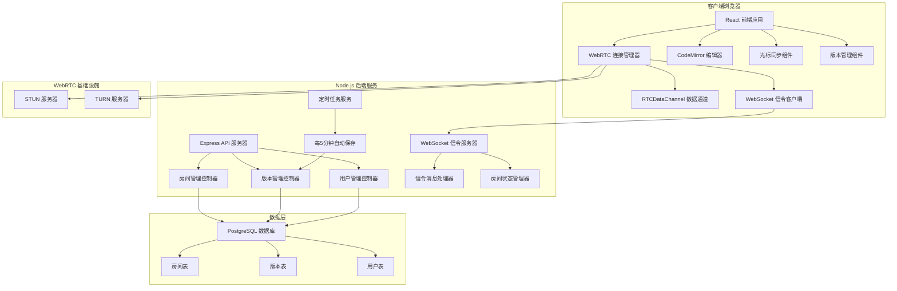
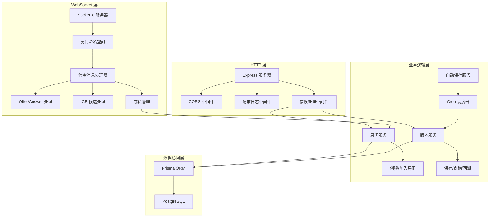
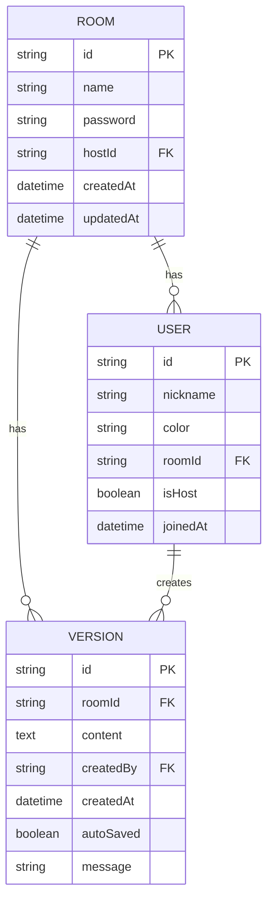

## 1. 架构设计



## 2. 技术描述

- **前端框架**: React@18 + TypeScript@5
- **构建工具**: Vite@5
- **样式方案**: TailwindCSS@3 + CSS变量
- **状态管理**: Zustand@4 - 轻量级状态管理
- **编辑器组件**: CodeMirror@6 - 可扩展的代码编辑器
- **图标库**: Lucide React - 现代化图标
- **路由**: React Router@6
- **WebSocket**: 浏览器原生 WebSocket API
- **WebRTC**: 浏览器原生 RTCPeerConnection API

- **后端框架**: Express@4 + TypeScript@5
- **实时通信**: Socket.io@4 - WebSocket信令服务器
- **数据库**: PostgreSQL@16 + pg@8
- **ORM**: Prisma@5 - 类型安全的数据库访问
- **定时任务**: node-cron@3 - 定时版本保存
- **CORS**: cors@2 - 跨域资源共享
- **环境变量**: dotenv@16 - 环境变量管理

## 3. 目录结构

```
sp11/
├── client/                         # 前端项目
│   ├── src/
│   │   ├── components/             # React 组件
│   │   │   ├── Editor/             # 编辑器组件
│   │   │   ├── Sidebar/            # 侧边栏组件
│   │   │   ├── Room/               # 房间相关组件
│   │   │   ├── Version/            # 版本相关组件
│   │   │   └── Cursor/             # 光标相关组件
│   │   ├── hooks/                  # 自定义 Hooks
│   │   │   ├── useWebRTC.ts        # WebRTC 连接 Hook
│   │   │   ├── useSignaling.ts     # 信令通信 Hook
│   │   │   └── useEditorSync.ts    # 编辑器同步 Hook
│   │   ├── store/                  # Zustand 状态
│   │   ├── types/                  # TypeScript 类型定义
│   │   ├── utils/                  # 工具函数
│   │   ├── pages/                  # 页面组件
│   │   ├── App.tsx
│   │   └── main.tsx
│   ├── public/
│   ├── package.json
│   ├── tsconfig.json
│   ├── vite.config.ts
│   └── tailwind.config.js
├── server/                         # 后端项目
│   ├── src/
│   │   ├── controllers/            # 控制器
│   │   ├── services/               # 业务逻辑
│   │   ├── models/                 # 数据模型
│   │   ├── routes/                 # API 路由
│   │   ├── middleware/             # 中间件
│   │   ├── websocket/              # WebSocket 信令
│   │   ├── cron/                   # 定时任务
│   │   ├── config/                 # 配置
│   │   ├── types/                  # 类型定义
│   │   └── index.ts                # 入口文件
│   ├── prisma/                     # Prisma 配置
│   │   └── schema.prisma
│   ├── package.json
│   ├── tsconfig.json
│   └── .env.example
├── docker-compose.yml              # PostgreSQL + STUN/TURN
└── README.md
```

## 4. 路由定义

### 4.1 前端路由

| 路由 | 页面 | 功能描述 |
|------|------|----------|
| / | 首页 | 创建或加入房间 |
| /room/:roomId | 编辑器页 | 协作编辑主界面 |
| /settings | 设置页 | STUN/TURN 配置 |

### 4.2 后端 API 路由

| 方法 | 路由 | 功能描述 |
|------|------|----------|
| POST | /api/rooms | 创建房间 |
| GET | /api/rooms/:roomId | 获取房间信息 |
| POST | /api/rooms/:roomId/join | 加入房间 |
| GET | /api/rooms/:roomId/versions | 获取版本列表 |
| GET | /api/rooms/:roomId/versions/:versionId | 获取特定版本内容 |
| POST | /api/rooms/:roomId/versions | 手动保存版本 |
| POST | /api/rooms/:roomId/versions/:versionId/restore | 回溯到指定版本 |
| GET | /api/ice-servers | 获取 ICE 服务器配置 |

## 5. API 定义

### 5.1 类型定义

```typescript
// 用户信息
interface User {
  id: string;
  nickname: string;
  color: string;
  roomId: string;
  isHost: boolean;
  joinedAt: Date;
}

// 房间信息
interface Room {
  id: string;
  name: string;
  password?: string;
  hostId: string;
  createdAt: Date;
  updatedAt: Date;
  members: User[];
}

// 版本信息
interface Version {
  id: string;
  roomId: string;
  content: string;
  createdBy: string;
  createdAt: Date;
  autoSaved: boolean;
  message?: string;
}

// 光标位置
interface CursorPosition {
  userId: string;
  line: number;
  column: number;
  selection?: {
    anchor: { line: number; column: number };
    head: { line: number; column: number };
  };
}

// 同步消息
interface SyncMessage {
  type: 'text' | 'cursor' | 'selection';
  userId: string;
  data: any;
  timestamp: number;
}

// ICE 服务器配置
interface ICEServer {
  urls: string | string[];
  username?: string;
  credential?: string;
}
```

### 5.2 请求/响应 Schema

```typescript
// 创建房间
type CreateRoomRequest = {
  nickname: string;
  roomName?: string;
  password?: string;
};
type CreateRoomResponse = {
  roomId: string;
  user: User;
  iceServers: ICEServer[];
};

// 加入房间
type JoinRoomRequest = {
  nickname: string;
  roomId: string;
  password?: string;
};
type JoinRoomResponse = {
  room: Room;
  user: User;
  currentContent: string;
  members: User[];
  iceServers: ICEServer[];
};

// 保存版本
type SaveVersionRequest = {
  content: string;
  message?: string;
  autoSaved?: boolean;
};
type SaveVersionResponse = {
  version: Version;
};

// WebSocket 信令消息
type SignalingMessage = {
  type: 'offer' | 'answer' | 'ice-candidate' | 'join' | 'leave' | 'sync';
  from: string;
  to?: string;
  roomId: string;
  data: any;
};
```

## 6. 服务器架构



## 7. 数据模型

### 7.1 ER 图



### 7.2 Prisma Schema

```prisma
model Room {
  id        String    @id @default(uuid())
  name      String
  password  String?
  hostId    String
  createdAt DateTime  @default(now())
  updatedAt DateTime  @updatedAt
  users     User[]
  versions  Version[]
}

model User {
  id        String    @id @default(uuid())
  nickname  String
  color     String
  roomId    String
  room      Room      @relation(fields: [roomId], references: [id], onDelete: Cascade)
  isHost    Boolean   @default(false)
  joinedAt  DateTime  @default(now())
  versions  Version[]
}

model Version {
  id         String   @id @default(uuid())
  roomId     String
  room       Room     @relation(fields: [roomId], references: [id], onDelete: Cascade)
  content    String   @db.Text
  createdBy  String
  user       User     @relation(fields: [createdBy], references: [id], onDelete: Cascade)
  createdAt  DateTime @default(now())
  autoSaved  Boolean  @default(false)
  message    String?
}
```

### 7.3 DDL 语句

```sql
CREATE EXTENSION IF NOT EXISTS "pgcrypto";

CREATE TABLE rooms (
    id UUID PRIMARY KEY DEFAULT gen_random_uuid(),
    name VARCHAR(255) NOT NULL,
    password VARCHAR(255),
    host_id UUID NOT NULL,
    created_at TIMESTAMP NOT NULL DEFAULT CURRENT_TIMESTAMP,
    updated_at TIMESTAMP NOT NULL DEFAULT CURRENT_TIMESTAMP
);

CREATE TABLE users (
    id UUID PRIMARY KEY DEFAULT gen_random_uuid(),
    nickname VARCHAR(100) NOT NULL,
    color VARCHAR(7) NOT NULL,
    room_id UUID NOT NULL REFERENCES rooms(id) ON DELETE CASCADE,
    is_host BOOLEAN NOT NULL DEFAULT FALSE,
    joined_at TIMESTAMP NOT NULL DEFAULT CURRENT_TIMESTAMP
);

CREATE TABLE versions (
    id UUID PRIMARY KEY DEFAULT gen_random_uuid(),
    room_id UUID NOT NULL REFERENCES rooms(id) ON DELETE CASCADE,
    content TEXT NOT NULL,
    created_by UUID NOT NULL REFERENCES users(id) ON DELETE CASCADE,
    created_at TIMESTAMP NOT NULL DEFAULT CURRENT_TIMESTAMP,
    auto_saved BOOLEAN NOT NULL DEFAULT FALSE,
    message VARCHAR(500)
);

CREATE INDEX idx_versions_room_id ON versions(room_id);
CREATE INDEX idx_versions_created_at ON versions(created_at DESC);
CREATE INDEX idx_users_room_id ON users(room_id);
```

## 8. 核心模块说明

### 8.1 WebRTC 连接模块

**核心功能：**
- 创建和管理 RTCPeerConnection
- 通过信令服务器交换 SDP Offer/Answer
- 收集和交换 ICE 候选
- 管理 RTCDataChannel 用于数据传输
- 自动重连机制

**关键技术点：**
- 使用 Google STUN 服务器和 coturn TURN 服务器
- 支持 mesh 网络拓扑（每个用户与其他用户建立P2P连接）
- 数据通道使用 reliable 模式确保消息可靠传输
- 实现 CRDT 算法解决并发编辑冲突

### 8.2 信令服务器模块

**核心功能：**
- 管理房间和用户连接
- 转发 SDP 和 ICE 消息
- 广播成员加入/离开事件
- 维护房间状态

**关键技术点：**
- 使用 Socket.io 房间功能
- 消息确认机制
- 心跳检测防止连接断开

### 8.3 编辑器同步模块

**核心功能：**
- 监听本地编辑事件
- 广播文本变更到其他用户
- 应用远程变更到本地编辑器
- 解决编辑冲突
- 同步光标和选区位置

**关键技术点：**
- CodeMirror 6 的 StateEffect 系统
- 操作转换 (OT) 或 CRDT 算法
- 防抖优化减少消息频率
- 光标位置映射算法

### 8.4 版本管理模块

**核心功能：**
- 每5分钟自动保存当前内容
- 手动保存版本（支持备注）
- 版本列表查询和分页
- 版本内容对比
- 回溯到指定版本

**关键技术点：**
- node-cron 定时任务
- 增量保存（只保存差异）
- 差异对比使用 diff-match-patch
- 版本回溯时的冲突处理

### 8.5 STUN/TURN 服务器配置

**默认配置：**
```javascript
const iceServers = [
  { urls: 'stun:stun.l.google.com:19302' },
  { urls: 'stun:stun1.l.google.com:19302' },
  { urls: 'stun:stun2.l.google.com:19302' },
  { 
    urls: 'turn:your-turn-server.com:3478',
    username: 'username',
    credential: 'password'
  }
];
```

**Docker 部署 coturn：**
```yaml
services:
  coturn:
    image: coturn/coturn:latest
    ports:
      - "3478:3478/udp"
      - "3478:3478/tcp"
    environment:
      - TURN_USERNAME=co-code
      - TURN_PASSWORD=co-code-2024
    command:
      - --min-port=49152
      - --max-port=65535
      - --fingerprint
      - --lt-cred-mech
      - --user=co-code:co-code-2024
      - --realm=co-code
```
