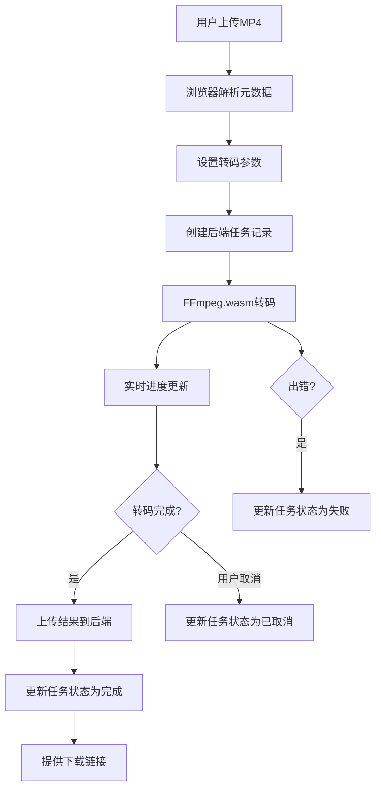

## 1. 产品概述

浏览器端视频转码工具，利用FFmpeg.wasm技术让用户在本地完成MP4视频转码，无需上传到服务器。后端Node.js服务负责任务队列管理和状态记录，转码完成后提供下载链接。

- **主要目的**：提供便捷的浏览器端视频转码服务，保护用户隐私（视频不上传），降低服务器带宽压力
- **解决问题**：传统云转码需要上传大文件、隐私泄露风险、服务器成本高
- **目标用户**：需要快速转码视频的内容创作者、开发者、普通用户

## 2. 核心功能

### 2.1 用户角色

| 角色 | 注册方式 | 核心权限 |
|------|----------|----------|
| 普通用户 | 无需注册，匿名使用 | 上传视频、设置转码参数、执行转码、下载结果、查看任务历史 |

### 2.2 功能模块

1. **首页/转码控制台**：文件上传区域、参数设置面板、转码进度显示、任务列表
2. **任务历史面板**：显示历史转码任务、状态、下载链接

### 2.3 页面详情

| 页面名称 | 模块名称 | 功能描述 |
|----------|----------|----------|
| 转码控制台 | 文件上传区 | 拖拽或点击上传MP4文件，显示文件信息（名称、大小、时长、分辨率） |
| 转码控制台 | 参数设置面板 | 帧率滑块(1-30)、分辨率选择(原尺寸/480p/720p)、质量选择(高/低) |
| 转码控制台 | 转码进度区 | 实时进度条、百分比显示、取消按钮、转码状态提示 |
| 转码控制台 | 任务列表 | 显示当前和历史任务、状态标签、下载按钮 |

## 3. 核心流程

用户上传MP4文件 → 浏览器解析视频元数据 → 用户设置转码参数 → 创建后端任务记录 → 浏览器端FFmpeg.wasm转码（实时进度）→ 转码完成上传结果到后端 → 更新任务状态 → 用户下载转码后文件

## 4. 用户界面设计

### 4.1 设计风格

- **设计方向**：工业科技风，深色主题，强调专业感和技术感
- **主色调**：深灰蓝 `#0f172a` 作为背景，霓虹青 `#06b6d4` 作为主强调色，橙红 `#f97316` 作为警告/进度色
- **按钮风格**：锐利边角，轻微3D凸起，hover时有发光效果
- **字体**：标题使用 `Space Grotesk` 粗体，正文使用 `Inter` 常规
- **布局**：卡片式布局，清晰的功能分区，左侧上传区、右侧参数区、底部任务列表
- **图标**：使用 lucide-react 线性图标，配合霓虹色调

### 4.2 页面设计概述

| 页面名称 | 模块名称 | UI元素 |
|----------|----------|--------|
| 转码控制台 | 文件上传区 | 虚线边框拖拽区，hover时发光，文件图标动画，元数据卡片 |
| 转码控制台 | 参数设置面板 | 滑块控件带数值显示，单选按钮组，标签切换效果 |
| 转码控制台 | 转码进度区 | 渐变进度条带脉冲动画，百分比大字显示，取消按钮红边 |
| 转码控制台 | 任务列表 | 表格样式，状态标签带颜色，下载按钮绿色发光 |

### 4.3 响应性

- Desktop-first 设计，适配 1280px 及以上
- 平板端：左右布局改为上下布局
- 移动端：单列布局，参数面板折叠为抽屉
- 所有可点击元素 touch 目标 ≥ 44px

## 5. 非功能需求

### 5.1 性能
- FFmpeg.wasm 加载采用懒加载，显示加载进度
- 转码进度更新节流，每 100ms 更新一次 UI
- 大文件采用分块处理，避免内存溢出

### 5.2 可靠性
- 转码过程中支持断点续传（如适用）
- 任务状态持久化到 SQLite，刷新页面不丢失
- 错误重试机制，网络失败自动重试 3 次

### 5.3 安全性
- 视频文件仅在浏览器本地处理，不上传原始文件
- 转码结果上传时进行病毒扫描（后端）
- 下载链接设置过期时间（24小时）
