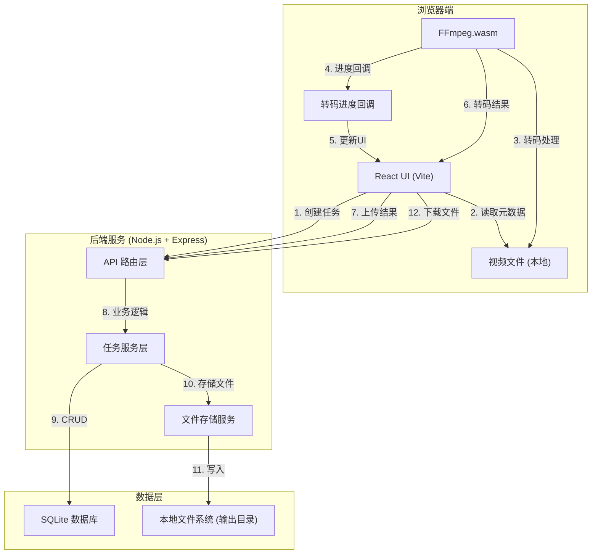
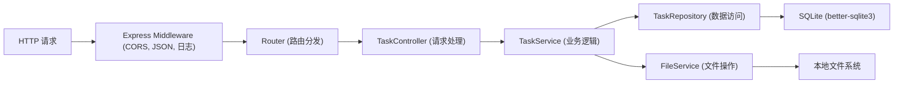
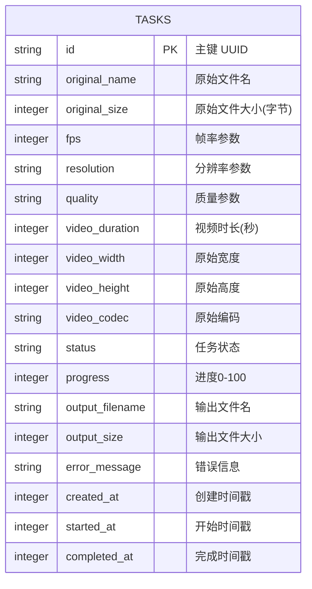

## 1. 架构设计



## 2. 技术描述

* **前端**：React\@18 + TypeScript + Vite + TailwindCSS\@3 + Zustand

* **转码核心**：@ffmpeg/ffmpeg\@0.12.x + @ffmpeg/util\@0.12.x

* **后端**：Node.js + Express\@4 + TypeScript + better-sqlite3

* **数据库**：SQLite (better-sqlite3)

* **文件上传**：multer

* **HTTP客户端**：axios

* **图标**：lucide-react

## 3. 目录结构

```
sp12/
├── api/                    # 后端代码
│   ├── src/
│   │   ├── index.ts        # Express 入口
│   │   ├── routes/         # API 路由
│   │   ├── services/       # 业务逻辑
│   │   ├── db/             # 数据库操作
│   │   ├── types/          # 类型定义
│   │   └── middleware/     # 中间件
│   └── uploads/            # 转码结果存储
├── src/                    # 前端代码
│   ├── components/         # React 组件
│   ├── hooks/              # 自定义 Hooks
│   ├── store/              # Zustand 状态管理
│   ├── utils/              # 工具函数
│   ├── types/              # 类型定义
│   ├── pages/              # 页面组件
│   └── App.tsx
├── shared/                 # 前后端共享类型
├── migrations/             # 数据库迁移
└── .trae/documents/        # 文档
```

## 4. 路由定义

| 前端路由 | 页面    | 说明         |
| ---- | ----- | ---------- |
| /    | 转码控制台 | 主页面，包含所有功能 |

| 后端API路由                 | 方法   | 用途        |
| ----------------------- | ---- | --------- |
| /api/tasks              | GET  | 获取所有任务列表  |
| /api/tasks/:id          | GET  | 获取单个任务详情  |
| /api/tasks              | POST | 创建新任务     |
| /api/tasks/:id          | PUT  | 更新任务状态/进度 |
| /api/tasks/:id/cancel   | POST | 取消任务      |
| /api/tasks/:id/upload   | POST | 上传转码结果文件  |
| /api/download/:filename | GET  | 下载转码结果    |

## 5. API 定义

### 类型定义

```typescript
// shared/types.ts
export type TaskStatus = 'pending' | 'queued' | 'processing' | 'completed' | 'failed' | 'cancelled';

export type Resolution = 'original' | '480p' | '720p';
export type Quality = 'high' | 'low';

export interface TranscodeParams {
  fps: number;           // 1-30
  resolution: Resolution;
  quality: Quality;
}

export interface VideoMetadata {
  name: string;
  size: number;
  duration: number;
  width: number;
  height: number;
  codec: string;
}

export interface Task {
  id: string;
  originalName: string;
  originalSize: number;
  params: TranscodeParams;
  metadata: VideoMetadata;
  status: TaskStatus;
  progress: number;      // 0-100
  outputFilename?: string;
  outputSize?: number;
  errorMessage?: string;
  createdAt: number;
  startedAt?: number;
  completedAt?: number;
}

// 请求/响应
export interface CreateTaskRequest {
  originalName: string;
  originalSize: number;
  params: TranscodeParams;
  metadata: VideoMetadata;
}

export interface UpdateTaskProgressRequest {
  progress: number;
  status?: TaskStatus;
}

export interface TaskResponse {
  success: boolean;
  data?: Task;
  message?: string;
}

export interface TaskListResponse {
  success: boolean;
  data: Task[];
}
```

## 6. 服务端架构



### 核心模块

| 模块             | 职责                  | 文件                             |
| -------------- | ------------------- | ------------------------------ |
| TaskController | 处理HTTP请求，参数校验，响应格式化 | \[src/routes/taskRoutes.ts]    |
| TaskService    | 任务状态机，业务规则验证        | \[src/services/taskService.ts] |
| TaskRepository | 数据库CRUD操作封装         | \[src/db/taskRepository.ts]    |
| FileService    | 文件上传、存储、下载管理        | \[src/services/fileService.ts] |
| Database       | 数据库连接、初始化、迁移        | \[src/db/database.ts]          |

## 7. 数据模型

### 7.1 ER 图



### 7.2 DDL

```sql
-- migrations/001_init.sql
CREATE TABLE IF NOT EXISTS tasks (
    id TEXT PRIMARY KEY,
    original_name TEXT NOT NULL,
    original_size INTEGER NOT NULL,
    fps INTEGER NOT NULL CHECK (fps BETWEEN 1 AND 30),
    resolution TEXT NOT NULL CHECK (resolution IN ('original', '480p', '720p')),
    quality TEXT NOT NULL CHECK (quality IN ('high', 'low')),
    video_duration REAL NOT NULL,
    video_width INTEGER NOT NULL,
    video_height INTEGER NOT NULL,
    video_codec TEXT NOT NULL,
    status TEXT NOT NULL DEFAULT 'pending' CHECK (status IN ('pending', 'queued', 'processing', 'completed', 'failed', 'cancelled')),
    progress INTEGER NOT NULL DEFAULT 0 CHECK (progress BETWEEN 0 AND 100),
    output_filename TEXT,
    output_size INTEGER,
    error_message TEXT,
    created_at INTEGER NOT NULL,
    started_at INTEGER,
    completed_at INTEGER
);

CREATE INDEX IF NOT EXISTS idx_tasks_status ON tasks(status);
CREATE INDEX IF NOT EXISTS idx_tasks_created_at ON tasks(created_at DESC);
```

## 8. 关键技术实现

### 8.1 FFmpeg.wasm 转码流程

```typescript
// 伪代码 - 转码核心逻辑
import { FFmpeg } from '@ffmpeg/ffmpeg';
import { fetchFile, toBlobURL } from '@ffmpeg/util';

const ffmpeg = new FFmpeg();

async function transcode(params: TranscodeParams, file: File, onProgress: (p: number) => void): Promise<Blob> {
  // 1. 加载 FFmpeg Core
  const baseURL = 'https://unpkg.com/@ffmpeg/core@0.12.6/dist/esm';
  ffmpeg.on('log', ({ message }) => console.log(message));
  ffmpeg.on('progress', ({ progress }) => onProgress(Math.round(progress * 100)));
  
  await ffmpeg.load({
    coreURL: await toBlobURL(`${baseURL}/ffmpeg-core.js`, 'text/javascript'),
    wasmURL: await toBlobURL(`${baseURL}/ffmpeg-core.wasm`, 'application/wasm'),
  });

  // 2. 写入输入文件
  const data = await fetchFile(file);
  await ffmpeg.writeFile('input.mp4', data);

  // 3. 构建 FFmpeg 参数
  const resolutionMap = { '480p': 'hd480', '720p': 'hd720', 'original': 'source' };
  const crf = params.quality === 'high' ? 23 : 30;
  const preset = params.quality === 'high' ? 'medium' : 'fast';
  
  const args = [
    '-i', 'input.mp4',
    '-r', params.fps.toString(),
    '-vf', resolutionMap[params.resolution] !== 'source' ? `scale=${resolutionMap[params.resolution]}` : 'null',
    '-c:v', 'libx264',
    '-preset', preset,
    '-crf', crf.toString(),
    '-c:a', 'aac',
    'output.mp4'
  ].filter(a => a !== 'null');

  // 4. 执行转码
  await ffmpeg.exec(args);

  // 5. 读取输出
  const outputData = await ffmpeg.readFile('output.mp4');
  return new Blob([outputData], { type: 'video/mp4' });
}
```

### 8.2 任务状态管理

```typescript
// Zustand store 示例
interface TaskState {
  tasks: Task[];
  currentTaskId: string | null;
  isTranscoding: boolean;
  abortController: AbortController | null;
  
  createTask: (file: File, params: TranscodeParams) => Promise<Task>;
  startTranscode: (taskId: string) => Promise<void>;
  cancelTranscode: (taskId: string) => Promise<void>;
  fetchTasks: () => Promise<void>;
}
```

## 9. 部署与运行

### 开发环境

```bash
# 安装依赖
npm install

# 启动后端 (端口 3001)
npm run dev:api

# 启动前端 (端口 5173)
npm run dev:web
```

### 环境变量

```env
# .env
PORT=3001
UPLOAD_DIR=./api/uploads
DATABASE_PATH=./api/data/tasks.db
MAX_FILE_SIZE=524288000  # 500MB
FILE_EXPIRE_HOURS=24
```

