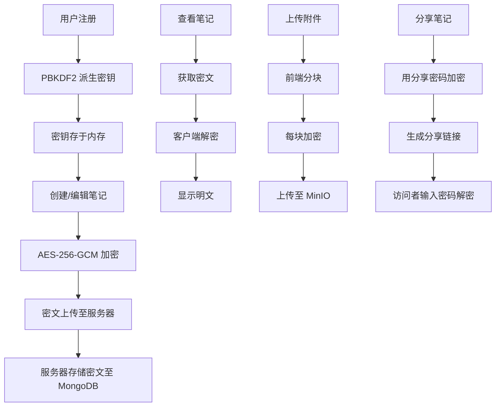

## 1. 产品概述

CryptNote 是一款端到端加密笔记应用，所有笔记内容在客户端使用 AES-256-GCM 加密后上传，服务器仅存储密文，确保零知识隐私。目标用户为注重隐私安全的个人用户，核心价值在于"服务器无法读取你的笔记"。

## 2. 核心功能

### 2.1 用户角色

| 角色 | 注册方式 | 核心权限 |
|------|----------|----------|
| 普通用户 | 邮箱+密码注册 | 创建、编辑、删除、分享加密笔记；上传加密附件 |

### 2.2 功能模块

1. **登录/注册页**：用户注册与登录，客户端 PBKDF2 密钥派生
2. **笔记列表页**：展示所有笔记（标题密文解密后显示）、标签筛选、客户端全文搜索
3. **笔记编辑页**：Markdown 编辑器 + 实时预览、附件管理、标签管理
4. **分享页**：生成带过期时间和访问密码的分享链接

### 2.3 页面详情

| 页面名称 | 模块名称 | 功能描述 |
|----------|----------|----------|
| 登录/注册页 | 注册表单 | 邮箱+密码注册，客户端用 PBKDF2 从密码派生 AES-256 密钥 |
| 登录/注册页 | 登录表单 | 邮箱+密码登录，派生密钥用于后续解密 |
| 笔记列表页 | 笔记卡片列表 | 展示解密后的笔记标题和摘要，支持标签过滤 |
| 笔记列表页 | 搜索栏 | 客户端解密后全文搜索，高亮匹配关键词 |
| 笔记列表页 | 标签侧边栏 | 标签树状展示，点击筛选 |
| 笔记编辑页 | Markdown 编辑器 | 左右分栏：左侧编辑、右侧实时预览 |
| 笔记编辑页 | 附件管理 | 上传图片/PDF，前端加密分块后上传至 MinIO |
| 笔记编辑页 | 标签编辑 | 为笔记添加/移除标签 |
| 笔记编辑页 | 分享功能 | 设置过期时间+访问密码，生成分享链接 |
| 分享页 | 密码输入 | 输入访问密码后解密查看笔记内容（只读） |

## 3. 核心流程

### 3.1 注册登录流程
用户在注册时，客户端使用 PBKDF2（SHA-512，100000 次迭代）从密码派生 AES-256 密钥。注册请求只发送邮箱和密码哈希（Argon2id 服务端哈希），密钥永不上传。登录后客户端再次派生密钥用于加解密。

### 3.2 笔记加解密流程
用户编辑笔记 → 客户端用 AES-256-GCM 加密内容 → 密文发送至服务器存储。查看笔记时 → 从服务器获取密文 → 客户端解密显示明文。

### 3.3 附件上传流程
选择文件 → 前端分块 → 每块 AES-256-GCM 加密 → 分块上传至 MinIO → 服务器记录加密分块元信息。

### 3.4 分享流程
用户点击分享 → 输入访问密码和过期时间 → 客户端用访问密码派生新密钥加密笔记 → 将密文发送至服务器生成分享链接 → 访问者打开链接输入密码 → 客户端解密查看。

## 4. 用户界面设计

### 4.1 设计风格
- **主色调**：深蓝黑 (#0f172a) 为底，翠绿 (#10b981) 为强调色，营造"安全加密"的科技感
- **次色调**：深灰蓝 (#1e293b) 卡片背景，浅灰 (#94a3b8) 文字
- **按钮风格**：圆角 (rounded-lg)，主按钮翠绿填充，次按钮透明边框
- **字体**：JetBrains Mono（代码/标题）+ Noto Sans SC（正文）
- **布局风格**：左侧导航栏 + 主内容区，笔记列表为卡片网格
- **图标风格**：Lucide 线性图标，与整体简约风格一致

### 4.2 页面设计概览

| 页面名称 | 模块名称 | UI 元素 |
|----------|----------|---------|
| 登录/注册页 | 表单区 | 居中卡片，深色背景，锁图标动画，渐变边框输入框 |
| 笔记列表页 | 侧边导航 | 固定左侧栏，标签列表，新建按钮，搜索框 |
| 笔记列表页 | 笔记网格 | 响应式卡片网格，悬停微动效，标签色点 |
| 笔记编辑页 | 编辑区 | 左右分栏，工具栏，自动保存提示 |
| 笔记编辑页 | 预览区 | Markdown 渲染，代码高亮 |
| 笔记编辑页 | 附件区 | 拖拽上传区，附件列表，进度条 |
| 分享页 | 查看区 | 居中卡片，密码输入框，解密动画 |

### 4.3 响应式设计
- 桌面优先，最小宽度 1024px
- 平板适配：编辑器改为上下分栏
- 移动端：侧边栏折叠为汉堡菜单，卡片单列

### 4.4 动效设计
- 笔记卡片：悬停时轻微上浮 + 阴影加深
- 加密/解密：文字模糊到清晰过渡动画
- 页面切换：淡入淡出
- 附件上传：圆形进度条
