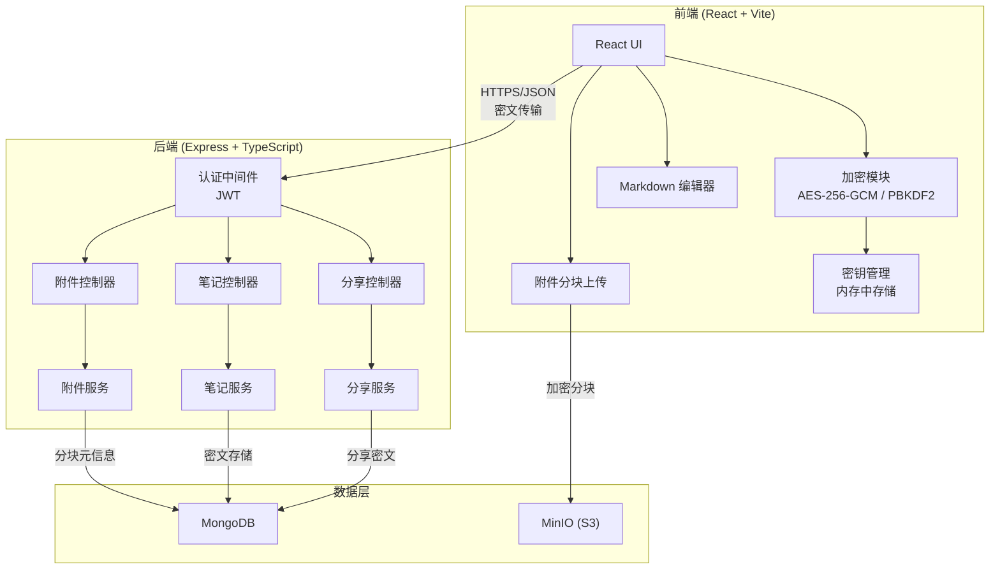
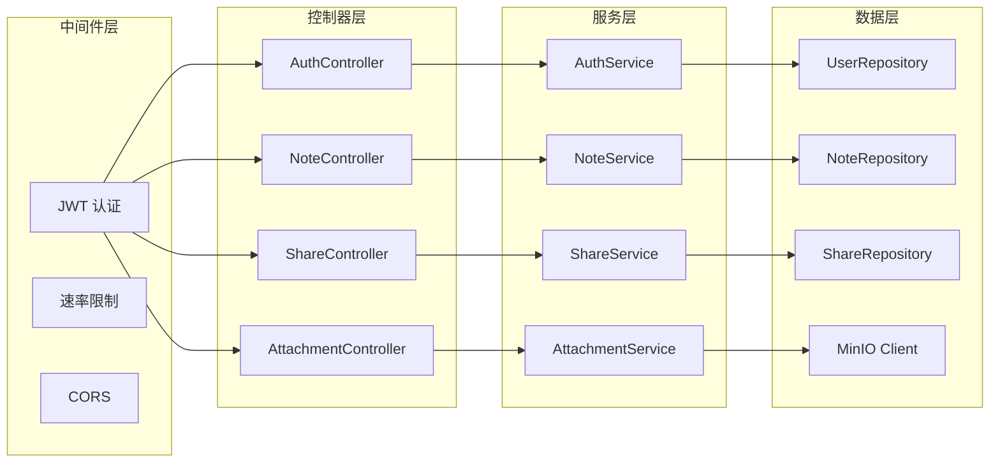
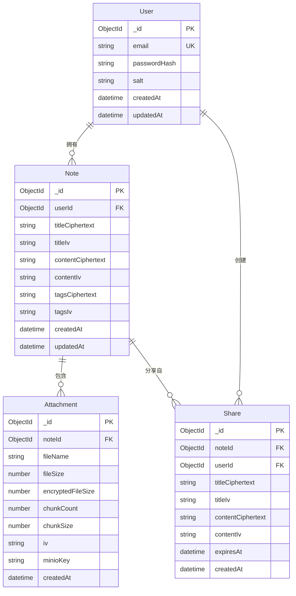

## 1. 架构设计



## 2. 技术说明

- **前端**：React@18 + TypeScript + TailwindCSS@3 + Vite
- **初始化工具**：vite-init (react-express-ts 模板)
- **后端**：Express@4 + TypeScript (ESM)
- **数据库**：MongoDB (Mongoose ODM)
- **对象存储**：MinIO (S3 兼容)
- **状态管理**：Zustand
- **加密库**：Web Crypto API (浏览器原生)
- **Markdown**：react-markdown + remark-gfm + rehype-highlight
- **图标**：lucide-react

## 3. 路由定义

| 路由 | 用途 |
|------|------|
| `/login` | 登录页面 |
| `/register` | 注册页面 |
| `/notes` | 笔记列表页 |
| `/notes/:id` | 笔记编辑页 |
| `/share/:shareId` | 分享查看页（公开） |

## 4. API 定义

### 4.1 认证相关

```typescript
// POST /api/auth/register
interface RegisterRequest {
  email: string;
  passwordHash: string; // Argon2id 哈希后的密码
  salt: string;         // 客户端生成的盐
  publicKey: string;    // 用于密钥验证的公钥
}
interface RegisterResponse {
  token: string;        // JWT
  user: { id: string; email: string };
}

// POST /api/auth/login
interface LoginRequest {
  email: string;
  passwordHash: string;
}
interface LoginResponse {
  token: string;
  user: { id: string; email: string };
}
```

### 4.2 笔记相关

```typescript
// POST /api/notes
interface CreateNoteRequest {
  titleCiphertext: string;    // 加密后的标题
  titleIv: string;            // 初始化向量
  contentCiphertext: string;  // 加密后的内容
  contentIv: string;
  tagsCiphertext: string;     // 加密后的标签 JSON
  tagsIv: string;
}
interface CreateNoteResponse {
  id: string;
  createdAt: string;
  updatedAt: string;
}

// GET /api/notes
interface ListNotesResponse {
  notes: Array<{
    id: string;
    titleCiphertext: string;
    titleIv: string;
    tagsCiphertext: string;
    tagsIv: string;
    createdAt: string;
    updatedAt: string;
  }>;
}

// GET /api/notes/:id
interface GetNoteResponse {
  id: string;
  titleCiphertext: string;
  titleIv: string;
  contentCiphertext: string;
  contentIv: string;
  tagsCiphertext: string;
  tagsIv: string;
  attachments: AttachmentMeta[];
  createdAt: string;
  updatedAt: string;
}

// PUT /api/notes/:id - 同 CreateNoteRequest 结构
// DELETE /api/notes/:id - 无请求体
```

### 4.3 附件相关

```typescript
// POST /api/attachments/upload-url
interface UploadUrlRequest {
  noteId: string;
  fileName: string;
  fileSize: number;
  chunkCount: number;
  chunkSize: number;
}
interface UploadUrlResponse {
  uploadId: string;
  urls: string[]; // 每个分块的预签名上传 URL
}

// POST /api/attachments/complete
interface CompleteUploadRequest {
  uploadId: string;
  noteId: string;
  fileName: string;
  encryptedFileSize: number;
  chunkCount: number;
  chunkSize: number;
  iv: string; // 文件加密 IV
}
interface CompleteUploadResponse {
  attachmentId: string;
}

// GET /api/attachments/:id/download
// 返回分块下载的预签名 URL 列表
interface DownloadUrlResponse {
  urls: string[];
  chunkSize: number;
  iv: string;
}
```

### 4.4 分享相关

```typescript
// POST /api/shares
interface CreateShareRequest {
  noteId: string;
  contentCiphertext: string; // 用分享密码加密的内容
  contentIv: string;
  titleCiphertext: string;   // 用分享密码加密的标题
  titleIv: string;
  expiresAt: string;         // ISO 8601
}
interface CreateShareResponse {
  shareId: string;
  shareUrl: string;
}

// GET /api/shares/:shareId
interface GetShareResponse {
  shareId: string;
  titleCiphertext: string;
  titleIv: string;
  contentCiphertext: string;
  contentIv: string;
  expiresAt: string;
  isExpired: boolean;
}
```

## 5. 服务器架构图



## 6. 数据模型

### 6.1 数据模型定义



### 6.2 数据定义语言

```javascript
// MongoDB Mongoose Schemas

// User Collection
db.createCollection("users");
db.users.createIndex({ email: 1 }, { unique: true });

// Note Collection
db.createCollection("notes");
db.notes.createIndex({ userId: 1, updatedAt: -1 });

// Attachment Collection
db.createCollection("attachments");
db.attachments.createIndex({ noteId: 1 });

// Share Collection
db.createCollection("shares");
db.shares.createIndex({ noteId: 1 });
db.shares.createIndex({ expiresAt: 1 }, { expireAfterSeconds: 0 }); // TTL 索引自动过期
```
