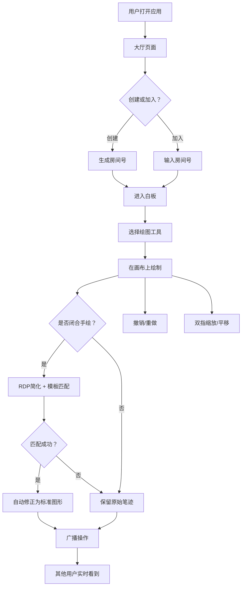

## 1. 产品概述

多人实时协作白板应用，支持画笔、矩形、圆形、线条、橡皮擦等绘图工具，所有操作通过 WebSocket 实时广播给房间内其他用户。内置几何图形自动识别（手绘→标准图形修正）、每用户独立撤销/重做、双指手势缩放平移、房间管理及用户光标实时显示。

- 目标用户：远程协作团队、在线教育师生、设计评审参与者
- 核心价值：零延迟感的多人实时绘图体验 + 智能图形修正 + 流畅手势交互

## 2. 核心功能

### 2.1 用户角色

| 角色 | 进入方式 | 核心权限 |
|------|----------|----------|
| 房间创建者 | 创建房间自动加入 | 绘图、管理房间、清空画布 |
| 参与者 | 输入房间号加入 | 绘图、查看他人光标 |

### 2.2 功能模块

1. **大厅页面**：创建房间 / 加入房间，房间号输入
2. **白板页面**：画布、工具栏、用户列表、光标显示

### 2.3 页面详情

| 页面名称 | 模块名称 | 功能描述 |
|----------|----------|----------|
| 大厅页面 | 房间创建 | 点击创建房间，生成唯一房间号，自动跳转白板 |
| 大厅页面 | 房间加入 | 输入房间号加入已有房间，跳转白板 |
| 白板页面 | 画布区域 | 支持画笔/矩形/圆形/线条/橡皮擦绘图，手势缩放平移 |
| 白板页面 | 工具栏 | 工具选择、颜色选择、线宽调节、撤销/重做、清空 |
| 白板页面 | 几何识别 | 手绘闭合图形自动修正为标准圆形/方形/三角形 |
| 白板页面 | 用户光标 | 实时显示房间内其他用户的光标位置和名称 |
| 白板页面 | 用户列表 | 显示当前房间在线用户，创建者可清空画布 |

## 3. 核心流程

用户打开应用 → 大厅页面 → 创建或加入房间 → 进入白板页面 → 选择工具绘图 → 操作实时广播 → 其他用户看到绘制 → 手绘闭合图形自动修正 → 撤销/重做操作 → 双指缩放/平移画布

## 4. 用户界面设计

### 4.1 设计风格

- 主色调：深墨蓝 `#1a1a2e`，辅助色：明橙 `#ff6b35`
- 工具栏：半透明毛玻璃风格，圆角按钮
- 画布背景：极浅灰网格点阵 `#f8f9fa`，营造专业绘图板感
- 字体：JetBrains Mono（代码/数字）+ Noto Sans SC（中文UI）
- 布局：左侧垂直工具栏 + 顶部房间信息栏 + 中央画布

### 4.2 页面设计概览

| 页面名称 | 模块名称 | UI 元素 |
|----------|----------|---------|
| 大厅页面 | 居中卡片 | 毛玻璃卡片，创建/加入按钮，房间号输入框，深色渐变背景 |
| 白板页面 | 工具栏 | 左侧垂直毛玻璃条，图标按钮，选中态橙色高亮，颜色圆点，线宽滑块 |
| 白板页面 | 画布区域 | 全屏画布，浅灰网格点阵背景，手势缩放平移 |
| 白板页面 | 顶部栏 | 房间号、在线人数、用户头像列表、清空按钮 |
| 白板页面 | 光标层 | 其他用户彩色光标 + 用户名标签 |

### 4.3 响应式

- 桌面优先，画布占满视口
- 触控板双指手势支持缩放和平移
- 工具栏在小屏时收窄为图标模式
