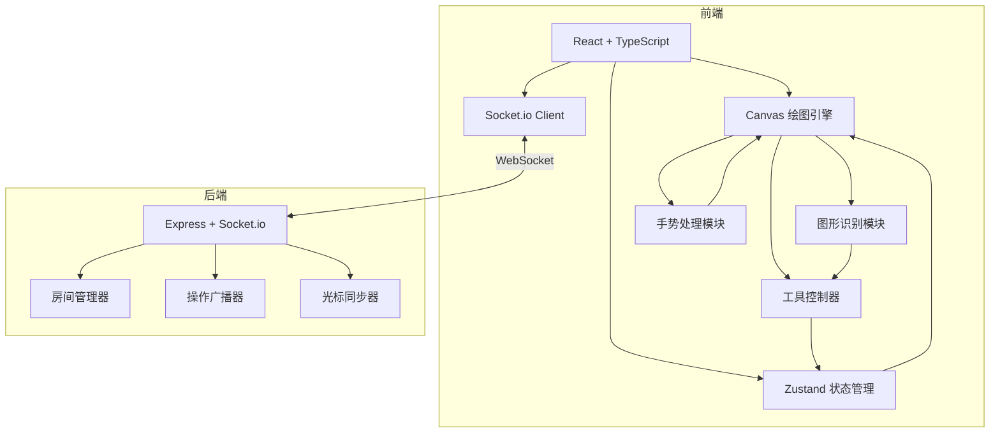
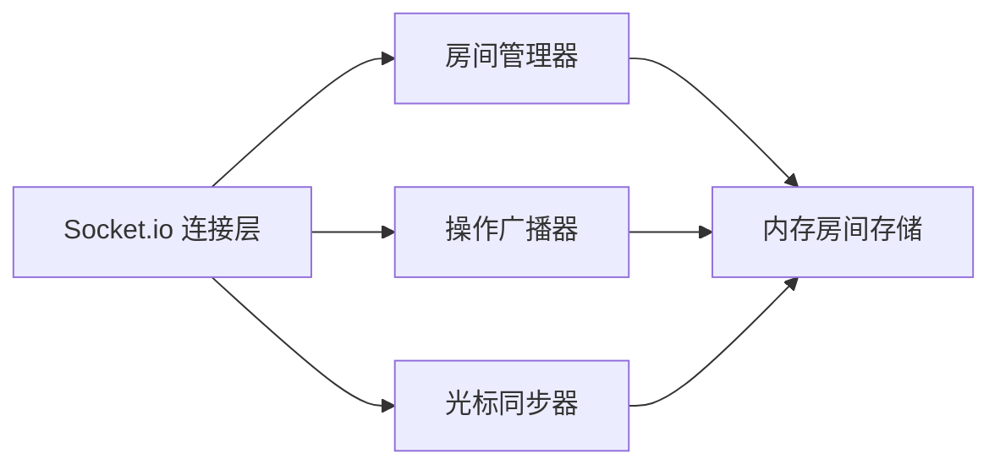
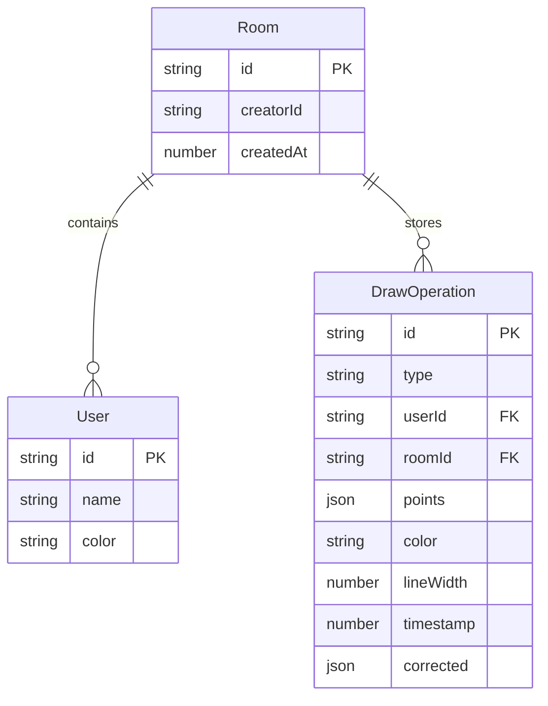

## 1. 架构设计



## 2. 技术说明

- 前端：React@18 + TypeScript + Tailwind CSS + Zustand + Vite
- 画布：原生 HTML5 Canvas 2D API（不依赖第三方 Canvas 库）
- 后端：Express@4 + Socket.io（ESM + TypeScript）
- 通信：Socket.io WebSocket 实时双向通信
- 初始化工具：vite-init（react-express-ts 模板）
- 无数据库（房间状态仅存内存）

## 3. 路由定义

| 路由 | 用途 |
|------|------|
| `/` | 大厅页面 - 创建/加入房间 |
| `/room/:roomId` | 白板页面 - 实时协作绘图 |

## 4. API 定义（Socket.io 事件）

### 客户端 → 服务器

```typescript
interface ClientToServerEvents {
  "room:create": () => void;
  "room:join": (roomId: string) => void;
  "room:leave": (roomId: string) => void;
  "draw:operation": (op: DrawOperation) => void;
  "cursor:move": (data: CursorData) => void;
  "canvas:clear": (roomId: string) => void;
  "undo:operation": (roomId: string, opId: string) => void;
}

interface DrawOperation {
  id: string;
  type: "pen" | "rect" | "circle" | "line" | "eraser";
  userId: string;
  roomId: string;
  points: Point[];
  color: string;
  lineWidth: number;
  timestamp: number;
  corrected?: CorrectedShape;
}

interface Point {
  x: number;
  y: number;
}

interface CursorData {
  userId: string;
  roomId: string;
  x: number;
  y: number;
}

interface CorrectedShape {
  type: "circle" | "rectangle" | "triangle";
  center: Point;
  radius?: number;
  width?: number;
  height?: number;
  vertices?: Point[];
}
```

### 服务器 → 客户端

```typescript
interface ServerToClientEvents {
  "room:created": (roomId: string) => void;
  "room:joined": (roomId: string, users: User[]) => void;
  "room:userJoined": (user: User) => void;
  "room:userLeft": (userId: string) => void;
  "draw:broadcast": (op: DrawOperation) => void;
  "cursor:broadcast": (data: CursorData) => void;
  "canvas:cleared": () => void;
  "undo:broadcast": (opId: string) => void;
  "error": (message: string) => void;
}

interface User {
  id: string;
  name: string;
  color: string;
}
```

## 5. 服务器架构图



## 6. 数据模型

### 6.1 数据模型定义



### 6.2 内存数据结构

房间数据全部存储在服务器内存中（无持久化），服务重启后清空：

```typescript
interface RoomState {
  id: string;
  creatorId: string;
  users: Map<string, User>;
  operations: DrawOperation[];
  createdAt: number;
}
```

## 7. 关键算法

### 7.1 Ramer-Douglas-Peucker 简化

用于将手绘笔迹简化为关键点，减少数据量并为模板匹配做准备。epsilon 参数根据笔画长度动态调整。

### 7.2 几何图形模板匹配

1. 对手绘闭合路径使用 RDP 简化
2. 根据简化后的点数和几何特征判断：
   - 3-4 点 + 近似等边 → 三角形
   - 4 点 + 近似直角 → 矩形
   - 多点 + 近似圆形度 → 圆形
3. 生成标准图形参数（中心、半径/宽高/顶点）
4. 替换原始笔迹，广播修正后的图形

### 7.3 撤销/重做

- 每个用户维护独立的操作历史栈和重做栈
- 撤销时从历史栈弹出，压入重做栈，同时通知服务器广播撤销事件
- 其他用户收到撤销广播后，从画布上移除对应操作并重绘
