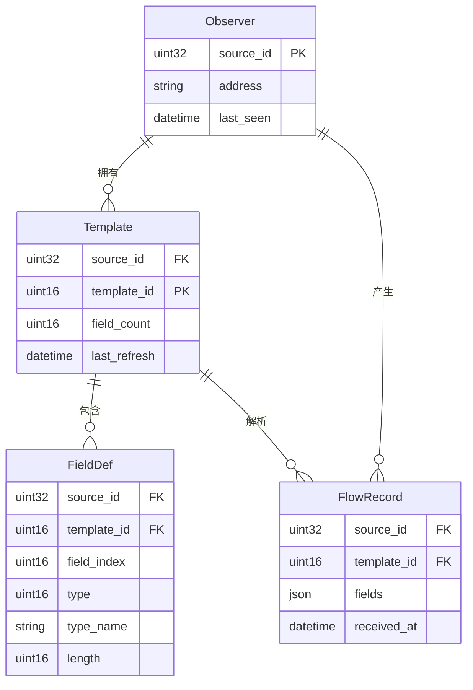

## 1. 架构设计

```mermaid
flowchart TB
    subgraph "网络设备层"
        "NetFlow v9 导出器"
    end
    subgraph "Go 后端"
        "UDP 监听器" --> "NetFlow v9 解码器"
        "NetFlow v9 解码器" --> "模板管理器"
        "NetFlow v9 解码器" --> "流记录存储"
        "模板管理器" --> "模板存储"
        "REST API" --> "模板存储"
        "REST API" --> "流记录存储"
        "WebSocket Hub" --> "模板存储"
        "WebSocket Hub" --> "流记录存储"
    end
    subgraph "React 前端"
        "仪表盘页面" --> "REST API 客户端"
        "仪表盘页面" --> "WebSocket 客户端"
        "观测点详情页面" --> "REST API 客户端"
        "观测点详情页面" --> "WebSocket 客户端"
    end
    "NetFlow v9 导出器" -->|"UDP"| "UDP 监听器"
    "REST API 客户端" -->|"HTTP"| "REST API"
    "WebSocket 客户端" -->|"WS"| "WebSocket Hub"
```

## 2. 技术说明

- 前端：React 18 + TypeScript + Tailwind CSS + Vite
- 初始化工具：vite-init (react-ts template)
- 后端：Go 1.22+（独立进程，不使用 Express）
- 数据库：内存存储（Go map + sync.RWMutex），可选 SQLite
- 通信：REST API + WebSocket（实时推送模板更新与流记录）

## 3. 路由定义

| 路由 | 用途 |
|------|------|
| `/` | 仪表盘页面，全局统计与观测点列表 |
| `/observer/:sourceId` | 观测点详情页，模板定义与流记录 |

## 4. API 定义

### 4.1 REST API

```
GET /api/stats
Response: { packets: number, templates: number, observers: number, flows: number }

GET /api/observers
Response: Observer[] 
  Observer = { sourceId: number, address: string, lastSeen: string, templateCount: number, flowCount: number }

GET /api/observers/:sourceId/templates
Response: Template[]
  Template = { templateId: number, fieldCount: number, fields: FieldDef[], lastRefresh: string }
  FieldDef = { type: number, typeName: string, length: number }

GET /api/observers/:sourceId/flows?templateId=&page=&pageSize=
Response: { flows: Record<string, any>[], total: number, page: number, pageSize: number }
```

### 4.2 WebSocket 消息

```
// 服务端推送
{ type: "template_update", sourceId: number, templateId: number }
{ type: "flow_record", sourceId: number, templateId: number, record: Record<string, any> }
{ type: "stats_update", stats: Stats }
```

### 4.3 Go 后端核心类型

```go
type TemplateKey struct {
    SourceID   uint32
    TemplateID uint16
}

type Template struct {
    TemplateID  uint16
    FieldCount  uint16
    Fields      []FieldDef
    LastRefresh time.Time
}

type FieldDef struct {
    Type     uint16
    TypeName string
    Length   uint16
}

type FlowRecord struct {
    SourceID   uint32
    TemplateID uint16
    Fields     map[string]interface{}
    ReceivedAt time.Time
}

type Observer struct {
    SourceID      uint32
    Address       string
    LastSeen      time.Time
    TemplateCount int
    FlowCount     int
}
```

## 5. 服务器架构图

```mermaid
flowchart LR
    "UDP Listener" --> "Decoder"
    "Decoder" --> "TemplateManager"
    "Decoder" --> "FlowStore"
    "TemplateManager" --> "InMemoryStore"
    "FlowStore" --> "InMemoryStore"
    "HTTP Handler" --> "InMemoryStore"
    "WS Hub" --> "InMemoryStore"
```

## 6. 数据模型

### 6.1 数据模型定义



### 6.2 数据定义语言

内存存储使用 Go 数据结构，无需 DDL。关键索引：
- `map[TemplateKey]*Template` — 按 SourceID+TemplateID 索引模板
- `map[uint32]*Observer` — 按 SourceID 索引观测点
- `[]FlowRecord` — 按 SourceID 过滤的流记录环形缓冲区（最大 10000 条/观测点）

## 7. 项目目录结构

```
sp2/
├── cmd/
│   └── collector/
│       └── main.go           # Go 后端入口
├── internal/
│   ├── netflow/
│   │   ├── decoder.go        # NetFlow v9 解码器
│   │   ├── template.go       # 模板管理
│   │   ├── fields.go         # 字段类型定义
│   │   └── packet.go         # 数据包结构
│   ├── store/
│   │   └── store.go          # 内存存储
│   └── api/
│       ├── handler.go        # REST API 处理器
│       └── websocket.go      # WebSocket Hub
├── src/                      # React 前端
│   ├── components/
│   ├── pages/
│   ├── hooks/
│   ├── utils/
│   └── ...
├── package.json
├── go.mod
└── vite.config.ts
```
