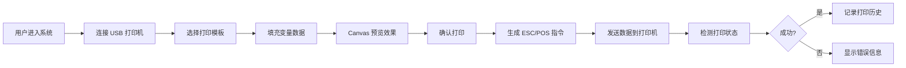

## 1. 产品概述

热敏打印机云打印管理系统，通过 WebUSB API 实现浏览器直接连接 USB 热敏打印机，支持云端模板管理、打印预览和打印机状态监控。解决商家需要灵活管理打印模板、无需安装驱动即可打印收据的痛点。

- 主要用途：零售店、餐厅、便利店等场景的收据打印
- 目标用户：商户、收银员、系统管理员
- 核心价值：免驱动打印、云端模板管理、实时状态监控、可视化打印预览

## 2. 核心功能

### 2.1 用户角色

| 角色 | 注册方式 | 核心权限 |
|------|---------|----------|
| 普通用户 | 无需登录，本地使用 | 连接打印机、选择模板、打印收据、查看状态 |
| 管理员 | 密码登录 | 管理打印模板、查看打印历史、系统配置 |

### 2.2 功能模块

1. **打印机连接页面**：USB 设备扫描、连接/断开、状态显示
2. **模板管理页面**：模板列表、创建/编辑/删除模板、变量占位符管理
3. **打印操作页面**：选择模板、填充数据、打印预览、执行打印
4. **状态监控页面**：实时状态显示（缺纸/过热/正常）、打印历史记录

### 2.3 页面详情

| 页面名称 | 模块名称 | 功能描述 |
|---------|---------|----------|
| 打印机连接 | 设备扫描模块 | 调用 WebUSB API 扫描并授权 USB 设备，显示已连接打印机信息 |
| 打印机连接 | 状态显示模块 | 显示打印机在线/离线状态，检测缺纸、过热等异常 |
| 模板管理 | 模板列表 | 展示所有模板，支持搜索、分页、排序 |
| 模板管理 | 模板编辑器 | 富文本编辑器，支持 `{店名}`、`{金额}` 等变量占位符，实时预览 |
| 打印操作 | 数据填充表单 | 根据模板变量动态生成表单，支持手动输入或批量导入 |
| 打印操作 | Canvas 预览 | 模拟热敏纸打印效果，支持缩放、调整边距 |
| 打印操作 | ESC/POS 指令生成 | 将模板和数据转换为打印机可识别的 ESC/POS 指令 |
| 状态监控 | 实时状态面板 | 显示打印机温度、纸张余量、打印计数等信息 |
| 状态监控 | 打印历史 | 记录每次打印的时间、模板、状态 |

## 3. 核心流程

### 3.1 打印主流程

### 3.2 模板编辑流程

## 4. 用户界面设计

### 4.1 设计风格

- **主色调**：科技蓝 `#165DFF`，代表专业和可靠
- **辅助色**：成功绿 `#00B42A`、警告橙 `#FF7D00`、危险红 `#F53F3F`
- **按钮风格**：圆角 6px，轻微阴影，悬停有浮起效果
- **字体**：使用 `Inter` 作为界面字体，`Monaco` 等宽字体用于模板编辑
- **布局风格**：左侧导航 + 右侧内容区，卡片式模块划分
- **图标风格**：使用 lucide-react 线性图标，统一 16px 尺寸

### 4.2 页面设计概述

| 页面名称 | 模块名称 | UI 元素 |
|---------|---------|---------|
| 打印机连接 | 设备扫描 | 大尺寸扫描按钮、设备列表卡片、连接状态指示器 |
| 打印机连接 | 状态面板 | 状态指示灯（绿/黄/红）、状态文字、参数网格 |
| 模板管理 | 模板列表 | 网格布局卡片、缩略图预览、操作按钮组 |
| 模板管理 | 编辑器 | 工具栏、编辑区（深色背景）、变量插入面板 |
| 打印操作 | 数据填充 | 分组表单、自动填充建议、实时验证 |
| 打印操作 | 打印预览 | 模拟纸张（米黄色背景）、工具栏、缩放控制 |
| 状态监控 | 历史记录 | 时间线布局、状态标签、详情展开 |

### 4.3 响应式设计

- Desktop-first 设计，适配 1280px 及以上
- 平板设备：左侧导航折叠为图标栏
- 移动设备：底部导航栏，模块垂直堆叠
- 触摸优化：按钮最小 44x44px，列表项增加垂直间距

### 4.4 交互细节

- 打印机连接时显示脉冲动画
- 状态变化时有轻微震动反馈（浏览器支持时）
- Canvas 预览支持拖拽缩放
- 模板编辑器支持语法高亮变量占位符
- 打印进度条模拟打印头移动效果
