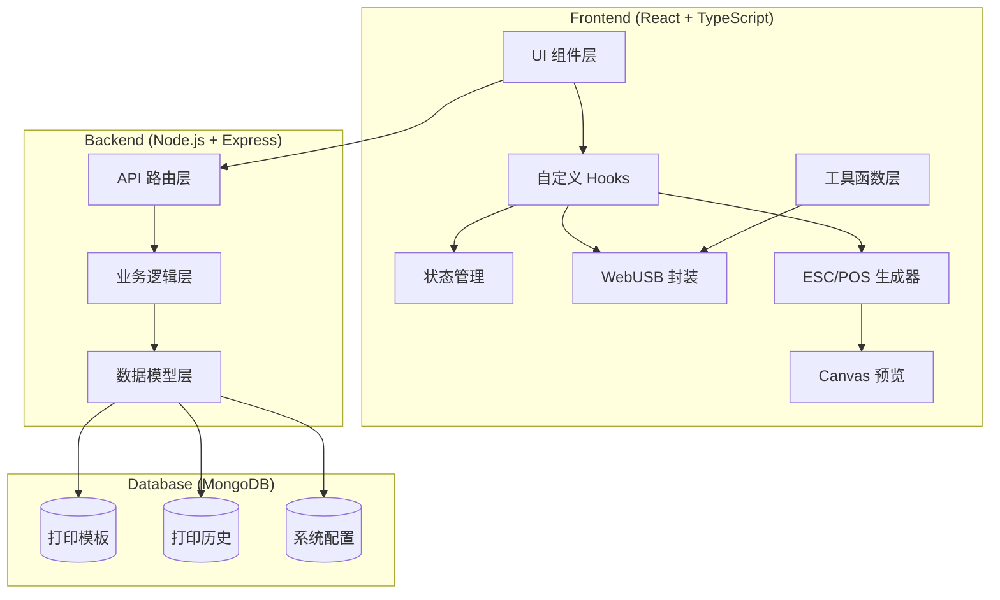
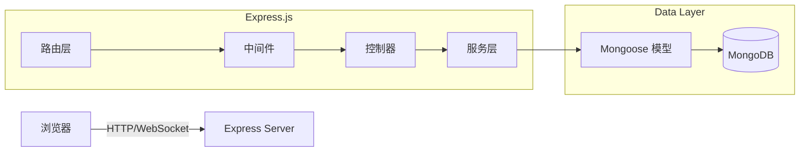
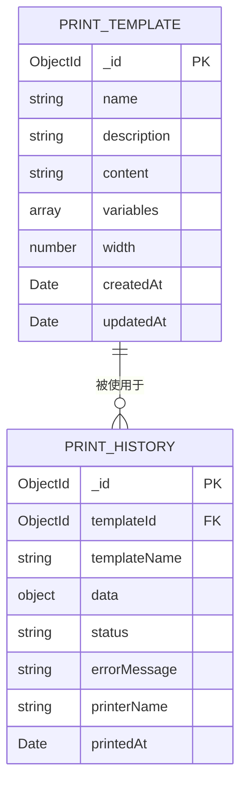

## 1. 架构设计



## 2. 技术描述

### 2.1 技术栈

- **前端**：React@18 + TypeScript + Vite + TailwindCSS@3
- **状态管理**：Zustand
- **路由**：React Router DOM@6
- **图标**：lucide-react
- **后端**：Express@4 + TypeScript
- **数据库**：MongoDB + Mongoose
- **HTTP 客户端**：Axios

### 2.2 核心技术点

1. **WebUSB API**：浏览器原生支持，无需安装驱动，通过 `navigator.usb` 访问 USB 设备
2. **ESC/POS 指令集**：实现 EPSON 标准指令，包括文本格式化、二维码、条形码、切纸等
3. **Canvas 渲染**：将模板和数据渲染为 Canvas，模拟热敏纸打印效果
4. **模板引擎**：自定义模板解析器，支持 `{变量名}` 占位符替换

## 3. 路由定义

### 3.1 前端路由

| 路由 | 页面 | 说明 |
|-----|------|------|
| `/` | 打印操作页 | 主页，包含数据填充和预览 |
| `/printer` | 打印机连接页 | 设备管理和状态监控 |
| `/templates` | 模板列表页 | 模板管理入口 |
| `/templates/new` | 新建模板页 | 模板编辑器 |
| `/templates/:id/edit` | 编辑模板页 | 模板编辑器 |
| `/history` | 打印历史页 | 历史记录查询 |

### 3.2 后端 API 路由

| 方法 | 路径 | 说明 |
|-----|------|------|
| GET | `/api/templates` | 获取模板列表 |
| GET | `/api/templates/:id` | 获取模板详情 |
| POST | `/api/templates` | 创建模板 |
| PUT | `/api/templates/:id` | 更新模板 |
| DELETE | `/api/templates/:id` | 删除模板 |
| GET | `/api/history` | 获取打印历史 |
| POST | `/api/history` | 记录打印历史 |
| GET | `/api/health` | 服务健康检查 |

## 4. API 定义

### 4.1 数据类型定义

```typescript
// 打印模板
interface PrintTemplate {
  _id: string;
  name: string;
  description: string;
  content: string;
  variables: TemplateVariable[];
  width: number;
  createdAt: Date;
  updatedAt: Date;
}

interface TemplateVariable {
  name: string;
  label: string;
  type: 'string' | 'number' | 'date' | 'boolean';
  required: boolean;
  defaultValue?: string;
}

// 打印历史
interface PrintHistory {
  _id: string;
  templateId: string;
  templateName: string;
  data: Record<string, any>;
  status: 'success' | 'failed' | 'pending';
  errorMessage?: string;
  printerName: string;
  printedAt: Date;
}

// 打印机状态
interface PrinterStatus {
  connected: boolean;
  online: boolean;
  paperOk: boolean;
  temperatureOk: boolean;
  coverOpen: boolean;
  errorMessage?: string;
}
```

### 4.2 请求响应示例

**GET /api/templates**
```typescript
// Response
{
  data: PrintTemplate[];
  total: number;
}
```

**POST /api/templates**
```typescript
// Request
{
  name: string;
  description: string;
  content: string;
  variables: TemplateVariable[];
  width: number;
}

// Response
{
  data: PrintTemplate;
  message: string;
}
```

## 5. 服务器架构图



## 6. 数据模型

### 6.1 ER 图



### 6.2 Mongoose Schema

```typescript
// Template Schema
const templateSchema = new Schema({
  name: { type: String, required: true, trim: true },
  description: { type: String, default: '' },
  content: { type: String, required: true },
  variables: [{
    name: String,
    label: String,
    type: { type: String, enum: ['string', 'number', 'date', 'boolean'] },
    required: Boolean,
    defaultValue: String
  }],
  width: { type: Number, default: 58 }
}, { timestamps: true });

// History Schema
const historySchema = new Schema({
  templateId: { type: Schema.Types.ObjectId, ref: 'Template' },
  templateName: String,
  data: Object,
  status: { type: String, enum: ['success', 'failed', 'pending'] },
  errorMessage: String,
  printerName: String,
  printedAt: { type: Date, default: Date.now }
});
```

### 6.3 初始化数据

```javascript
// 预置模板
const defaultTemplates = [
  {
    name: '标准收据',
    description: '通用收银收据模板',
    width: 58,
    content: `{店名}
{地址}
{电话}
----------------
商品名称      金额
{商品列表}
----------------
合计: {合计金额}
实收: {实收金额}
找零: {找零金额}
----------------
谢谢惠顾，欢迎再次光临！
{日期时间}`,
    variables: [
      { name: '店名', label: '店铺名称', type: 'string', required: true },
      { name: '地址', label: '店铺地址', type: 'string', required: false },
      { name: '电话', label: '联系电话', type: 'string', required: false },
      { name: '商品列表', label: '商品明细', type: 'string', required: true },
      { name: '合计金额', label: '合计金额', type: 'number', required: true },
      { name: '实收金额', label: '实收金额', type: 'number', required: true },
      { name: '找零金额', label: '找零金额', type: 'number', required: true },
      { name: '日期时间', label: '打印时间', type: 'date', required: true }
    ]
  },
  {
    name: '餐饮小票',
    description: '餐厅订单打印模板',
    width: 58,
    content: `{店名}
{桌号} {人数}人
{下单时间}
----------------
{菜品列表}
----------------
小计: {小计金额}
服务费: {服务费}
合计: {合计金额}
----------------
{备注}
请妥善保管好您的随身物品`,
    variables: [
      { name: '店名', label: '店铺名称', type: 'string', required: true },
      { name: '桌号', label: '桌号', type: 'string', required: true },
      { name: '人数', label: '用餐人数', type: 'number', required: true },
      { name: '下单时间', label: '下单时间', type: 'date', required: true },
      { name: '菜品列表', label: '菜品明细', type: 'string', required: true },
      { name: '小计金额', label: '小计金额', type: 'number', required: true },
      { name: '服务费', label: '服务费', type: 'number', required: false, defaultValue: '0' },
      { name: '合计金额', label: '合计金额', type: 'number', required: true },
      { name: '备注', label: '备注', type: 'string', required: false }
    ]
  }
];
```
