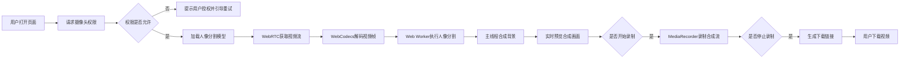

## 1. 产品概述

实时人像抠图与背景替换Web应用，基于WebRTC获取摄像头视频流，结合TensorFlow.js人像分割模型实现实时背景抠除，并支持自定义图片/视频背景替换与录制功能。

- **核心目标**：提供浏览器端无需插件的实时视频抠图体验，适用于在线会议、直播、视频创作等场景
- **目标用户**：内容创作者、职场人士、直播主播、视频会议用户
- **市场价值**：无需安装专业软件，浏览器即可完成专业级视频背景处理

## 2. 核心功能

### 2.1 用户角色

| 角色 | 注册方式 | 核心权限 |
|------|----------|----------|
| 普通用户 | 无需注册，直接使用 | 摄像头访问、背景替换、视频录制、下载 |

### 2.2 功能模块

1. **主页**：视频预览区域、控制面板、背景选择区
2. **设置面板**：摄像头参数、分割精度、录制质量

### 2.3 页面详情

| 页面名称 | 模块名称 | 功能描述 |
|-----------|-------------|---------------------|
| 主页 | 视频预览区 | 实时显示抠图合成后的视频画面，支持全屏预览 |
| 主页 | 控制面板 | 开始/停止摄像头、开始/停止录制、下载录制视频、设置按钮 |
| 主页 | 背景选择区 | 上传本地图片/视频、选择预设背景、模糊背景效果 |
| 主页 | 状态栏 | 显示FPS、模型加载状态、录制时长 |
| 设置面板 | 摄像头设置 | 分辨率选择（720p/1080p）、帧率、前后摄像头切换 |
| 设置面板 | 分割设置 | 模型精度调节、边缘平滑度、前景阈值 |
| 设置面板 | 录制设置 | 录制格式（WebM/MP4）、码率、是否包含音频 |

## 3. 核心流程

## 4. 用户界面设计

### 4.1 设计风格
- **主色调**：深蓝 `#0F172A` 作为主背景，科技感青蓝 `#06B6D4` 作为主强调色
- **辅助色**：紫色 `#8B5CF6` 用于高亮按钮，翠绿 `#10B981` 用于状态指示
- **按钮风格**：圆角12px，微立体阴影，hover时有平滑的缩放和发光效果
- **字体**：展示字体使用 `Space Grotesk`，正文字体使用 `Inter`
- **布局风格**：暗黑科技风，玻璃拟态控制面板，视频区域居中占主导
- **图标风格**：使用lucide-react线性图标，与整体科技感保持一致

### 4.2 页面设计概述

| 页面名称 | 模块名称 | UI元素 |
|-----------|-------------|-------------|
| 主页 | 视频预览区 | 16:9居中显示，圆角16px，外发光效果，角落显示FPS和录制状态 |
| 主页 | 控制面板 | 底部玻璃拟态横条，半透明背景，按钮组均匀分布，录制按钮脉冲动画 |
| 主页 | 背景选择区 | 右侧可折叠抽屉，网格布局展示背景缩略图，上传区域拖放高亮 |
| 主页 | 状态栏 | 顶部窄条，显示模型加载进度、网络状态、当前分辨率 |
| 设置面板 | 设置项 | 模态弹窗，分组展示，开关和滑块组件，实时预览效果 |

### 4.3 响应性
- **桌面端**：视频预览居中，控制面板底部固定，背景选择区右侧抽屉
- **平板端**：背景选择区改为底部弹出面板，按钮尺寸适当放大
- **移动端**：竖屏时视频预览9:16，控制面板改为底部浮动圆形按钮组
- **触摸优化**：所有可点击区域最小48x48px，滑动手势支持切换背景

### 4.4 视觉动效
- 页面加载：视频区域从中心淡入放大，控制面板从底部滑入
- 录制状态：录制按钮呼吸灯效果，边框脉冲闪烁
- 背景切换：合成画面交叉溶解过渡，持续300ms
- 悬停效果：按钮微放大+外发光，滑块轨道颜色渐变
