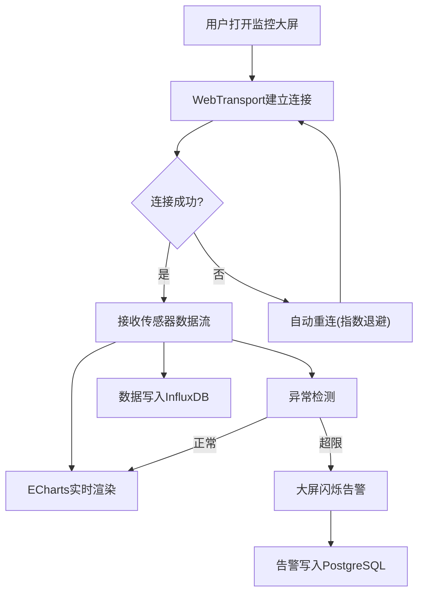
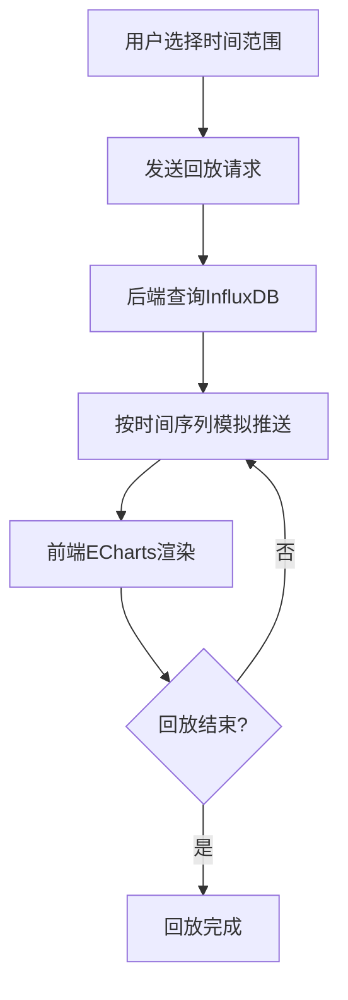

## 1. 产品概述
工业设备实时监控大屏系统，基于WebTransport（HTTP/3）双向流推送100个传感器数据（温度、压力、振动），实现毫秒级实时曲线展示、异常阈值告警和历史数据回放，面向工业运维人员提供全场景设备健康监控。

## 2. 核心功能

### 2.1 用户角色
| 角色 | 注册方式 | 核心权限 |
|------|----------|----------|
| 运维工程师 | 系统分配账号 | 查看实时数据、配置阈值、查看告警、回放历史 |
| 管理员 | 系统分配账号 | 所有权限 + 传感器管理 + 用户管理 |

### 2.2 功能模块
1. **实时监控大屏**：传感器选择面板、ECharts实时曲线、设备状态概览、告警闪烁
2. **告警管理页**：告警记录列表、阈值配置、告警统计
3. **历史回放页**：时间范围选择、回放速度控制、传感器选择

### 2.3 页面详情
| 页面名称 | 模块名称 | 功能描述 |
|----------|----------|----------|
| 实时监控大屏 | 传感器选择面板 | 100个传感器按区域分组，支持搜索、多选、全选 |
| 实时监控大屏 | 实时曲线区域 | ECharts动态折线图，每100ms更新，最多展示最近5分钟数据 |
| 实时监控大屏 | 设备状态概览 | 100个传感器状态卡片（正常/告警/离线），颜色区分 |
| 实时监控大屏 | 告警横幅 | 超限时顶部横幅闪烁红色，显示告警传感器编号和数值 |
| 实时监控大屏 | 连接状态指示 | WebTransport连接状态（已连接/重连中/断开） |
| 告警管理页 | 告警记录列表 | 分页展示PostgreSQL中的告警记录，支持时间/传感器/级别筛选 |
| 告警管理页 | 阈值配置面板 | 为每类指标（温度/压力/振动）配置上下限阈值 |
| 告警管理页 | 告警统计图表 | 按时间/传感器/类型的告警分布统计 |
| 历史回放页 | 时间范围选择器 | 选择起止时间，从InfluxDB查询历史数据 |
| 历史回放页 | 回放控制栏 | 播放/暂停、速度调节（1x/2x/5x/10x）、进度条 |
| 历史回放页 | 历史曲线展示 | ECharts展示回放数据，模拟实时推送效果 |

## 3. 核心流程

**实时监控流程**：用户打开大屏 → WebTransport建立连接 → 后端100个传感器每100ms生成数据 → 通过双向流推送 → 前端ECharts实时渲染 → 超限触发告警闪烁 → 告警记录写入PostgreSQL → 数据写入InfluxDB

**历史回放流程**：用户选择时间范围 → 前端发送回放请求 → 后端从InfluxDB查询 → 按时间序列模拟100ms间隔推送 → 前端ECharts渲染

## 4. 用户界面设计

### 4.1 设计风格
- **主色调**：深色工业风（#0a0e17 深蓝黑底）+ 青色科技感强调色（#00f0ff）+ 红色告警（#ff2d55）
- **辅助色**：暗灰面板（#1a1f2e）、绿色正常状态（#00e676）、橙色警告（#ff9100）
- **按钮风格**：圆角矩形，半透明玻璃拟态效果，hover时发光边框
- **字体**：标题用 Orbitron（科技感显示字体），正文用 Source Sans 3（清晰可读）
- **布局风格**：全屏深色大屏，左侧传感器面板，中央曲线图，顶部告警横幅，右侧状态面板
- **图标风格**：线性图标，青色发光效果

### 4.2 页面设计概览
| 页面名称 | 模块名称 | UI元素 |
|----------|----------|--------|
| 实时监控大屏 | 传感器选择面板 | 深色半透明侧边栏，搜索框，分组折叠面板，复选框列表，选中项青色高亮 |
| 实时监控大屏 | 实时曲线区域 | 深色背景ECharts图表，青色/绿色/橙色三条曲线，网格线半透明，图例右上角 |
| 实时监控大屏 | 设备状态概览 | 10x10网格小卡片，正常绿色、告警红色脉冲动画、离线灰色 |
| 实时监控大屏 | 告警横幅 | 全宽红色半透明横幅，脉冲闪烁动画，显示传感器ID和超限值 |
| 实时监控大屏 | 连接状态指示 | 右上角状态点，绿色=已连接，黄色=重连中(旋转动画)，红色=断开 |
| 告警管理页 | 告警记录列表 | 深色表格，红色标记严重告警，橙色标记警告，支持筛选排序 |
| 告警管理页 | 阈值配置面板 | 卡片式配置，每类指标独立卡片，输入框配置上下限，保存按钮 |
| 历史回放页 | 回放控制栏 | 底部控制栏，播放/暂停按钮，速度选择下拉，进度条拖拽 |

### 4.3 响应式设计
- 桌面优先设计，针对大屏监控场景优化（1920x1080及以上）
- 最小支持1366x768分辨率
- 平板端简化侧边栏为可收起抽屉

### 4.4 动效设计
- 告警闪烁：红色脉冲动画，2s周期
- 数据流指示：连接状态下顶部青色流光动画
- 传感器卡片：状态变化时平滑过渡，告警时呼吸灯效果
- 图表入场：曲线从左向右渐显
