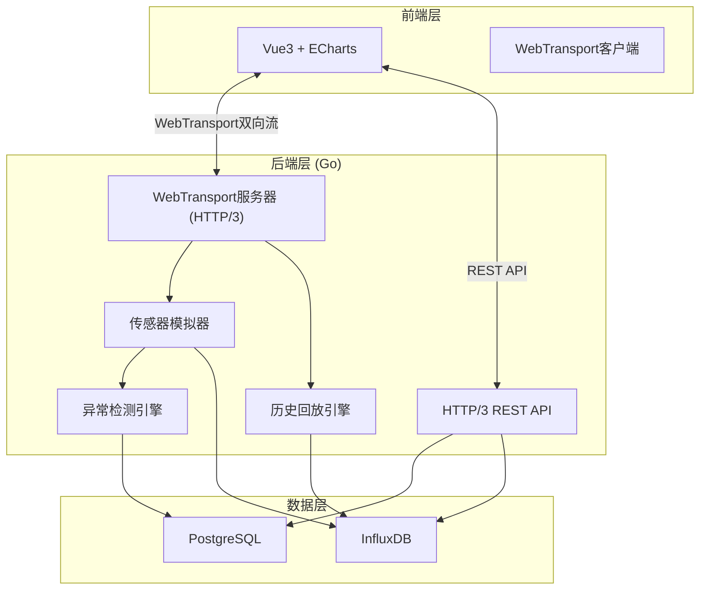
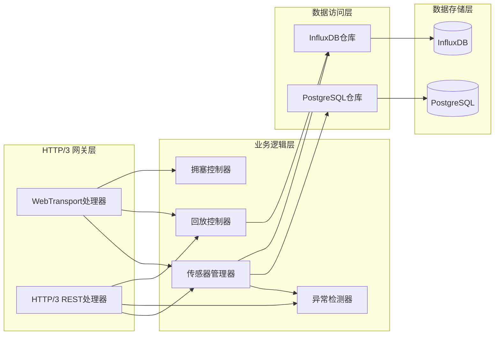
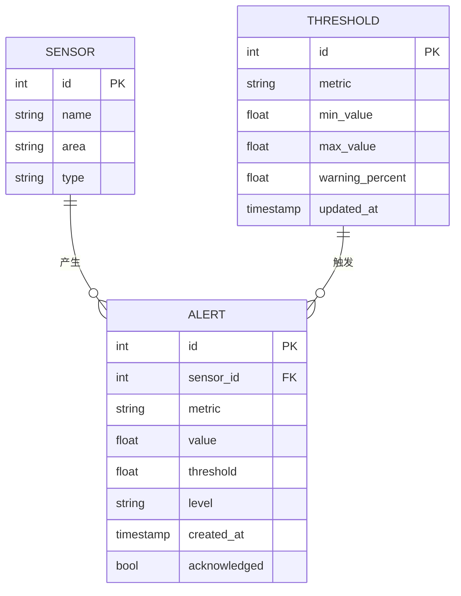

## 1. 架构设计



## 2. 技术说明
- **前端**：Vue3 + TypeScript + Vite + TailwindCSS + ECharts + vue-router
- **初始化工具**：vite-init (vue-ts模板)
- **后端**：Go 1.22+ + quic-go (WebTransport) + net/http
- **数据库**：PostgreSQL（告警记录）+ InfluxDB 2.x（时序数据）
- **通信协议**：WebTransport (HTTP/3) 双向流 + HTTP/3 REST API
- **数据格式**：JSON（控制消息）+ 二进制（传感器数据，高性能）

## 3. 路由定义
| 路由 | 用途 |
|------|------|
| / | 实时监控大屏（默认页） |
| /alerts | 告警管理页 |
| /replay | 历史回放页 |

## 4. API定义

### 4.1 WebTransport数据通道

**连接地址**：`wts://host:443/sensor-stream`

**下行数据（服务器→客户端）- 传感器实时数据**：
```typescript
interface SensorData {
  id: number          // 传感器ID 1-100
  ts: number          // Unix毫秒时间戳
  temperature: number // 温度 (°C)
  pressure: number    // 压力 (MPa)
  vibration: number   // 振动 (mm/s)
}

interface ServerMessage {
  type: 'sensor_data' | 'alert' | 'replay_data' | 'replay_end'
  payload: SensorData | AlertPayload | SensorData[]
}

interface AlertPayload {
  sensorId: number
  metric: 'temperature' | 'pressure' | 'vibration'
  value: number
  threshold: number
  level: 'warning' | 'critical'
  timestamp: number
}
```

**上行数据（客户端→服务器）- 控制命令**：
```typescript
interface ClientMessage {
  type: 'subscribe' | 'unsubscribe' | 'replay_start' | 'replay_stop' | 'set_threshold'
  payload: SubscribePayload | ReplayPayload | ThresholdPayload
}

interface SubscribePayload {
  sensorIds: number[]  // 订阅的传感器ID列表
}

interface ReplayPayload {
  startTime: string    // ISO8601
  endTime: string      // ISO8601
  speed: 1 | 2 | 5 | 10
  sensorIds: number[]
}

interface ThresholdPayload {
  metric: 'temperature' | 'pressure' | 'vibration'
  min: number
  max: number
  warningPercent: number  // 预警百分比(0-100)
}
```

### 4.2 HTTP REST API

| 方法 | 路径 | 用途 |
|------|------|------|
| GET | /api/sensors | 获取传感器列表及状态 |
| GET | /api/alerts | 查询告警记录（分页、筛选） |
| PUT | /api/thresholds | 更新阈值配置 |
| GET | /api/thresholds | 获取当前阈值配置 |
| GET | /api/history | 查询历史数据范围 |
| GET | /api/stats | 告警统计数据 |

```typescript
interface SensorInfo {
  id: number
  name: string
  area: string
  status: 'normal' | 'warning' | 'critical' | 'offline'
}

interface AlertRecord {
  id: number
  sensorId: number
  metric: string
  value: number
  threshold: number
  level: 'warning' | 'critical'
  createdAt: string
  acknowledged: boolean
}

interface ThresholdConfig {
  temperature: { min: number; max: number; warningPercent: number }
  pressure: { min: number; max: number; warningPercent: number }
  vibration: { min: number; max: number; warningPercent: number }
}
```

## 5. 服务器架构图



## 6. 数据模型

### 6.1 数据模型定义



### 6.2 数据定义语言

**PostgreSQL DDL：**
```sql
CREATE TABLE sensors (
    id SERIAL PRIMARY KEY,
    name VARCHAR(100) NOT NULL,
    area VARCHAR(50) NOT NULL,
    type VARCHAR(50) DEFAULT 'industrial'
);

CREATE TABLE alerts (
    id SERIAL PRIMARY KEY,
    sensor_id INTEGER NOT NULL REFERENCES sensors(id),
    metric VARCHAR(20) NOT NULL,
    value DOUBLE PRECISION NOT NULL,
    threshold DOUBLE PRECISION NOT NULL,
    level VARCHAR(10) NOT NULL CHECK (level IN ('warning', 'critical')),
    created_at TIMESTAMPTZ NOT NULL DEFAULT NOW(),
    acknowledged BOOLEAN NOT NULL DEFAULT FALSE
);

CREATE TABLE thresholds (
    id SERIAL PRIMARY KEY,
    metric VARCHAR(20) NOT NULL UNIQUE,
    min_value DOUBLE PRECISION NOT NULL,
    max_value DOUBLE PRECISION NOT NULL,
    warning_percent DOUBLE PRECISION NOT NULL DEFAULT 80.0,
    updated_at TIMESTAMPTZ NOT NULL DEFAULT NOW()
);

CREATE INDEX idx_alerts_sensor_id ON alerts(sensor_id);
CREATE INDEX idx_alerts_created_at ON alerts(created_at);
CREATE INDEX idx_alerts_level ON alerts(level);

INSERT INTO sensors (id, name, area) SELECT g, 'Sensor-' || g, 'Area-' || ((g-1)/10 + 1) FROM generate_series(1,100) g;

INSERT INTO thresholds (metric, min_value, max_value, warning_percent) VALUES
('temperature', -20, 120, 80),
('pressure', 0, 10, 85),
('vibration', 0, 50, 80);
```

**InfluxDB Measurement：**
```
measurement: sensor_data
tags: sensor_id, area
fields: temperature=float, pressure=float, vibration=float
timestamp: nanosecond precision
```

## 7. 关键技术方案

### 7.1 WebTransport断线重连
- 客户端检测连接断开后，使用指数退避策略重连（1s→2s→4s→8s→最大30s）
- 重连期间缓存数据，连接恢复后发送缺失时间范围请求
- 连接状态实时显示在大屏右上角

### 7.2 拥塞控制
- 服务端监控发送缓冲区大小，当缓冲区超过阈值时降频推送（100ms→200ms→500ms）
- 客户端通过WebTransport双向流发送接收反馈（ACK/NACK）
- 降频时通知前端调整图表刷新频率

### 7.3 传感器数据模拟
- 温度：基准40°C + 正弦波(周期60s, 幅度15) + 随机噪声(±2)
- 压力：基准5MPa + 正弦波(周期45s, 幅度2) + 随机噪声(±0.3)
- 振动：基准10mm/s + 正弦波(周期30s, 幅度8) + 随机噪声(±1)
- 10%概率产生突变值（模拟异常）

### 7.4 历史回放
- 后端从InfluxDB查询指定时间范围数据
- 按原始时间间隔通过WebTransport推送，支持倍速播放
- 回放数据标记为replay类型，前端区分实时/回放模式
