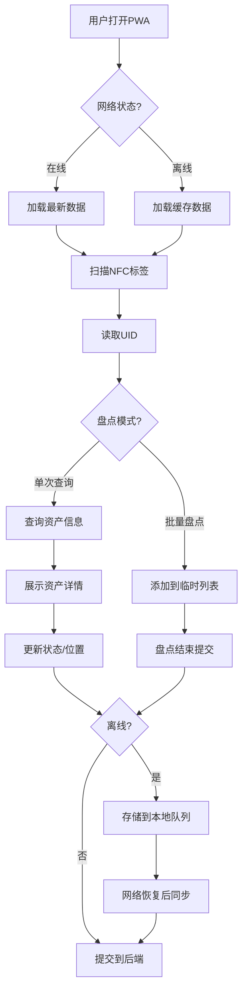

## 1. 产品概述

NFC资产管理系统是一款基于Web NFC API的企业级资产管理工具，通过手机触碰NFC标签即可快速查询和更新资产信息，支持离线盘点和位置跟踪。

- **主要目标**：解决传统资产盘点效率低、易出错的问题，实现资产全生命周期的数字化管理
- **目标用户**：企业资产管理员、仓管员、IT运维人员
- **市场价值**：大幅提升盘点效率（从人工盘点的数天缩短至数小时），降低资产流失率

## 2. 核心功能

### 2.1 用户角色

| 角色 | 注册方式 | 核心权限 |
|------|----------|----------|
| 资产管理员 | 管理员邀请 | 资产CRUD、标签写入、查看所有盘点记录 |
| 盘点员 | 管理员邀请 | 资产查询、批量盘点、位置更新 |

### 2.2 功能模块

1. **首页/资产查询**：NFC标签扫描、资产信息展示、快速状态更新
2. **批量盘点**：连续扫描模式、临时列表管理、批量提交后台
3. **标签写入**：写入/覆盖资产ID到NFC标签、标签格式化
4. **位置跟踪**：GPS定位、蓝牙信标RSSI采集、位置历史记录
5. **离线支持**：Service Worker缓存、离线数据同步、冲突解决

### 2.3 页面详情

| 页面名称 | 模块名称 | 功能描述 |
|----------|----------|----------|
| 首页 | NFC扫描区 | 大尺寸扫描按钮、实时NFC状态指示、扫描成功动画 |
| 首页 | 资产信息卡片 | 展示资产名称、位置、状态、图片、最后盘点时间 |
| 首页 | 快速操作栏 | 一键更新状态（在用/闲置/维修中/报废） |
| 批量盘点 | 盘点控制 | 开始/结束盘点、盘点进度显示、已扫描数量统计 |
| 批量盘点 | 临时列表 | 已扫描标签列表、重复扫描提示、手动删除功能 |
| 批量盘点 | 提交面板 | 批量更新状态选择、备注填写、提交确认 |
| 标签写入 | 写入表单 | 资产ID输入、写入进度、写入成功/失败提示 |
| 位置跟踪 | 位置信息 | 实时GPS坐标、蓝牙信标列表、信号强度可视化 |
| 位置跟踪 | 历史记录 | 位置变化时间线、地图标记展示 |
| 离线状态 | 同步面板 | 待同步数据列表、手动同步按钮、冲突提示 |

## 3. 核心流程

### 3.1 单次资产查询流程
用户打开应用 → 点击"扫描NFC标签" → 手机触碰NFC标签 → 读取标签UID → 查询后端API → 展示资产详情 → 可选择更新状态

### 3.2 批量盘点流程
点击"开始盘点" → 选择盘点状态（如"在用"）→ 连续触碰NFC标签 → 实时显示已扫描数量 → 完成后点击"提交" → 后台批量更新资产状态

### 3.3 标签写入流程
选择"标签写入" → 输入资产ID → 点击"开始写入" → 触碰NFC标签 → 写入进度显示 → 写入成功提示

### 3.4 位置跟踪流程
扫描NFC标签时自动触发 → 获取GPS坐标 → 扫描周围蓝牙信标 → 记录RSSI值 → 与资产UID关联上传 → 生成位置历史

### 3.5 离线同步流程
网络断开时自动切换离线模式 → 所有操作存储到IndexedDB → 网络恢复后自动检测 → 后台静默同步 → 冲突时提示用户选择

## 4. 用户界面设计

### 4.1 设计风格
- **主色调**：科技蓝 #1E40AF（专业、可信赖）
- **辅助色**：成功绿 #10B981、警告橙 #F59E0B、危险红 #EF4444
- **中性色**：深灰 #1F2937、中灰 #6B7280、浅灰 #F3F4F6
- **按钮风格**：圆角12px、微阴影、悬停时轻微上浮动画
- **字体**：标题用 Space Grotesk（科技感），正文用 Inter（清晰易读）
- **布局**：卡片式布局，主操作区突出，移动端适配
- **图标**：Lucide 图标库，线条风格，统一24px尺寸

### 4.2 页面设计概述

| 页面名称 | 模块名称 | UI元素 |
|----------|----------|--------|
| 首页 | NFC扫描区 | 全屏渐变背景、居中圆形扫描按钮、脉冲动画、NFC状态指示灯 |
| 首页 | 资产卡片 | 玻璃拟态效果、圆角16px、阴影分层、进入动画 |
| 批量盘点 | 进度条 | 顶部固定进度条、已扫描数量徽章、实时更新动画 |
| 批量盘点 | 列表项 | 滑动删除、重复项红色高亮、新增项弹跳动画 |
| 标签写入 | 写入进度 | 环形进度条、百分比显示、成功/失败状态切换动画 |
| 位置跟踪 | 信号强度 | 条形图可视化、颜色渐变（绿-黄-红）、实时刷新 |

### 4.3 响应式设计
- **桌面优先**：最大宽度1200px，三列布局
- **平板**：两列布局，侧边栏可折叠
- **移动端**：单列布局，底部导航栏，大尺寸触控按钮（最小48x48px）
- **触摸优化**：按钮间距≥8px，避免误触；支持下拉刷新；支持滑动操作

### 4.4 动效设计
- **页面加载**：交错渐入动画（staggered fade-in），延迟50ms递增
- **扫描成功**：圆形波纹扩散动画 + 轻微震动反馈
- **状态切换**：颜色过渡动画 + 缩放效果
- **数据同步**：旋转加载动画 + 进度条
- **错误提示**：轻微抖动动画 + 红色边框高亮
