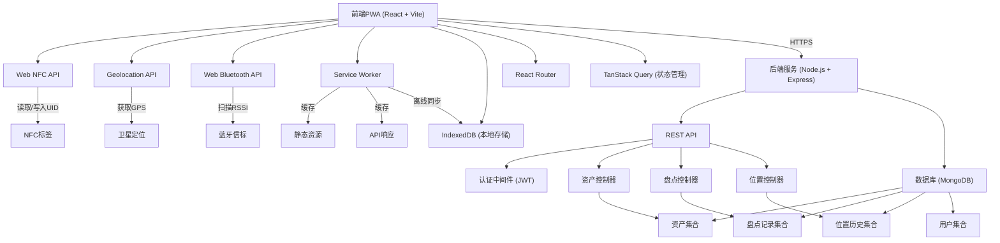
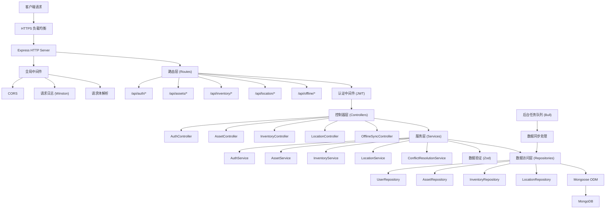
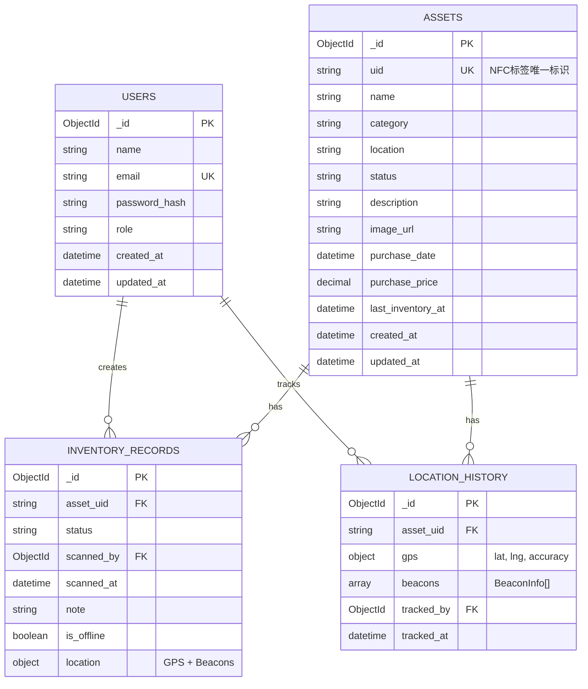

## 1. 架构设计



## 2. 技术描述

### 2.1 前端技术栈
- **框架**: React@18.2.0 + TypeScript@5.4.0
- **构建工具**: Vite@5.2.0
- **路由**: react-router-dom@6.22.0
- **状态管理**: @tanstack/react-query@5.24.0 + zustand@4.5.0
- **UI组件**: tailwindcss@3.4.1 + framer-motion@11.0.0 + lucide-react@0.344.0
- **PWA支持**: vite-plugin-pwa@0.19.0
- **本地存储**: idb@8.0.0 (IndexedDB封装)
- **HTTP客户端**: axios@1.6.7

### 2.2 后端技术栈
- **运行时**: Node.js@20.10.0
- **框架**: Express@4.18.2
- **数据库**: MongoDB@6.0 + Mongoose@8.2.0
- **认证**: jsonwebtoken@9.0.2 + bcryptjs@2.4.3
- **验证**: zod@3.22.4
- **日志**: winston@3.11.0
- **CORS**: cors@2.8.5

### 2.3 核心API特性
- Web NFC API: 读取NFC标签UID、写入NDEF记录
- Geolocation API: 获取GPS坐标（高精度模式）
- Web Bluetooth API: 扫描蓝牙信标、读取RSSI
- Service Worker: 静态资源缓存、API请求缓存、后台同步

## 3. 路由定义

### 3.1 前端路由

| 路由 | 页面 | 功能 |
|------|------|------|
| / | 首页 | NFC扫描、资产查询、快速操作 |
| /inventory | 批量盘点 | 连续扫描、临时列表、批量提交 |
| /write-tag | 标签写入 | 写入/覆盖资产ID到NFC标签 |
| /location | 位置跟踪 | GPS和蓝牙信标信息、位置历史 |
| /offline | 离线同步 | 待同步数据、手动同步、冲突处理 |
| /assets | 资产管理 | 资产列表、搜索、CRUD操作 |
| /assets/:id | 资产详情 | 资产完整信息、操作历史 |
| /login | 登录页 | 用户认证 |

### 3.2 后端API路由

| 方法 | 路由 | 功能 |
|------|------|------|
| POST | /api/auth/login | 用户登录 |
| GET | /api/assets | 获取资产列表（支持分页、搜索） |
| GET | /api/assets/:uid | 根据NFC UID查询资产 |
| POST | /api/assets | 创建新资产 |
| PUT | /api/assets/:uid | 更新资产信息 |
| DELETE | /api/assets/:uid | 删除资产 |
| PUT | /api/assets/batch/status | 批量更新资产状态 |
| POST | /api/inventory/records | 提交盘点记录 |
| GET | /api/inventory/records | 获取盘点历史 |
| POST | /api/location/track | 提交位置跟踪数据 |
| GET | /api/location/history/:assetUid | 获取资产位置历史 |
| POST | /api/offline/sync | 批量同步离线数据 |

## 4. API 类型定义

```typescript
// 资产状态枚举
type AssetStatus = 'in_use' | 'idle' | 'maintenance' | 'scrapped';

// 资产接口
interface Asset {
  _id: string;
  uid: string;           // NFC标签UID
  name: string;          // 资产名称
  category: string;      // 资产分类
  location: string;      // 所在位置
  status: AssetStatus;   // 资产状态
  description?: string;  // 描述
  imageUrl?: string;     // 图片URL
  purchaseDate?: string;
  purchasePrice?: number;
  lastInventoryAt?: string;
  createdAt: string;
  updatedAt: string;
}

// 盘点记录
interface InventoryRecord {
  _id: string;
  assetUid: string;
  status: AssetStatus;
  location?: {
    gps: { lat: number; lng: number };
    beacons: BeaconInfo[];
  };
  scannedBy: string;     // 用户ID
  scannedAt: string;
  note?: string;
  isOffline: boolean;
}

// 蓝牙信标信息
interface BeaconInfo {
  id: string;
  name?: string;
  rssi: number;          // 信号强度 (dBm)
  uuid?: string;
  major?: number;
  minor?: number;
}

// 位置跟踪数据
interface LocationTrack {
  _id: string;
  assetUid: string;
  gps: {
    lat: number;
    lng: number;
    accuracy?: number;   // 精度（米）
  };
  beacons: BeaconInfo[];
  trackedAt: string;
  trackedBy: string;
}

// 离线同步队列项
interface SyncQueueItem {
  id: string;
  type: 'asset_update' | 'inventory' | 'location';
  data: any;
  createdAt: string;
  retryCount: number;
  error?: string;
}

// API响应格式
interface ApiResponse<T> {
  success: boolean;
  data?: T;
  error?: {
    code: string;
    message: string;
  };
}

// 登录请求
interface LoginRequest {
  email: string;
  password: string;
}

// 登录响应
interface LoginResponse {
  token: string;
  user: {
    id: string;
    name: string;
    email: string;
    role: 'admin' | 'inventory';
  };
}

// 批量更新状态请求
interface BatchStatusUpdateRequest {
  uids: string[];
  status: AssetStatus;
  note?: string;
}

// 批量盘点提交请求
interface BatchInventoryRequest {
  items: {
    uid: string;
    status: AssetStatus;
    note?: string;
  }[];
  location?: {
    gps: { lat: number; lng: number };
    beacons: BeaconInfo[];
  };
}
```

## 5. 服务器架构图



## 6. 数据模型

### 6.1 数据模型ER图



### 6.2 MongoDB Schema 定义

```javascript
// Asset Schema
const assetSchema = new Schema({
  uid: { type: String, required: true, unique: true, index: true },
  name: { type: String, required: true, index: true },
  category: { type: String, required: true, index: true },
  location: { type: String, required: true },
  status: { 
    type: String, 
    required: true, 
    enum: ['in_use', 'idle', 'maintenance', 'scrapped'],
    default: 'in_use'
  },
  description: String,
  imageUrl: String,
  purchaseDate: Date,
  purchasePrice: Number,
  lastInventoryAt: Date,
  createdAt: { type: Date, default: Date.now },
  updatedAt: { type: Date, default: Date.now }
});

// Inventory Record Schema
const inventoryRecordSchema = new Schema({
  assetUid: { type: String, required: true, ref: 'Asset', index: true },
  status: { 
    type: String, 
    required: true, 
    enum: ['in_use', 'idle', 'maintenance', 'scrapped']
  },
  scannedBy: { type: Schema.Types.ObjectId, ref: 'User', required: true, index: true },
  scannedAt: { type: Date, default: Date.now, index: true },
  note: String,
  isOffline: { type: Boolean, default: false },
  location: {
    gps: {
      lat: Number,
      lng: Number,
      accuracy: Number
    },
    beacons: [{
      id: String,
      name: String,
      rssi: Number,
      uuid: String,
      major: Number,
      minor: Number
    }]
  }
});

// Location History Schema
const locationHistorySchema = new Schema({
  assetUid: { type: String, required: true, ref: 'Asset', index: true },
  gps: {
    lat: { type: Number, required: true },
    lng: { type: Number, required: true },
    accuracy: Number
  },
  beacons: [{
    id: String,
    name: String,
    rssi: Number,
    uuid: String,
    major: Number,
    minor: Number
  }],
  trackedBy: { type: Schema.Types.ObjectId, ref: 'User', required: true },
  trackedAt: { type: Date, default: Date.now, index: true }
});

// User Schema
const userSchema = new Schema({
  name: { type: String, required: true },
  email: { type: String, required: true, unique: true, index: true },
  passwordHash: { type: String, required: true },
  role: { 
    type: String, 
    required: true, 
    enum: ['admin', 'inventory'],
    default: 'inventory'
  },
  createdAt: { type: Date, default: Date.now },
  updatedAt: { type: Date, default: Date.now }
});

// Indexes
assetSchema.index({ status: 1 });
assetSchema.index({ category: 1 });
inventoryRecordSchema.index({ scannedAt: -1 });
inventoryRecordSchema.index({ assetUid: 1, scannedAt: -1 });
locationHistorySchema.index({ trackedAt: -1 });
locationHistorySchema.index({ assetUid: 1, trackedAt: -1 });
```

### 6.3 初始化数据

```javascript
// 初始用户数据（首次部署时执行）
const initialUsers = [
  {
    name: '系统管理员',
    email: 'admin@example.com',
    password: 'admin123456',
    role: 'admin'
  },
  {
    name: '盘点员张三',
    email: 'inventory@example.com',
    password: 'inventory123',
    role: 'inventory'
  }
];

// 示例资产数据
const sampleAssets = [
  {
    uid: 'E280689000004000B3F95B51',
    name: 'MacBook Pro 16寸',
    category: 'IT设备',
    location: '研发部-A区-12号工位',
    status: 'in_use',
    description: '开发用笔记本电脑',
    purchaseDate: new Date('2024-01-15'),
    purchasePrice: 19999
  },
  {
    uid: 'E280689000004000B3F95B52',
    name: '办公椅',
    category: '办公家具',
    location: '市场部-B区-5号工位',
    status: 'in_use',
    purchaseDate: new Date('2023-06-20'),
    purchasePrice: 899
  },
  {
    uid: 'E280689000004000B3F95B53',
    name: '投影仪',
    category: '会议设备',
    location: '3楼-大会议室',
    status: 'idle',
    description: '4K激光投影仪',
    purchaseDate: new Date('2024-03-10'),
    purchasePrice: 12800
  }
];
```
