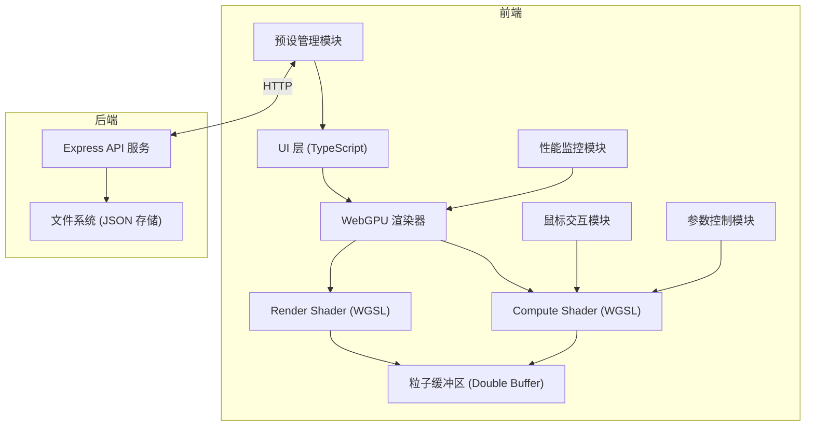

## 1. 架构设计



## 2. 技术描述

- **前端**: TypeScript + Vite + WebGPU API（原生，无 Three.js）
- **着色器语言**: WGSL（WebGPU Shading Language）
- **样式**: TailwindCSS 3 + 自定义 CSS 变量
- **后端**: Node.js + Express 4（仅用于预设参数持久化）
- **存储**: 本地文件系统（JSON 文件），无需数据库
- **初始化工具**: npm create vite@latest

## 3. 核心技术方案

### 3.1 WebGPU 核心架构

| 模块 | 职责 | 关键技术 |
|------|------|----------|
| WebGPUDevice | 管理 GPU 设备、适配器、队列 | navigator.gpu.requestAdapter() |
| BufferManager | 粒子缓冲区、Uniform 缓冲区管理 | GPUBuffer, double buffering |
| ComputePipeline | 粒子物理计算 | ComputeShader, dispatchWorkgroups |
| RenderPipeline | 粒子渲染 | Instanced drawing, vertex buffer |

### 3.2 粒子数据结构

每个粒子 32 字节，使用 std140 布局：
```typescript
interface Particle {
  position: [number, number];      // 位置 x, y (vec2f)
  velocity: [number, number];      // 速度 vx, vy (vec2f)
  color: [number, number, number]; // 颜色 r, g, b (vec3f)
  padding: number;                 // 对齐填充
}
```

### 3.3 力场计算（Compute Shader）

- **中心引力**: `F = G * m / r²`，指向中心点
- **中心斥力**: `F = -K * m / r²`，远离中心点
- **涡流力**: 垂直于位置向量的切线方向力
- **边界反弹**: 检测边界并反转速度，应用阻尼系数
- **鼠标斥力**: 基于鼠标位置的动态斥力场

### 3.4 渲染管线

- **Instanced Drawing**: 单个 quad 几何体，每个粒子一个实例
- **Additive Blending**: 加法混合实现发光效果
- **Point Sprite**: 也支持 point 渲染模式作为备选

## 4. 目录结构

```
sp27/
├── src/
│   ├── gpu/
│   │   ├── WebGPURenderer.ts     # WebGPU 核心渲染器
│   │   ├── shaders/
│   │   │   ├── compute.wgsl      # 粒子计算着色器
│   │   │   └── render.wgsl       # 粒子渲染着色器
│   │   ├── BufferManager.ts      # 缓冲区管理
│   │   └── types.ts              # WebGPU 类型定义
│   ├── particles/
│   │   ├── ParticleSystem.ts     # 粒子系统控制
│   │   └── ParticleInitializer.ts # 粒子初始化
│   ├── forces/
│   │   ├── ForceField.ts         # 力场定义
│   │   └── MouseForce.ts         # 鼠标力场
│   ├── ui/
│   │   ├── ControlPanel.ts       # 控制面板
│   │   ├── PerformanceMonitor.ts # 性能监控
│   │   └── PresetManager.ts      # 预设管理
│   ├── api/
│   │   └── presetApi.ts          # 后端 API 封装
│   ├── types/
│   │   └── index.ts              # 全局类型定义
│   ├── main.ts                   # 入口文件
│   └── style.css                 # 全局样式
├── server/
│   └── index.ts                  # Express 后端服务
├── presets/                      # 预设 JSON 存储目录
├── index.html
├── vite.config.ts
├── tsconfig.json
└── package.json
```

## 5. API 定义（后端）

### TypeScript 类型定义

```typescript
interface Preset {
  id: string;
  name: string;
  createdAt: number;
  params: {
    particleCount: number;
    particleSize: number;
    gravityStrength: number;
    gravityRadius: number;
    repulsionStrength: number;
    repulsionRadius: number;
    vortexStrength: number;
    vortexRadius: number;
    mouseStrength: number;
    mouseRadius: number;
    damping: number;
    bounceDamping: number;
    colorMode: 'velocity' | 'position' | 'rainbow' | 'fixed';
    baseColor: [number, number, number];
  };
}
```

### REST API

| Method | Route | Purpose | Request | Response |
|--------|-------|---------|---------|----------|
| GET | `/api/presets` | 获取所有预设 | - | `Preset[]` |
| GET | `/api/presets/:id` | 获取单个预设 | - | `Preset` |
| POST | `/api/presets` | 保存新预设 | `Omit<Preset, 'id' | 'createdAt'>` | `Preset` |
| PUT | `/api/presets/:id` | 更新预设 | `Partial<Preset['params']>` | `Preset` |
| DELETE | `/api/presets/:id` | 删除预设 | - | `{ success: boolean }` |

## 6. 性能优化策略

1. **Double Buffering**: 粒子缓冲区使用读写分离，避免 GPU 同步等待
2. **Uniform Buffers**: 力场参数通过 uniform buffer 批量更新
3. **Workgroup Size**: 计算着色器使用 64 线程/工作组，适配 GPU 架构
4. **Buffer Mapping**: 仅在初始化时映射缓冲区，运行时使用 GPU 内存
5. **Timestamp Queries**: WebGPU 时间戳查询测量 GPU 执行时间
6. **Instanced Rendering**: 单次 draw call 渲染所有粒子

## 7. 浏览器兼容性

- 支持 WebGPU 的浏览器：Chrome 113+、Edge 113+、Safari 17+、Firefox Nightly
- 降级方案：检测 WebGPU 支持，不支持时显示友好提示
