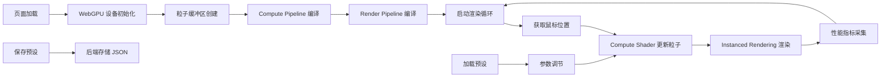

## 1. 产品概述

WebGPU 高性能粒子系统演示平台，利用 GPU 并行计算能力实现十万级粒子实时模拟。通过多种力场（引力、斥力、涡流）和鼠标交互，创造沉浸式动态视觉效果。目标用户为图形开发者、设计师和技术爱好者，展示 WebGPU 在通用计算和图形渲染领域的强大潜力。

## 2. 核心功能

### 2.1 功能模块

1. **粒子系统核心**：GPU 加速粒子物理模拟，支持十万级粒子实时更新
2. **力场系统**：中心引力、中心斥力、涡流力场、边界反弹
3. **鼠标交互**：鼠标位置产生动态斥力场，实时推离粒子
4. **性能监控**：实时显示 FPS、粒子数量、GPU 时间等指标
5. **参数控制**：可调节力场强度、半径、粒子大小、颜色等参数
6. **预设管理**：保存/加载参数预设，支持多套配置快速切换

### 2.3 页面详情

| 页面名称 | 模块名称 | 功能描述 |
|-----------|-------------|---------------------|
| 主页面 | Canvas 渲染区 | WebGPU 粒子系统全屏渲染，鼠标交互区域 |
| 主页面 | 性能监控面板 | 左上角显示 FPS、粒子数、帧时间 |
| 主页面 | 控制面板 | 右侧可折叠面板，力场参数调节、预设管理 |
| 主页面 | 力场可视化 | 可选显示力场范围指示圆环 |

## 3. 核心流程

用户进入页面 → WebGPU 初始化 → 粒子系统启动 → 实时渲染循环 → 鼠标移动产生斥力 → 调节参数观察效果 → 保存预设到后端

## 4. 用户界面设计

### 4.1 设计风格

- **主色调**：深空黑 (#0a0a0f) 背景，霓虹蓝 (#00f0ff) 高亮，紫罗兰 (#8b5cf6) 点缀
- **粒子颜色**：HSL 动态渐变，基于粒子速度/位置变化
- **字体**：
  - 标题：Space Mono（等宽科技感字体）
  - 正文：JetBrains Mono（清晰易读的编程字体）
- **UI 元素**：半透明毛玻璃面板，霓虹发光边框，细微的网格背景纹理
- **交互反馈**：滑块拖动实时响应，按钮悬停发光效果，面板展开/折叠平滑动画
- **整体氛围**：赛博朋克 / 科幻控制台风格，深色主题为主，粒子光效营造沉浸感

### 4.2 页面设计概述

| 页面名称 | 模块名称 | UI Elements |
|-----------|-------------|-------------|
| 主页面 | Canvas 渲染区 | 全屏 Canvas，黑色背景，粒子发光效果，鼠标跟随光晕 |
| 主页面 | 性能监控面板 | 左上角固定，半透明黑底，等宽字体显示 FPS、粒子数、帧时间 |
| 主页面 | 控制面板 | 右侧悬浮，可折叠，标签页切换（力场/粒子/预设），滑块+数值输入组合 |
| 主页面 | 预设列表 | 下拉选择器，保存/删除按钮，预设名称输入框 |

### 4.3 响应性

- Desktop-first 设计，全屏 Canvas 自适应窗口大小
- 控制面板在小屏幕转为底部抽屉式布局
- 触摸设备支持触屏拖动产生斥力场

### 4.4 视觉特效指导

- **粒子渲染**：Additive Blending（加法混合）模式，粒子发光效果，距离中心越远颜色越暖
- **背景**：深色径向渐变，中心略亮，边缘渐暗，细微噪点纹理
- **鼠标交互**：鼠标位置显示半透明斥力场范围圆环，拖动时产生拖尾效果
- **力场指示**：可选开关，显示引力/斥力/涡流的范围和方向指示线
