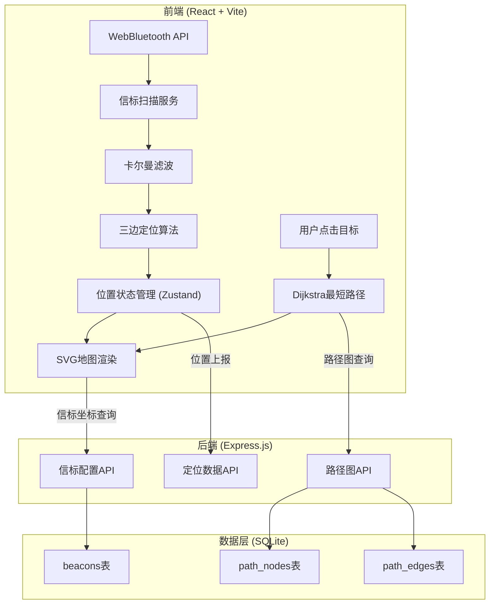
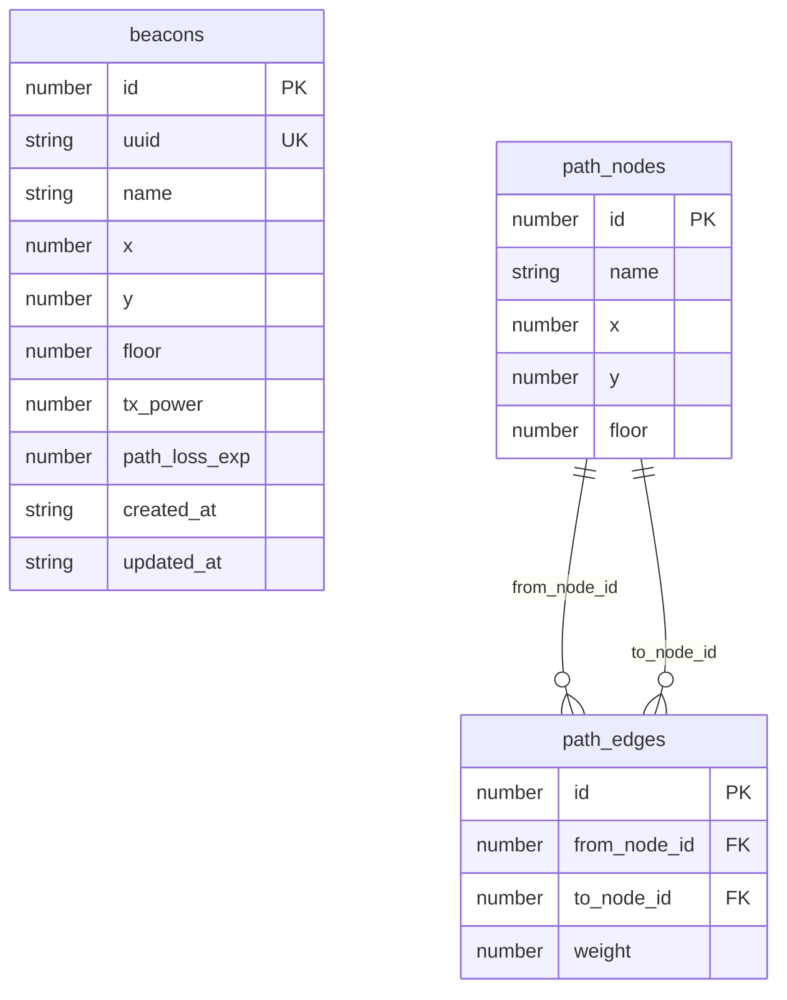

## 1. 架构设计



## 2. 技术说明

- 前端：React@18 + TypeScript + TailwindCSS@3 + Vite
- 初始化工具：vite-init
- 后端：Express@4 + TypeScript（ESM格式）
- 数据库：SQLite（better-sqlite3），轻量级嵌入式数据库，适合单机部署
- 状态管理：Zustand
- 图标库：lucide-react

## 3. 路由定义

| 路由 | 用途 |
|------|------|
| / | 定位大厅 - 主页面，BLE扫描、地图、定位、导航 |
| /beacons | 信标管理 - 注册/编辑/删除信标 |
| /paths | 路径编辑 - 管理路径图节点和边 |

## 4. API定义

### 4.1 信标管理 API

```typescript
interface Beacon {
  id: number;
  uuid: string;
  name: string;
  x: number;
  y: number;
  floor: number;
  tx_power: number;
  path_loss_exp: number;
  created_at: string;
  updated_at: string;
}

// GET /api/beacons - 获取所有信标
// GET /api/beacons/:id - 获取单个信标
// POST /api/beacons - 注册新信标
// PUT /api/beacons/:id - 更新信标
// DELETE /api/beacons/:id - 删除信标
```

### 4.2 路径图 API

```typescript
interface PathNode {
  id: number;
  name: string;
  x: number;
  y: number;
  floor: number;
}

interface PathEdge {
  id: number;
  from_node_id: number;
  to_node_id: number;
  weight: number;
}

// GET /api/path-nodes - 获取所有路径节点
// POST /api/path-nodes - 创建路径节点
// PUT /api/path-nodes/:id - 更新节点
// DELETE /api/path-nodes/:id - 删除节点
// GET /api/path-edges - 获取所有路径边
// POST /api/path-edges - 创建路径边
// DELETE /api/path-edges/:id - 删除边
// GET /api/path-graph - 获取完整路径图（节点+边）
```

### 4.3 定位数据 API

```typescript
interface PositionReport {
  x: number;
  y: number;
  floor: number;
  accuracy: number;
  beacon_readings: { uuid: string; rssi: number; distance: number }[];
}

// POST /api/position - 上报位置数据（可选，用于历史记录）
// GET /api/beacons/coordinates - 获取信标坐标（前端定位计算用）
```

## 5. 服务端架构图


## 6. 数据模型

### 6.1 数据模型定义



### 6.2 数据定义语言

```sql
CREATE TABLE IF NOT EXISTS beacons (
  id INTEGER PRIMARY KEY AUTOINCREMENT,
  uuid TEXT NOT NULL UNIQUE,
  name TEXT NOT NULL,
  x REAL NOT NULL,
  y REAL NOT NULL,
  floor INTEGER NOT NULL DEFAULT 1,
  tx_power REAL NOT NULL DEFAULT -59,
  path_loss_exp REAL NOT NULL DEFAULT 2.0,
  created_at TEXT NOT NULL DEFAULT (datetime('now')),
  updated_at TEXT NOT NULL DEFAULT (datetime('now'))
);

CREATE TABLE IF NOT EXISTS path_nodes (
  id INTEGER PRIMARY KEY AUTOINCREMENT,
  name TEXT NOT NULL,
  x REAL NOT NULL,
  y REAL NOT NULL,
  floor INTEGER NOT NULL DEFAULT 1
);

CREATE TABLE IF NOT EXISTS path_edges (
  id INTEGER PRIMARY KEY AUTOINCREMENT,
  from_node_id INTEGER NOT NULL REFERENCES path_nodes(id) ON DELETE CASCADE,
  to_node_id INTEGER NOT NULL REFERENCES path_nodes(id) ON DELETE CASCADE,
  weight REAL NOT NULL,
  UNIQUE(from_node_id, to_node_id)
);

-- 初始演示数据：3个信标构成定位三角
INSERT INTO beacons (uuid, name, x, y, floor) VALUES
  ('AA-BB-CC-DD-EE-01', '信标A-入口', 100, 100, 1),
  ('AA-BB-CC-DD-EE-02', '信标B-中庭', 500, 100, 1),
  ('AA-BB-CC-DD-EE-03', '信标C-展厅', 300, 400, 1);

-- 初始演示路径图
INSERT INTO path_nodes (name, x, y, floor) VALUES
  ('入口', 100, 100, 1),
  ('大厅', 300, 100, 1),
  ('中庭', 500, 100, 1),
  ('展厅A', 200, 250, 1),
  ('展厅B', 400, 250, 1),
  ('展厅C', 300, 400, 1),
  ('休息区', 500, 400, 1);

INSERT INTO path_edges (from_node_id, to_node_id, weight) VALUES
  (1, 2, 200), (2, 3, 200), (2, 4, 180), (2, 5, 180),
  (4, 5, 200), (4, 6, 200), (5, 6, 180), (5, 7, 200),
  (6, 7, 200);
```
