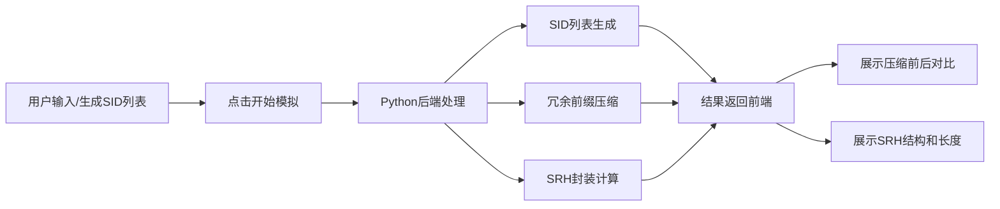

## 1. 产品概述

SRv6模拟器是一个用于演示Segment Routing over IPv6（SRv6）技术的交互式Web应用，帮助网络工程师和学习者理解SRv6的SID列表生成、冗余压缩和SRH封装机制。

- **核心目的**：可视化展示SRv6数据包处理流程，对比压缩前后的SID列表和SRH头部长度
- **目标用户**：网络工程师、网络技术学习者、研究人员
- **产品价值**：通过交互式界面直观理解SRv6压缩机制的优势和工作原理

## 2. 核心功能

### 2.1 用户角色
| 角色 | 注册方式 | 核心权限 |
|------|----------|----------|
| 访客用户 | 无需注册 | 使用所有模拟功能，查看对比结果 |

### 2.2 功能模块
1. **首页**：SID输入配置、压缩算法演示、结果对比展示
2. **SRH结构可视化**：Segment Routing Header的详细结构展示

### 2.3 页面详情
| 页面名称 | 模块名称 | 功能描述 |
|-----------|-------------|---------------------|
| 首页 | 配置区域 | 输入或随机生成SID列表，配置压缩参数 |
| 首页 | 原始SID列表 | 展示未压缩的完整SID列表及总长度 |
| 首页 | 压缩后SID列表 | 展示经过冗余前缀压缩后的SID列表 |
| 首页 | SRH结构展示 | 可视化展示SRH头部的各个字段和最终长度 |
| 首页 | 对比统计 | 压缩率、字节节省、长度对比等统计数据 |

## 3. 核心流程

用户在首页输入或生成SID列表，点击模拟按钮，系统调用Python后端进行SID压缩和SRH封装，前端展示压缩前后对比结果和SRH结构。

## 4. 用户界面设计

### 4.1 设计风格
- **主色调**：深蓝色（#0ea5e9）代表网络技术，搭配深科技灰背景
- **辅助色**：翡翠绿（#10b981）表示压缩成功，琥珀色（#f59e0b）用于数据高亮
- **按钮风格**：圆角矩形，带微妙阴影和悬停动效
- **字体**：使用JetBrains Mono作为代码字体，Space Grotesk作为标题字体
- **布局风格**：卡片式布局，左右分栏对比展示
- **图标风格**：使用Lucide图标库，简洁线性风格

### 4.2 页面设计概述
| 页面名称 | 模块名称 | UI元素 |
|-----------|-------------|-------------|
| 首页 | 配置区 | 输入框、随机生成按钮、压缩算法选择、提交按钮 |
| 首页 | 对比区 | 左右双栏卡片，分别展示原始和压缩后的SID列表 |
| 首页 | SRH可视化 | 分块展示SRH头部结构，带字节标注 |
| 首页 | 统计区 | 数字仪表盘展示压缩率、字节数等关键指标 |

### 4.3 响应式
- 桌面端：左右双栏对比布局
- 平板端：上下堆叠布局
- 移动端：单列流式布局，优化触摸交互

### 4.4 技术氛围感
- 背景使用微妙的网格纹理和渐变
- 代码区域使用等宽字体和语法高亮
- 数据加载和切换使用平滑过渡动画
- 关键数据变化时使用数字滚动动效
