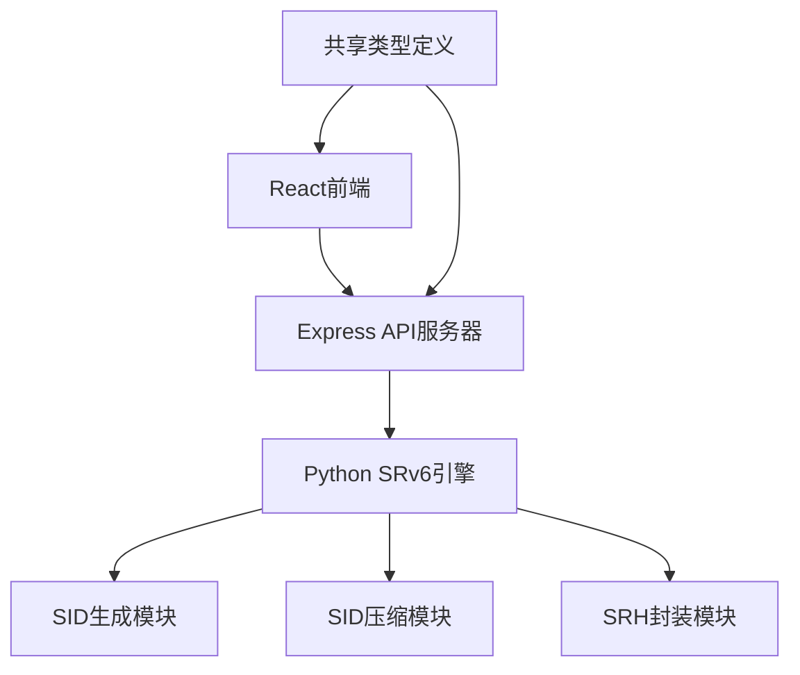

## 1. 架构设计



## 2. 技术描述

- **前端**：React@18 + TypeScript + TailwindCSS@3 + Vite + Zustand
- **后端API**：Express@4 + TypeScript
- **核心引擎**：Python 3.9+（无额外依赖）
- **初始化工具**：vite-init
- **前后端通信**：RESTful API + JSON

## 3. 技术选型说明

- **Python作为核心引擎**：SRv6算法逻辑复杂，Python在网络编程和快速原型开发方面具有优势
- **Express作为API网关**：接收前端请求，调用Python脚本并返回结果
- **React作为前端**：提供交互式用户界面和数据可视化

## 4. 目录结构

```
sp3/
├── src/                    # 前端代码
│   ├── components/        # React组件
│   ├── pages/            # 页面组件
│   ├── utils/            # 工具函数
│   ├── store/            # Zustand状态管理
│   └── App.tsx
├── api/                   # Express后端
│   └── index.ts
├── python/                # Python SRv6引擎
│   ├── srv6_simulator.py
│   └── test_srv6.py
├── shared/                # 共享类型定义
│   └── types.ts
└── .trae/documents/      # 项目文档
```

## 5. 路由定义

| 路由 | 用途 |
|-------|---------|
| / | 首页 - SRv6模拟器主界面 |

## 6. API 定义

### 6.1 类型定义

```typescript
interface SID {
  address: string;        // IPv6地址
  function: string;       // SRv6功能类型
  description: string;    // 描述
}

interface SRHField {
  name: string;           // 字段名称
  value: string;          // 字段值
  length: number;         // 长度（字节）
  description: string;    // 字段说明
}

interface CompressionResult {
  originalSids: SID[];            // 原始SID列表
  compressedSids: SID[];          // 压缩后SID列表
  originalTotalLength: number;    // 原始总长度（字节）
  compressedTotalLength: number;  // 压缩后总长度（字节）
  compressionRatio: number;       // 压缩率
  bytesSaved: number;             // 节省字节数
  srhFields: SRHField[];          // SRH字段列表
  srhTotalLength: number;         // SRH总长度（字节）
  sharedPrefix: string;           // 共享前缀
  compressionMethod: string;      // 使用的压缩方法
}
```

### 6.2 API 接口

#### POST /api/simulate
生成SID列表并执行压缩和SRH封装

**请求体：**
```typescript
interface SimulateRequest {
  sidCount?: number;              // 生成SID数量（默认5）
  customSids?: string[];          // 自定义SID列表
  prefix?: string;                // 公共前缀（默认随机）
  compressionMethod?: 'prefix' | 'full'; // 压缩方法
}
```

**响应体：**
```typescript
interface SimulateResponse {
  success: boolean;
  data: CompressionResult;
  error?: string;
}
```

#### GET /api/health
健康检查

**响应体：**
```typescript
{
  status: 'ok',
  pythonAvailable: boolean,
  timestamp: string
}
```

## 7. Python 核心模块

### 7.1 模块功能

1. **SID生成**：
   - 生成符合SRv6格式的IPv6 SID地址
   - 支持指定公共前缀和功能类型
   - 支持End、End.X、End.DX4、End.DX6等常见SRv6功能

2. **SID压缩**：
   - **前缀压缩**：识别并提取连续SID的共享前缀，只存储差异部分
   - **完全压缩**：去重完全相同的SID

3. **SRH封装**：
   - 计算Next Header、Hdr Ext Len、Routing Type、Segments Left等字段
   - 计算最终SRH头部长度
   - 生成完整的SRH结构描述

### 7.2 Python 脚本接口

```bash
# 调用方式
python3 python/srv6_simulator.py --mode simulate --count 5 --method prefix

# 或通过stdin传递参数
echo '{"sidCount": 5, "compressionMethod": "prefix"}' | python3 python/srv6_simulator.py
```

### 7.3 SRH 结构说明

SRH（Segment Routing Header）结构：
| 字段 | 长度（字节） | 说明 |
|------|-------------|------|
| Next Header | 1 | 下一个头部类型 |
| Hdr Ext Len | 1 | 头部扩展长度（8字节单位） |
| Routing Type | 1 | 路由类型（SRH为4） |
| Segments Left | 1 | 剩余段数 |
| Last Entry | 1 | 最后一个SID的索引 |
| Flags | 1 | 标志位 |
| Tag | 2 | 标签 |
| Segment List | 16 * N | SID列表（每个16字节） |
