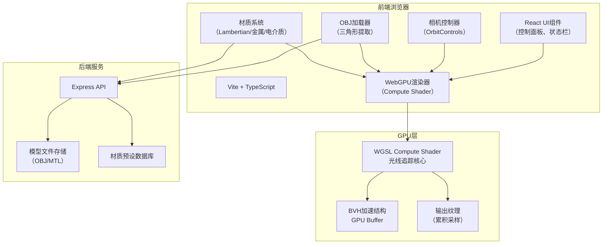
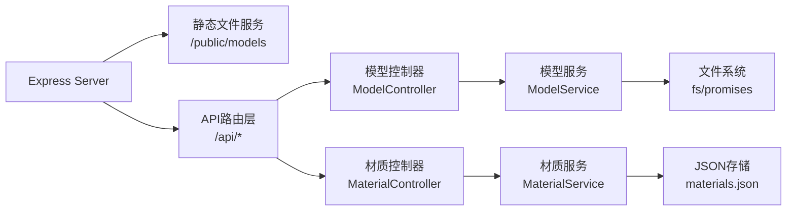
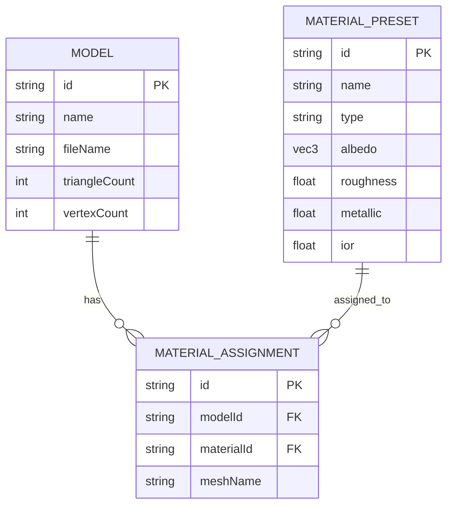

## 1. 架构设计



## 2. 技术描述

- **前端框架**: React@18 + TypeScript@5 + Vite@5
- **样式**: TailwindCSS@3 + CSS Variables
- **WebGPU**: 原生WebGPU API，WGSL Compute Shader
- **状态管理**: Zustand@4
- **后端**: Express@4 + TypeScript
- **数据存储**: 本地文件系统（模型文件）+ JSON（材质预设）
- **文件处理**: 前端OBJ解析 + 后端静态文件服务

## 3. 路由定义

| 路由 | 用途 |
|-------|---------|
| / | 主渲染页面 |
| /api/models | 获取可用模型列表 |
| /api/models/:name | 下载指定模型文件 |
| /api/materials | 获取材质预设列表 |
| /api/materials/:id | 获取/更新材质预设 |

## 4. API 定义

### 4.1 类型定义

```typescript
interface ModelInfo {
  id: string;
  name: string;
  fileName: string;
  triangleCount: number;
  vertexCount: number;
  thumbnail?: string;
}

interface MaterialPreset {
  id: string;
  name: string;
  type: 'lambertian' | 'metal' | 'dielectric';
  albedo: [number, number, number];
  roughness?: number;
  metallic?: number;
  ior?: number;
}

interface OBJData {
  vertices: Float32Array;
  normals: Float32Array;
  uvs: Float32Array;
  indices: Uint32Array;
  materials: MaterialAssignment[];
}

interface CameraState {
  position: [number, number, number];
  target: [number, number, number];
  fov: number;
  aspect: number;
}

interface RenderParams {
  samplesPerPixel: number;
  maxBounces: number;
  resolution: [number, number];
  enableNoise: boolean;
}
```

### 4.2 接口定义

**GET /api/models**
- 响应: `{ models: ModelInfo[] }`

**GET /api/models/:name**
- 响应: OBJ文件流（Content-Type: model/obj）

**GET /api/materials**
- 响应: `{ materials: MaterialPreset[] }`

**POST /api/materials**
- 请求体: `MaterialPreset`
- 响应: `{ success: boolean; id: string }`

## 5. 服务器架构图



## 6. 数据模型

### 6.1 数据模型定义



### 6.2 初始化数据

```json
// materials.json - 初始材质预设
{
  "materials": [
    {
      "id": "mat-001",
      "name": "红色漫反射",
      "type": "lambertian",
      "albedo": [0.9, 0.1, 0.1]
    },
    {
      "id": "mat-002",
      "name": "金色金属",
      "type": "metal",
      "albedo": [1.0, 0.85, 0.3],
      "roughness": 0.1
    },
    {
      "id": "mat-003",
      "name": "玻璃",
      "type": "dielectric",
      "albedo": [1.0, 1.0, 1.0],
      "ior": 1.5
    }
  ]
}
```
