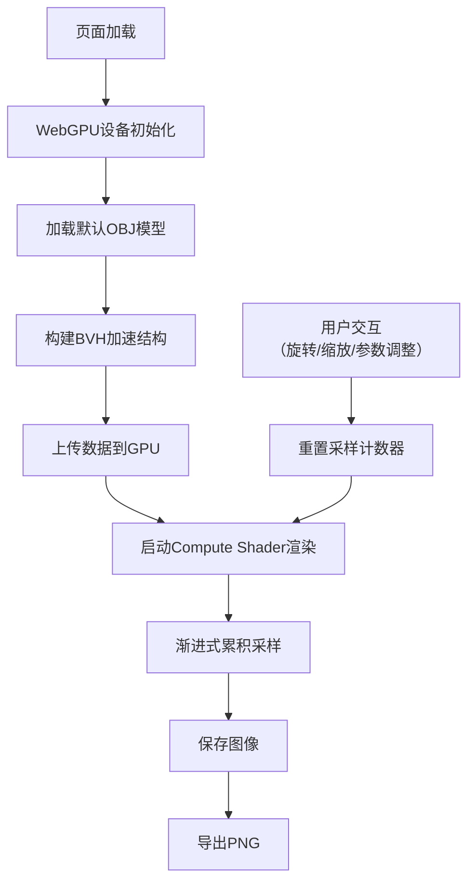

## 1. 产品概述

基于WebGPU Compute Shader的实时光线追踪器，支持加载OBJ模型、多种材质渲染和交互式相机控制。面向图形开发者和3D艺术家，提供高性能的浏览器端光线追踪预览能力。

## 2. 核心功能

### 2.1 用户角色

| 角色 | 注册方式 | 核心权限 |
|------|----------|----------|
| 普通用户 | 无需注册 | 上传模型、调整渲染参数、导出渲染结果 |

### 2.2 功能模块

1. **渲染主视图**: WebGPU画布，实时显示光线追踪结果，支持渐进式渲染
2. **模型管理面板**: 加载OBJ模型，选择内置场景（Cornell Box, Sponza）
3. **材质编辑器**: 配置Lambertian、金属、电介质材质参数
4. **相机控制面板**: 轨道控制、视角调整、渲染参数设置
5. **渲染状态栏**: 显示当前采样数、FPS、渲染进度

### 2.3 页面详情

| 页面名称 | 模块名称 | 功能描述 |
|-----------|-------------|---------------------|
| 主页面 | 渲染画布 | 全屏WebGPU渲染，鼠标拖拽控制相机，滚轮缩放 |
| 主页面 | 左侧控制面板 | 模型选择、材质预设、渲染参数调整 |
| 主页面 | 底部状态栏 | 采样进度、FPS、三角形数量、光线信息 |
| 主页面 | 顶部工具栏 | 重置相机、保存图像、切换渲染模式 |

## 3. 核心流程

用户进入页面 → 系统初始化WebGPU → 加载默认Cornell Box场景 → 相机自动开始渐进式渲染 → 用户拖拽旋转相机 → 系统重置采样并重新追踪 → 用户调整材质参数 → 实时更新渲染结果 → 用户保存渲染图像

## 4. 用户界面设计

### 4.1 设计风格

**科技极简风** - 深色主题，突出3D渲染内容
- **主色调**: 深灰色背景 `#0a0a0f`，边框 `#1e1e2e`
- **强调色**: 霓虹蓝 `#3b82f6`，用于高亮和进度指示
- **文字**: 白色 `#ffffff` 主文字，灰色 `#9ca3af` 辅助文字
- **字体**: 标题使用 `Space Grotesk`，正文使用 `JetBrains Mono` 等宽字体
- **控件**: 圆角 `8px`，微妙发光效果，毛玻璃背景

### 4.2 页面设计概述

| 页面名称 | 模块名称 | UI元素 |
|-----------|-------------|-------------|
| 主页面 | 渲染画布 | 全屏WebGPU Canvas，居中显示，边框高亮 |
| 主页面 | 左侧控制面板 | 固定宽度280px，半透明背景，分组折叠面板 |
| 主页面 | 底部状态栏 | 全宽，半透明，显示状态信息 |
| 主页面 | 顶部工具栏 | 悬浮按钮组，图标+文字提示 |

### 4.3 响应性

- 桌面端：左侧固定控制面板，底部状态栏
- 平板端：控制面板可折叠，保持渲染区域最大化
- 移动端：隐藏控制面板，仅保留核心渲染和触摸控制

### 4.4 3D场景指导

- **环境**: Cornell Box经典测试场景，提供精确的光线反弹参考
- **光照**: 区域光+环境光，支持软阴影和全局光照
- **相机**: 透视投影，FOV 45°，轨道控制环绕目标点
- **后处理**: 色调映射、伽马校正、降噪（可选）
- **性能目标**: 1024x768分辨率下，首帧<2s，渐进式采样流畅
