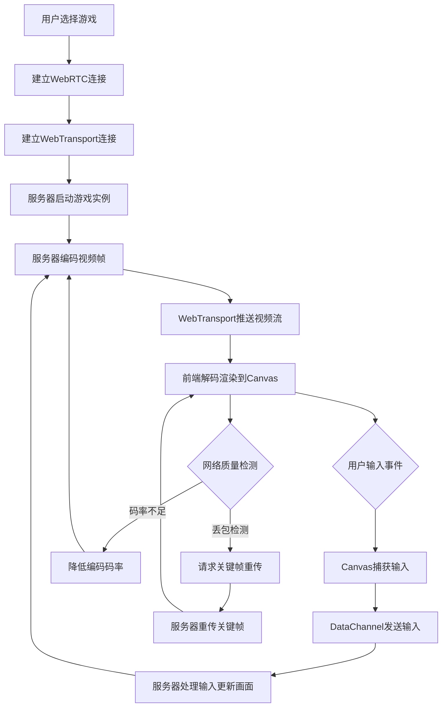

## 1. 产品概述

云游戏流媒体平台——基于WebRTC + WebTransport的低延迟云端游戏串流解决方案，让用户在浏览器中即可畅玩高质量游戏，无需下载安装。通过双通道架构（WebRTC DataChannel传输操控输入、WebTransport推送高吞吐视频流），实现端到端低延迟交互体验。

- 目标用户：移动端/低端设备玩家、云游戏服务开发者
- 核心价值：零安装即玩、自适应码率保障流畅体验、可定制触控操控

## 2. 核心功能

### 2.1 用户角色

| 角色 | 注册方式 | 核心权限 |
|------|----------|----------|
| 玩家 | 免注册直接进入 | 选择游戏、操控游戏、自定义触控布局 |

### 2.2 功能模块

1. **游戏大厅页**：游戏列表、连接状态、启动入口
2. **游戏串流页**：视频流播放、输入捕获、触控overlay、码率自适应状态

### 2.3 页面详情

| 页面名称 | 模块名称 | 功能描述 |
|----------|----------|----------|
| 游戏大厅页 | 游戏列表 | 展示可用的云游戏卡片，点击进入游戏串流 |
| 游戏大厅页 | 连接状态 | 显示WebRTC/WebTransport连接状态指示器 |
| 游戏串流页 | 视频播放器 | 基于Canvas/WebCodecs渲染WebTransport推来的视频帧 |
| 游戏串流页 | 输入捕获 | Canvas层捕获鼠标/键盘/触控事件，经WebRTC DataChannel发送 |
| 游戏串流页 | 触控Overlay | 虚拟摇杆+自定义按钮，可拖拽调整位置 |
| 游戏串流页 | 码率状态 | 显示当前码率、帧率、丢包率、延迟等指标 |
| 游戏串流页 | 关键帧重传 | 检测丢包后请求服务器重传关键帧恢复画面 |

## 3. 核心流程

用户打开大厅页 → 选择游戏 → 前端建立WebRTC连接（DataChannel用于输入）→ 前端建立WebTransport连接（接收视频流）→ 服务器启动游戏实例 → 服务器编码视频帧并通过WebTransport推送 → 前端解码渲染到Canvas → 用户输入经DataChannel发送到服务器 → 服务器处理输入更新游戏画面 → 自适应码率根据网络状况调整编码参数 → 丢包时请求关键帧重传恢复画面

## 4. 用户界面设计

### 4.1 设计风格

- 主色调：深色科技风（#0a0e17 深空黑背景 + #00f0ff 赛博青高亮 + #ff3366 霓虹红强调）
- 辅助色：#1a1f2e 面板背景、#2a3040 卡片背景
- 按钮风格：圆角微发光边框，hover时边框亮度增强
- 字体：Orbitron（标题/数字）+ Source Sans 3（正文）
- 布局风格：沉浸式全屏游戏画面，浮动面板式状态栏
- 图标风格：线条发光风格（lucide-react）

### 4.2 页面设计概览

| 页面名称 | 模块名称 | UI元素 |
|----------|----------|--------|
| 游戏大厅页 | 游戏列表 | 深色网格卡片，封面图+游戏名+启动按钮，发光边框hover效果 |
| 游戏大厅页 | 连接状态 | 右上角浮动胶囊，绿色圆点+延迟数字，脉冲动画 |
| 游戏串流页 | 视频播放器 | 全屏Canvas，16:9比例自适应，黑色填充余下空间 |
| 游戏串流页 | 触控Overlay | 半透明虚拟摇杆（左侧）+ A/B按钮（右侧），拖拽移动位置 |
| 游戏串流页 | 码率状态 | 左上角浮动小面板，显示码率/帧率/丢包率/延迟，半透明背景 |
| 游戏串流页 | 控制栏 | 底部悬浮栏：全屏/静音/退出按钮，hover显示 |

### 4.3 响应式设计

- 桌面端优先：全屏Canvas + 键鼠操控为主
- 移动端适配：触控Overlay自动显示，虚拟摇杆+按钮
- 横屏锁定提示：竖屏时提示用户旋转设备
- 触控优化：大尺寸触控区域，触觉反馈

### 4.4 3D场景指南（不适用）
