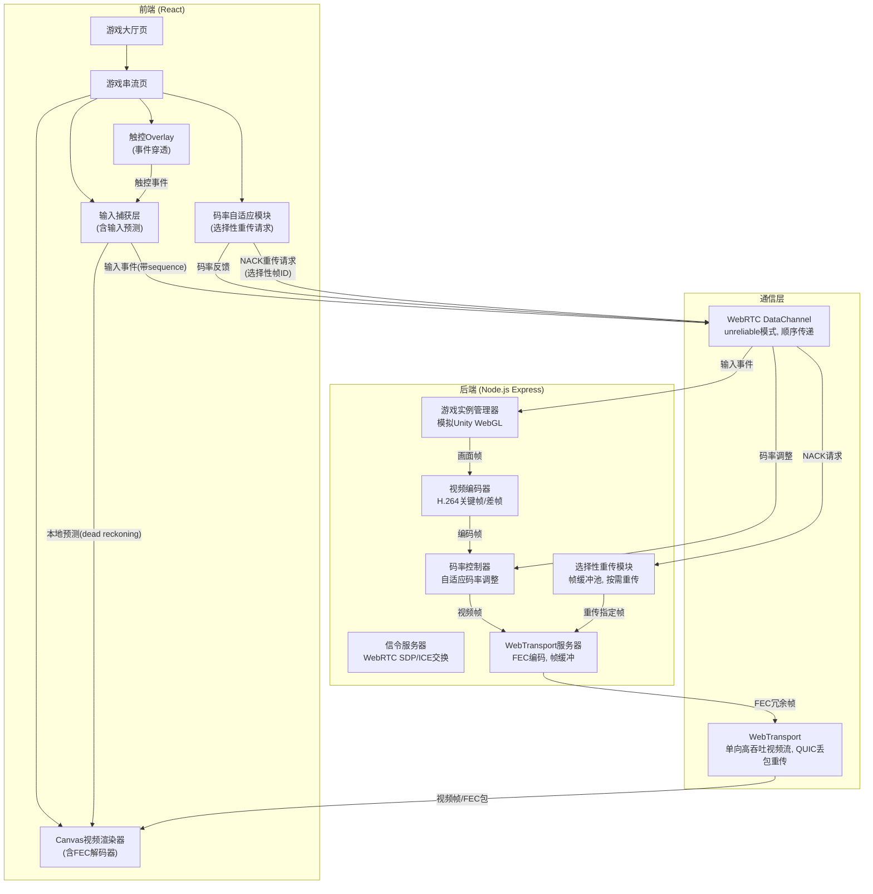
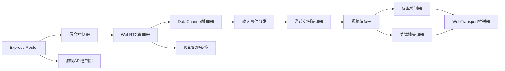

## 1. 架构设计



## 2. 技术说明

- 前端：React@18 + tailwindcss@3 + vite + zustand
- 初始化工具：vite-init (react-express-ts模板)
- 后端：Express@4 + Node.js WebTransport API
- 数据库：无（纯实时通信，无持久化需求）
- 通信协议：WebRTC (SCTP) + WebTransport (QUIC)
  - WebRTC DataChannel: `maxRetransmits: 0` (unreliable), `ordered: true` (顺序传递)
  - WebTransport: 单通道推流, QUIC内置重传 + 应用层FEC
- 视频编解码：前端 Canvas 2D 渲染 GameObject, 后端模拟编码
- 游戏模拟：Canvas 2D 渲染替代Unity WebGL，服务器端运行游戏逻辑
- 抗丢包：
  - FEC（前向纠错）：XOR编码, 每4帧插入1个冗余包
  - 选择性重传（NACK）：客户端检测到丢包后只请求缺失的特定帧
  - 帧缓冲池：服务器缓存最近60帧用于重传
- 输入延迟优化：
  - WebRTC DataChannel unreliable模式，减少ACK等待时间
  - Dead Reckoning输入预测：客户端在等待服务器确认前先本地预测玩家移动
  - 基于RTT的预测平滑：根据网络RTT动态调整预测幅度
- 触控优化：
  - 触控Overlay按区域划分事件捕获和穿透
  - 游戏UI区域（分数、波次、Game Over）自动穿透触控事件
  - 边缘拖拽区域用于操控，中央区域用于查看

## 3. 路由定义

| 路由 | 用途 |
|------|------|
| / | 游戏大厅页，展示游戏列表和连接入口 |
| /play/:gameId | 游戏串流页，全屏视频流+输入捕获+触控overlay |

## 4. API定义

### 4.1 WebSocket信令API

```typescript
interface SignalingMessage {
  type: 'offer' | 'answer' | 'ice-candidate' | 'start-game' | 'stop-game';
  payload: any;
}

interface RTCOfferPayload {
  sdp: string;
  gameId: string;
}

interface RTCAnswerPayload {
  sdp: string;
}

interface ICECandidatePayload {
  candidate: RTCIceCandidateInit;
}
```

### 4.2 WebRTC DataChannel 输入协议

```typescript
interface InputEvent {
  type: 'mousemove' | 'mousedown' | 'mouseup' | 'keydown' | 'keyup' | 'touchstart' | 'touchmove' | 'touchend';
  timestamp: number;
  data: {
    x?: number;
    y?: number;
    button?: number;
    key?: string;
    touches?: Array<{ id: number; x: number; y: number }>;
  };
}

interface BitrateFeedback {
  type: 'bitrate-feedback';
  timestamp: number;
  data: {
    targetBitrate: number;
    packetLoss: number;
    rtt: number;
  };
}

interface KeyframeRequest {
  type: 'keyframe-request';
  timestamp: number;
  data: {
    frameId: number;
  };
}
```

### 4.3 WebTransport 视频帧协议

```typescript
interface VideoFrame {
  frameId: number;
  isKeyframe: boolean;
  timestamp: number;
  width: number;
  height: number;
  bitrate: number;
  data: ArrayBuffer;
}
```

### 4.4 HTTP API

```typescript
GET /api/games
Response: Array<{ id: string; name: string; description: string; thumbnail: string; }>

POST /api/signal
Body: SignalingMessage
Response: SignalingMessage
```

## 5. 服务器架构图



## 6. 数据模型（不适用）

本项目为纯实时通信系统，不使用数据库。游戏列表为静态配置，会话状态保存在内存中。
