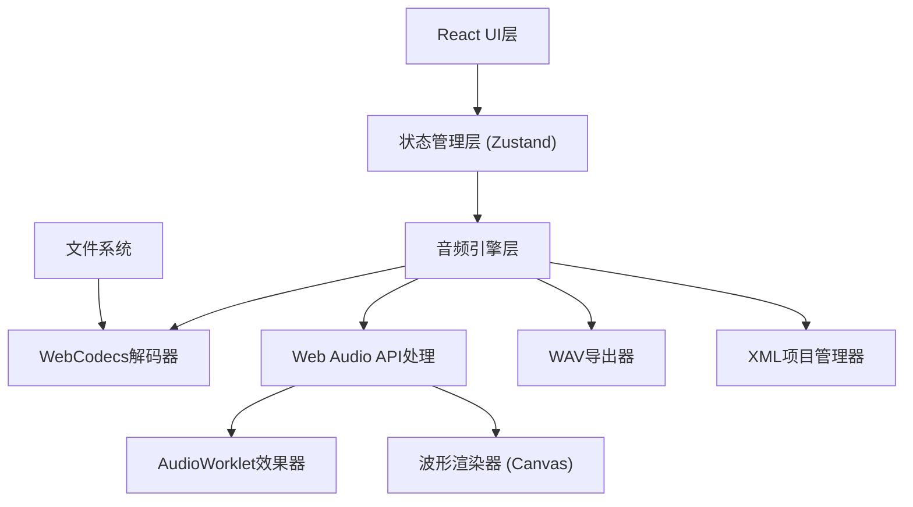

## 1. 架构设计



## 2. 技术描述

- **前端框架**：React@18 + TypeScript
- **构建工具**：Vite@5
- **样式方案**：TailwindCSS@3 + SCSS
- **状态管理**：Zustand（轻量，适合音频实时状态）
- **音频技术**：
  - WebCodecs API：MP3/AAC解码
  - Web Audio API：音频处理、播放控制
  - AudioWorklet：效果器算法（压缩器、均衡器、限制器）
- **波形渲染**：Canvas 2D API
- **文件格式**：
  - 导出：WAV (PCM)
  - 项目保存：XML

## 3. 目录结构

```
src/
├── components/
│   ├── Toolbar/          # 顶部工具栏
│   ├── Timeline/         # 多轨时间轴
│   ├── TrackControl/     # 轨道控制面板
│   ├── EffectsPanel/     # 效果器面板
│   └── PlaybackBar/      # 播放控制栏
├── audio/
│   ├── decoder.ts        # WebCodecs解码器
│   ├── engine.ts         # 音频引擎核心
│   ├── worklets/         # AudioWorklet处理器
│   │   ├── compressor.ts
│   │   ├── equalizer.ts
│   │   └── limiter.ts
│   ├── effects/          # 效果器封装
│   └── exporters/        # WAV导出、XML项目管理
├── store/
│   └── useAudioStore.ts  # Zustand状态管理
├── hooks/
│   ├── useAudioContext.ts
│   └── useWaveform.ts    # 波形渲染Hook
├── types/
│   └── audio.ts          # 类型定义
└── utils/
    └── audioUtils.ts
```

## 4. 核心类型定义

```typescript
interface Track {
  id: string;
  name: string;
  audioBuffer: AudioBuffer | null;
  startTime: number;
  duration: number;
  trimStart: number;
  trimEnd: number;
  volume: number;
  pan: number;
  muted: boolean;
  solo: boolean;
  color: string;
  effects: EffectChain;
}

interface EffectChain {
  compressor: CompressorParams;
  equalizer: EqualizerParams;
  limiter: LimiterParams;
  bypassed: boolean;
}

interface Project {
  name: string;
  sampleRate: number;
  duration: number;
  tracks: Track[];
}
```

## 5. 关键技术实现

### 5.1 WebCodecs 解码流程
1. 使用 `AudioDecoder` 配置 MP3/AAC 解码
2. 读取文件为 `ArrayBuffer`，创建 `EncodedAudioChunk`
3. 解码输出为 `AudioData`，转换为 `AudioBuffer`

### 5.2 AudioWorklet 效果器
- **压缩器**：基于RMS检测，攻击/释放时间控制，比率调节
- **均衡器**：3段参数均衡（低/中/高频），Bell/Peaking滤波
- **限制器**：Look-ahead峰值检测，砖墙限制，软拐点

### 5.3 波形渲染优化
- 离线预渲染波形峰值数据
- 分块渲染，支持大文件
- 缩放时动态调整采样率

### 5.4 XML 项目格式
```xml
<project name="MyProject" sampleRate="44100">
  <tracks>
    <track id="1" name="Vocal" color="#ff6b6b">
      <audio source="..." startTime="0" trimStart="0.5" trimEnd="10.2"/>
      <volume value="0.8"/>
      <effects>
        <compressor threshold="-20" ratio="4" attack="10" release="100" bypass="false"/>
      </effects>
    </track>
  </tracks>
</project>
```
