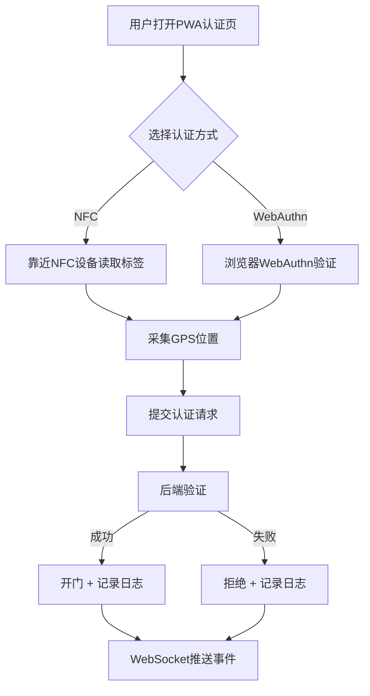

## 1. 产品概述

智能门禁控制系统——基于PWA和Node.js的全栈门禁管理平台，支持NFC手机和物理密钥（YubiKey）通过WebNFC与WebAuthn进行身份认证，提供管理员密钥注册绑定、门禁日志追踪（含GPS位置）、远程开门及WebSocket实时事件推送能力。

- 目标用户：企业/园区物业管理人员、安保人员、普通通行用户
- 核心价值：无接触、高安全性的门禁认证方案，统一管理所有密钥与通行记录，实时掌控门禁状态

## 2. 核心功能

### 2.1 用户角色

| 角色 | 注册方式 | 核心权限 |
|------|----------|----------|
| 普通用户 | 管理员创建账户 | NFC/WebAuthn认证开门、查看个人通行记录 |
| 管理员 | 系统初始化创建 | 注册/注销密钥、绑定用户、远程开门、查看所有日志、管理门禁点 |

### 2.2 功能模块

1. **认证页面**：WebNFC读卡认证、WebAuthn密钥认证、GPS位置采集
2. **管理员后台-密钥管理**：注册新密钥（WebAuthn注册流程）、绑定/解绑用户、查看密钥列表
3. **管理员后台-门禁日志**：实时日志流、按时间/密钥/位置筛选、管理员操作标记
4. **管理员后台-远程开门**：一键远程开门、操作确认弹窗、记录为管理员操作
5. **实时事件面板**：WebSocket推送门禁事件、事件通知与声音提醒

### 2.3 页面详情

| 页面名称 | 模块名称 | 功能描述 |
|----------|----------|----------|
| 认证页面 | NFC认证区 | 提示用户将NFC设备靠近手机，读取NFC标签数据并提交认证 |
| 认证页面 | WebAuthn认证区 | 调用浏览器WebAuthn API，使用已注册的密钥完成挑战-响应认证 |
| 认证页面 | GPS位置采集 | 采集当前GPS坐标随认证请求提交 |
| 管理员后台 | 密钥管理 | 列出所有已注册密钥，支持注册新密钥、绑定/解绑用户、删除密钥 |
| 管理员后台 | 门禁日志 | 展示所有认证记录，包含时间、密钥ID、用户、GPS位置、认证方式、结果 |
| 管理员后台 | 远程开门 | 选择门禁点，确认后远程开门，记录为管理员操作 |
| 管理员后台 | 实时事件 | WebSocket实时推送门禁事件，事件卡片包含时间、用户、结果、位置 |

## 3. 核心流程

**用户认证开门流程**：用户打开PWA认证页面 → 选择认证方式（NFC/WebAuthn） → NFC模式下靠近设备读取标签 / WebAuthn模式下浏览器弹出密钥验证 → 采集GPS位置 → 提交认证请求 → 后端验证 → 成功则开门并记录日志 → WebSocket推送事件给管理员

**管理员注册密钥流程**：管理员登录后台 → 进入密钥管理 → 点击注册新密钥 → 选择用户 → 浏览器WebAuthn注册流程 → 密钥凭证存储到后端 → 绑定完成

**远程开门流程**：管理员点击远程开门 → 选择门禁点 → 确认弹窗 → 后端执行开门并记录为管理员操作 → WebSocket推送事件

## 4. 用户界面设计

### 4.1 设计风格

- 主色调：深灰/炭黑（#1a1a2e）搭配翠绿荧光（#00e676）——科技安全风格
- 辅助色：冷灰（#2d2d44）、警报红（#ff5252）、信息蓝（#448aff）
- 按钮：圆角矩形，荧光绿主按钮，灰色次按钮，红色危险按钮
- 字体：JetBrains Mono（代码/数据展示）+ Noto Sans SC（中文正文）
- 布局：侧边栏导航 + 主内容区，卡片式信息展示
- 图标：Lucide图标库，线条风格

### 4.2 页面设计概述

| 页面名称 | 模块名称 | UI元素 |
|----------|----------|--------|
| 认证页面 | NFC认证区 | 大号NFC图标动画、脉冲波纹效果、状态文字提示 |
| 认证页面 | WebAuthn认证区 | 密钥图标、认证按钮、认证状态动画 |
| 认证页面 | GPS位置采集 | 小地图标记、坐标文字、信号状态 |
| 管理员后台 | 侧边栏导航 | 深色侧边栏、图标+文字、当前页高亮 |
| 管理员后台 | 密钥管理 | 密钥列表表格、注册弹窗、操作按钮 |
| 管理员后台 | 门禁日志 | 日志表格、筛选栏、实时刷新标记 |
| 管理员后台 | 远程开门 | 门禁点卡片、开门按钮、确认对话框 |
| 管理员后台 | 实时事件 | 事件卡片流、时间戳、类型图标、声音开关 |

### 4.3 响应式

- 桌面优先设计，管理员后台主要在桌面端使用
- 认证页面适配移动端（PWA场景），大按钮、触摸友好
- 表格在移动端可横向滚动或切换为卡片视图

### 4.4 3D场景指导

不适用
