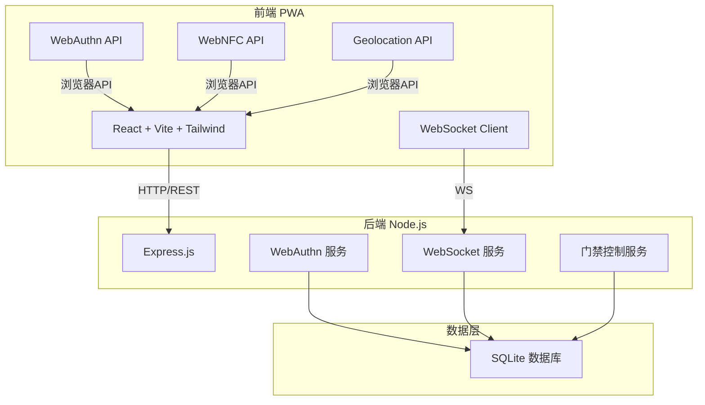
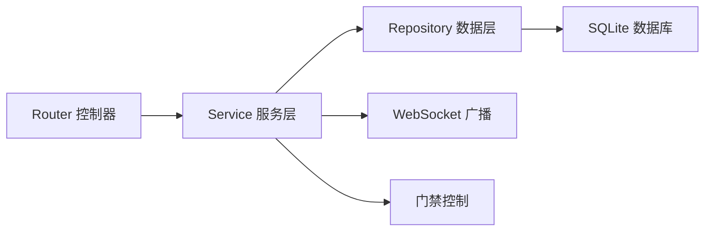
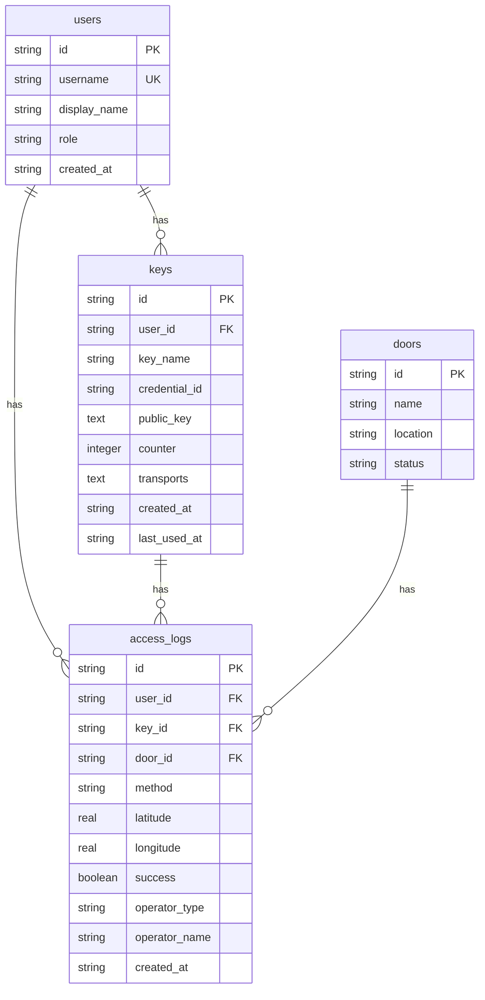

## 1. 架构设计



## 2. 技术说明

- 前端：React@18 + Tailwind CSS@3 + Vite（PWA模式）
- 初始化工具：vite-init（react-express-ts模板）
- 后端：Express@4 + TypeScript（ESM格式）
- 数据库：SQLite（better-sqlite3）
- WebAuthn：@simplewebauthn/server + @simplewebauthn/browser
- WebSocket：ws库
- PWA：vite-plugin-pwa
- 状态管理：zustand
- 图标：lucide-react

## 3. 路由定义

| 路由 | 用途 |
|------|------|
| `/` | 认证首页（NFC/WebAuthn认证入口） |
| `/admin` | 管理员后台布局 |
| `/admin/keys` | 密钥管理页面 |
| `/admin/logs` | 门禁日志页面 |
| `/admin/remote` | 远程开门页面 |
| `/admin/events` | 实时事件面板 |

## 4. API定义

### 4.1 认证相关

```typescript
interface AuthChallengeRequest {
  username: string;
}

interface AuthChallengeResponse {
  challenge: string;
  allowCredentials: PublicKeyCredentialDescriptor[];
}

interface AuthVerifyRequest {
  username: string;
  credential: AuthenticationCredentialJSON;
  gps: { latitude: number; longitude: number };
  method: "webauthn" | "nfc";
  nfcTagId?: string;
  doorId: string;
}

interface AuthVerifyResponse {
  success: boolean;
  message: string;
  logId?: string;
}
```

### 4.2 密钥注册相关

```typescript
interface RegStartRequest {
  username: string;
  keyName: string;
}

interface RegStartResponse {
  challenge: string;
  user: { id: string; name: string; displayName: string };
  excludeCredentials: PublicKeyCredentialDescriptor[];
}

interface RegFinishRequest {
  username: string;
  credential: RegistrationCredentialJSON;
  keyName: string;
}

interface RegFinishResponse {
  success: boolean;
  keyId: string;
  message: string;
}
```

### 4.3 密钥管理

```typescript
interface KeyInfo {
  id: string;
  keyName: string;
  credentialId: string;
  username: string;
  createdAt: string;
  lastUsedAt: string | null;
  transports: string[];
}

interface KeyListResponse {
  keys: KeyInfo[];
  total: number;
}

interface KeyDeleteRequest {
  keyId: string;
}
```

### 4.4 门禁日志

```typescript
interface AccessLog {
  id: string;
  timestamp: string;
  username: string;
  keyId: string;
  keyName: string;
  doorId: string;
  doorName: string;
  method: "webauthn" | "nfc" | "remote";
  gps: { latitude: number; longitude: number } | null;
  success: boolean;
  operatorType: "user" | "admin";
  operatorName: string;
}

interface LogQueryRequest {
  page: number;
  pageSize: number;
  startTime?: string;
  endTime?: string;
  keyId?: string;
  doorId?: string;
  method?: string;
  success?: boolean;
}

interface LogQueryResponse {
  logs: AccessLog[];
  total: number;
  page: number;
  pageSize: number;
}
```

### 4.5 远程开门

```typescript
interface RemoteOpenRequest {
  doorId: string;
  operatorName: string;
}

interface RemoteOpenResponse {
  success: boolean;
  message: string;
  logId: string;
}
```

### 4.6 门禁点管理

```typescript
interface DoorInfo {
  id: string;
  name: string;
  location: string;
  status: "online" | "offline";
}

interface DoorListResponse {
  doors: DoorInfo[];
}
```

### 4.7 WebSocket事件

```typescript
interface AccessEvent {
  type: "access_granted" | "access_denied" | "remote_open";
  timestamp: string;
  username: string;
  keyName: string;
  doorName: string;
  method: string;
  gps: { latitude: number; longitude: number } | null;
  success: boolean;
  operatorType: "user" | "admin";
}
```

## 5. 服务端架构图



## 6. 数据模型

### 6.1 数据模型定义



### 6.2 数据定义语言

```sql
CREATE TABLE users (
  id TEXT PRIMARY KEY,
  username TEXT UNIQUE NOT NULL,
  display_name TEXT NOT NULL,
  role TEXT NOT NULL CHECK(role IN ('user', 'admin')),
  created_at TEXT NOT NULL DEFAULT (datetime('now'))
);

CREATE TABLE keys (
  id TEXT PRIMARY KEY,
  user_id TEXT NOT NULL REFERENCES users(id) ON DELETE CASCADE,
  key_name TEXT NOT NULL,
  credential_id TEXT NOT NULL,
  public_key TEXT NOT NULL,
  counter INTEGER NOT NULL DEFAULT 0,
  transports TEXT,
  created_at TEXT NOT NULL DEFAULT (datetime('now')),
  last_used_at TEXT
);

CREATE TABLE doors (
  id TEXT PRIMARY KEY,
  name TEXT NOT NULL,
  location TEXT NOT NULL,
  status TEXT NOT NULL DEFAULT 'online' CHECK(status IN ('online', 'offline'))
);

CREATE TABLE access_logs (
  id TEXT PRIMARY KEY,
  user_id TEXT REFERENCES users(id),
  key_id TEXT REFERENCES keys(id),
  door_id TEXT NOT NULL REFERENCES doors(id),
  method TEXT NOT NULL CHECK(method IN ('webauthn', 'nfc', 'remote')),
  latitude REAL,
  longitude REAL,
  success INTEGER NOT NULL DEFAULT 0,
  operator_type TEXT NOT NULL CHECK(operator_type IN ('user', 'admin')),
  operator_name TEXT NOT NULL,
  created_at TEXT NOT NULL DEFAULT (datetime('now'))
);

CREATE INDEX idx_access_logs_created_at ON access_logs(created_at);
CREATE INDEX idx_access_logs_user_id ON access_logs(user_id);
CREATE INDEX idx_access_logs_door_id ON access_logs(door_id);
CREATE INDEX idx_keys_user_id ON keys(user_id);
CREATE INDEX idx_keys_credential_id ON keys(credential_id);

INSERT INTO users (id, username, display_name, role) VALUES
  ('admin-001', 'admin', '系统管理员', 'admin'),
  ('user-001', 'zhangsan', '张三', 'user'),
  ('user-002', 'lisi', '李四', 'user');

INSERT INTO doors (id, name, location, status) VALUES
  ('door-001', 'A栋大门', 'A栋1楼', 'online'),
  ('door-002', 'B栋后门', 'B栋1楼', 'online'),
  ('door-003', '机房门', 'C栋2楼', 'online');
```
