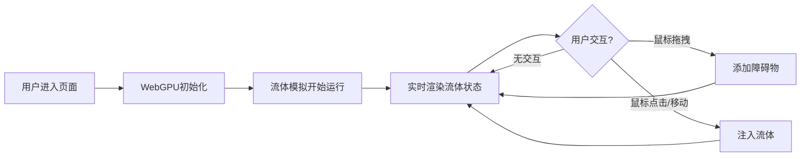

## 1. 产品概述
基于WebGPU的2D格子玻尔兹曼流体模拟器，使用LBM D2Q9算法实现256x256网格的实时流体动力学模拟。用户可通过鼠标交互添加障碍物、注入流体，直观观察流体绕流现象。

- **核心用途**：物理模拟演示、教育展示、交互式流体艺术
- **目标用户**：物理爱好者、学生、开发者、设计师
- **市场价值**：展示WebGPU计算能力，提供高性能实时流体模拟体验

## 2. 核心功能

### 2.1 功能模块
1. **流体模拟主界面**：256x256网格LBM D2Q9流体模拟
2. **可视化层**：速度场颜色编码显示 + 密度场显示
3. **交互控制系统**：鼠标拖拽添加障碍物、鼠标位置注入流体
4. **性能监控面板**：实时FPS显示、迭代时间统计

### 2.2 页面详情
| 页面名称 | 模块名称 | 功能描述 |
|-----------|-------------|---------------------|
| 主页面 | 流体画布 | WebGPU渲染256x256流体模拟，支持速度场/密度场切换 |
| 主页面 | 控制面板 | 障碍物类型选择（圆形/矩形）、清除按钮、显示模式切换 |
| 主页面 | 性能面板 | FPS计数器、每帧迭代时间(ms)、GPU内存占用 |

## 3. 核心流程

## 4. 用户界面设计

### 4.1 设计风格
- **主色调**：深海蓝 (#0a1628) 背景，流体使用HSV颜色编码
- **辅助色**：青色 (#00d4ff) 用于UI元素，橙色 (#ff6b35) 用于高亮
- **字体**：使用 JetBrains Mono 等宽字体，科技感十足
- **布局**：全屏流体画布，控制面板悬浮于右上角，性能面板悬浮于左上角
- **风格**：赛博朋克/科技感，深色主题，玻璃态UI面板

### 4.2 页面设计概述
| 页面名称 | 模块名称 | UI 元素 |
|-----------|-------------|-------------|
| 主页面 | 流体画布 | 全屏WebGPU画布，鼠标悬停显示十字准星 |
| 主页面 | 控制面板 | 玻璃态圆角卡片，包含障碍物类型单选、清除按钮、显示模式切换 |
| 主页面 | 性能面板 | 半透明背景，等宽字体显示性能数据，实时更新 |

### 4.3 响应式
- 桌面端优先，全屏画布体验
- 控制面板和性能面板固定定位，不随滚动
- 移动端适配：简化控制按钮布局

### 4.4 交互细节
- 鼠标拖拽添加障碍物时有实时预览
- 流体注入时有视觉反馈（粒子效果）
- 按钮悬停有发光效果
- 面板支持拖拽移动位置
