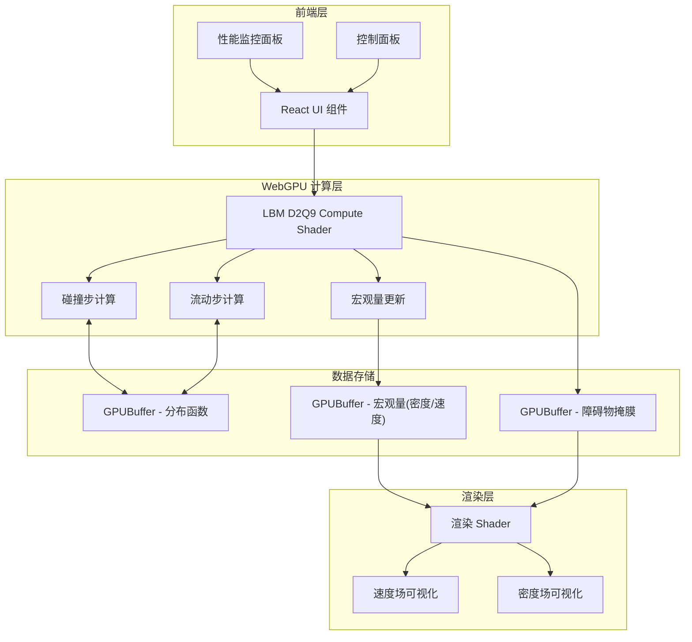

## 1. 架构设计


## 2. 技术描述
- **前端框架**: React@18 + TypeScript + Vite
- **样式方案**: TailwindCSS@3
- **GPU计算**: WebGPU (WGSL Shader)
- **状态管理**: Zustand
- **图标**: Lucide React

## 3. 核心技术实现

### 3.1 LBM D2Q9 算法
- **网格大小**: 256x256
- **离散速度模型**: D2Q9 (9个速度方向)
- **权重系数**: w0=4/9, w1-4=1/9, w5-8=1/36
- **松弛时间**: τ = 0.6 (粘度控制)

### 3.2 WebGPU 资源配置
| 资源类型 | 名称 | 格式/大小 | 用途 |
|----------|------|-----------|------|
| Storage Buffer | f0, f1 | 256x256x9 x f32 | 分布函数双缓冲 |
| Storage Buffer | macro | 256x256x3 x f32 | 宏观量(rho, ux, uy) |
| Storage Buffer | obstacles | 256x256 x u32 | 障碍物掩膜 |
| Texture | renderTexture | 256x256 rgba8unorm | 渲染输出 |

### 3.3 Compute Pipeline
1. **碰撞步**: BGK碰撞模型，计算平衡态分布函数
2. **流动步**: 周期性边界条件，分布函数传播
3. **宏观量更新**: 计算密度和速度场
4. **边界处理**: 反弹边界条件处理障碍物

## 4. 目录结构
```
src/
├── components/
│   ├── FluidCanvas.tsx      # WebGPU流体画布
│   ├── ControlPanel.tsx     # 控制面板
│   └── PerformancePanel.tsx # 性能面板
├── hooks/
│   ├── useWebGPU.ts         # WebGPU初始化hook
│   └── useFluidSimulation.ts # 流体模拟逻辑hook
├── shaders/
│   ├── lbmD2Q9.wgsl         # LBM计算着色器
│   └── render.wgsl          # 渲染着色器
├── utils/
│   └── lbmMath.ts           # LBM数学工具
├── store/
│   └── useSimulationStore.ts # 状态管理
├── App.tsx
└── main.tsx
```

## 5. 性能优化策略
1. **双缓冲技术**: Ping-pong buffer减少数据拷贝
2. **工作组优化**: 8x8工作组大小，充分利用GPU并行
3. **内存布局**: 结构体数组(AoS)转数组结构(SoA)
4. **减少CPU-GPU数据传输**: 尽可能在GPU端完成所有计算

## 6. 关键数据结构
```typescript
// LBM D2Q9 速度方向
const D2Q9_VELOCITIES = [
  [0, 0], [1, 0], [0, 1], [-1, 0], [0, -1],
  [1, 1], [-1, 1], [-1, -1], [1, -1]
];

// 权重系数
const D2Q9_WEIGHTS = [
  4/9, 1/9, 1/9, 1/9, 1/9,
  1/36, 1/36, 1/36, 1/36
];

// 模拟配置
interface SimulationConfig {
  gridSize: number;
  tau: number;
  omega: number;
  reynolds: number;
}
```
