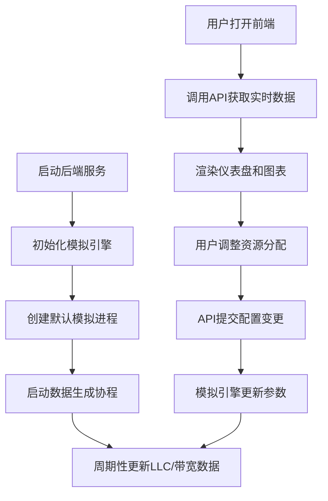

## 1. 产品概述

Intel RDT（Resource Director Technology）资源监控与分配模拟器，模拟LLC（Last Level Cache）占用和内存带宽监控能力，为不同进程分配缓存和带宽限制，帮助开发者理解和调试资源隔离策略。

- 核心目的：模拟Intel RDT的CAT（Cache Allocation Technology）和MBA（Memory Bandwidth Allocation）功能，在无需真实硬件支持的环境下进行资源调度算法的开发与验证
- 目标用户：系统性能工程师、云计算平台开发者、操作系统内核研究者
- 产品价值：降低RDT技术学习门槛，提供可控的模拟环境用于资源分配策略的快速迭代测试

## 2. 核心功能

### 2.1 用户角色

| 角色 | 注册方式 | 核心权限 |
|------|----------|----------|
| 系统管理员 | 无需注册，本地直接访问 | 查看监控数据、管理进程、配置资源分配策略、调整模拟参数 |

### 2.2 功能模块

1. **实时监控仪表盘**：系统整体资源概览、LLC总使用率、内存总带宽、进程数量统计
2. **进程管理面板**：进程列表展示、添加/删除模拟进程、进程资源占用详情
3. **LLC命中率监控**：各进程LLC命中率实时曲线、命中率历史趋势、命中率排名对比
4. **内存带宽监控**：各进程内存带宽使用量、读写带宽分离统计、带宽超限告警
5. **资源分配控制**：LLC缓存分配（按CLOS组）、内存带宽限制配置、实时调整生效
6. **模拟参数配置**：LLC总容量、内存总带宽、模拟数据生成速率、随机波动幅度

### 2.3 页面详情

| 页面名称 | 模块名称 | 功能描述 |
|----------|----------|----------|
| 主监控台 | 顶部状态栏 | 显示系统运行时间、模拟状态开关、数据刷新频率 |
| 主监控台 | 系统概览卡片 | LLC总使用率环形图、内存总带宽仪表盘、活跃进程数、CLOS组数量 |
| 主监控台 | 进程列表 | 展示进程ID、名称、所属CLOS组、LLC使用率、命中率、带宽使用量 |
| 主监控台 | 实时趋势图表 | LLC命中率多进程对比曲线、内存带宽使用堆叠面积图 |
| 进程详情页 | 进程基本信息 | PID、进程名、启动时间、优先级、当前状态 |
| 进程详情页 | 资源分配配置 | LLC分配量滑块、带宽限制滑块、CLOS组选择下拉框 |
| 进程详情页 | 性能指标详情 | LLC命中率折线图、带宽使用柱状图、资源占用历史 |
| 资源配置页 | 全局资源配置 | LLC总容量设置、内存总带宽设置、CLOS组管理 |
| 资源配置页 | 模拟参数设置 | 数据生成间隔、随机噪声系数、命中率波动范围 |

## 3. 核心流程

用户启动应用后，后端模拟引擎自动开始生成模拟数据。用户可通过前端界面查看各进程的LLC命中率和带宽使用情况，调整资源分配策略，模拟引擎会根据新的配置实时调整数据生成逻辑。

## 4. 用户界面设计

### 4.1 设计风格

- **主色调**：深空蓝 (#0A1929) 作为背景，科技感青色 (#00E5FF) 作为主强调色，警示橙 (#FF9800) 用于超限告警，成功绿 (#4CAF50) 用于正常状态
- **辅助色**：深灰蓝 (#132F4C) 用于卡片背景，银灰 (#B2BAC2) 用于次要文字
- **按钮风格**：圆角8px，扁平化设计，hover时有轻微发光效果，禁用状态半透明
- **字体**：主标题使用 JetBrains Mono（等宽科技感字体），正文使用 Inter，数字指标使用 monospace 字体增强对齐感
- **布局风格**：卡片式网格布局，左侧导航栏 + 右侧内容区，关键指标卡片悬浮展示
- **图标风格**：线性简约图标，统一使用2px描边，状态变化时带颜色过渡动画

### 4.2 页面设计概述

| 页面名称 | 模块名称 | UI元素 |
|----------|----------|----------|
| 主监控台 | 顶部状态栏 | 深色背景条，左侧logo+标题，中间模拟状态指示灯，右侧刷新频率选择 |
| 主监控台 | 系统概览卡片 | 四张等宽卡片并排，每张包含图标、大数字指标、趋势箭头、环比变化率 |
| 主监控台 | 进程列表 | 斑马纹表格，支持点击展开详情，每行显示资源使用率进度条 |
| 主监控台 | 实时趋势图表 | 双图表布局，上下排列，带时间选择器和图例开关 |
| 进程详情页 | 配置面板 | 左右分栏，左侧基本信息，右侧滑块控件组，底部操作按钮 |
| 进程详情页 | 历史图表 | 三图表Tab切换，支持时间范围缩放和数据点悬停查看 |

### 4.3 响应性

- **桌面优先**：针对1920px宽度优化，4列卡片网格布局
- **平板适配**：1024px以下切换为2列网格，侧边栏收起为图标模式
- **移动适配**：768px以下切换为单列布局，底部导航替代侧边栏
- **触摸优化**：关键操作按钮最小尺寸44x44px，滑块控件增大触控区域

### 4.4 交互与动画

- 页面加载时卡片依次淡入，带100ms交错延迟
- 数据刷新时数字平滑过渡，进度条带弹性动画
- 告警状态时指标数字脉动闪烁
- 滑块拖动时实时预览效果，释放后提交配置
- 鼠标悬停表格行时高亮背景，数据点悬停显示详情浮窗
