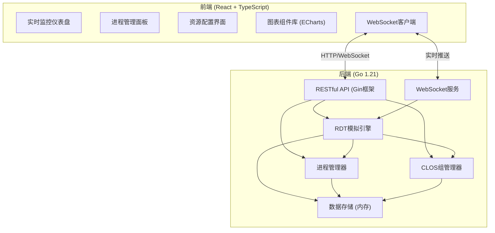
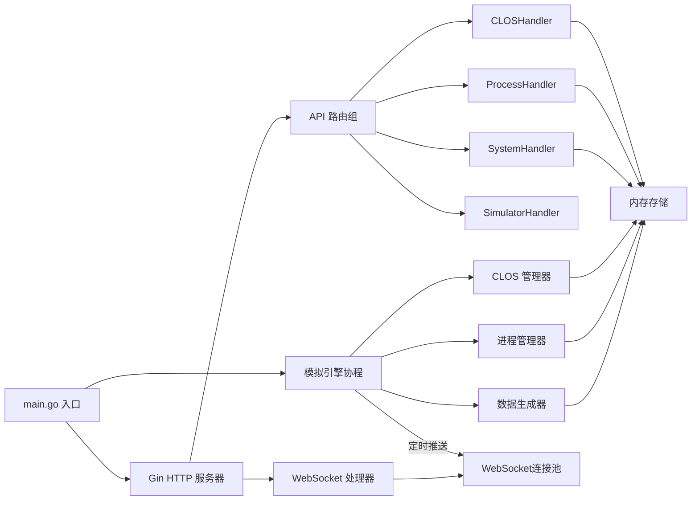

## 1. 架构设计



## 2. 技术描述

- **前端**：React@18 + TypeScript + Vite@5 + TailwindCSS@3 + ECharts@5 + React Router@6
- **后端**：Go@1.21 + Gin@1.9 + Gorilla WebSocket@1.5
- **数据存储**：内存存储（无需持久化），支持快照导出为JSON
- **构建工具**：前端使用Vite，后端使用标准Go工具链
- **通信协议**：HTTP/1.1 + WebSocket

## 3. 目录结构

```
sp4/
├── backend/                    # Go后端
│   ├── cmd/
│   │   └── server/          # 主程序入口
│   │       └── main.go
│   ├── internal/
│   │   ├── api/             # API路由和处理器
│   │   ├── simulator/       # RDT模拟引擎核心
│   │   ├── model/           # 数据模型定义
│   │   └── storage/       # 内存存储
│   ├── go.mod
│   └── go.sum
└── frontend/                   # React前端
│   ├── src/
│   │   ├── components/  # React组件
│   │   ├── pages/         # 页面组件
│   │   ├── services/      # API服务
│   │   ├── types/         # TypeScript类型定义
│   │   └── utils/         # 工具函数
│   ├── index.html
│   ├── package.json
│   ├── tsconfig.json
│   ├── vite.config.ts
│   └── tailwind.config.js
```

## 3. 前端路由定义

| 路由 | 页面名称 | 功能描述 |
|------|----------|----------|
| / | 主监控台 | 系统概览、进程列表、实时图表 |
| /process/:id | 进程详情 | 进程信息、资源配置、历史图表 |
| /config | 资源配置 | 全局资源配置、模拟参数设置 |

## 4. API 定义

### 4.1 数据模型

```go
// Process - 模拟进程
type Process struct {
    PID            int       `json:"pid"`
    Name           string    `json:"name"`
    CLOSID         int       `json:"clos_id"`
    LLCUsage       float64   `json:"llc_usage"`
    LLCHitRate     float64   `json:"llc_hit_rate"`
    MemBandwidth    float64   `json:"mem_bandwidth"`
    ReadBandwidth  float64   `json:"read_bandwidth"`
    WriteBandwidth float64   `json:"write_bandwidth"`
    LLCLimit        float64   `json:"llc_limit"`
    BWLimit         float64   `json:"bw_limit"`
    StartTime       time.Time `json:"start_time"`
    Status          string    `json:"status"`
    Priority        int       `json:"priority"`
}

// CLOSGroup - 缓存分配组
type CLOSGroup struct {
    ID          int     `json:"id"`
    Name        string  `json:"name"`
    CBM         uint64  `json:"cbm"`
    BWMbps      int     `json:"bw_mbps"`
    Color        string  `json:"color"`
}

// SystemMetrics - 系统整体指标
type SystemMetrics struct {
    Timestamp      time.Time `json:"timestamp"`
    TotalLLC     float64   `json:"total_llc"`
    UsedLLC      float64   `json:"used_llc"`
    TotalBW      float64   `json:"total_bw"`
    UsedBW       float64   `json:"used_bw"`
    ProcessCount int       `json:"process_count"`
    CLOSCount    int       `json:"clos_count"`
}

// MetricsHistory - 历史指标数据点
type MetricsHistory struct {
    Timestamp   time.Time `json:"timestamp"`
    ProcessID int       `json:"process_id"`
    LLCHitRate float64 `json:"llc_hit_rate"`
    MemBW     float64   `json:"mem_bw"`
}
```

### 4.2 RESTful API

| 方法 | 路径 | 功能 | 请求体 | 响应体 |
|------|------|------|--------|--------|
| GET | /api/system/metrics | 获取系统实时指标 | - | SystemMetrics |
| GET | /api/system/config | 获取系统配置 | - | SystemConfig |
| PUT | /api/system/config | 更新系统配置 | SystemConfig | SystemConfig |
| GET | /api/processes | 获取进程列表 | - | []Process |
| POST | /api/processes | 创建新进程 | CreateProcessRequest | Process |
| GET | /api/processes/:id | 获取进程详情 | - | Process |
| PUT | /api/processes/:id | 更新进程配置 | UpdateProcessRequest | Process |
| DELETE | /api/processes/:id | 删除进程 | - | { "status": "success" } |
| GET | /api/processes/:id/history | 获取进程历史数据 | ?duration=5m | []MetricsHistory |
| GET | /api/clos | 获取CLOS组列表 | - | []CLOSGroup |
| POST | /api/clos | 创建CLOS组 | CreateCLOSRequest | CLOSGroup |
| PUT | /api/clos/:id | 更新CLOS组 | UpdateCLOSRequest | CLOSGroup |
| DELETE | /api/clos/:id | 删除CLOS组 | - | { "status": "success" } |
| GET | /api/simulator/status | 获取模拟器状态 | - | SimulatorStatus |
| POST | /api/simulator/start | 启动模拟器 | - | { "status": "running" } |
| POST | /api/simulator/stop | 停止模拟器 | - | { "status": "stopped" } |

### 4.3 WebSocket 实时推送

- **连接路径**：/ws/metrics
- **推送频率**：1秒/次（可配置）
- **推送内容**：

```json
{
  "type": "metrics_update",
  "data": {
    "system": SystemMetrics,
    "processes": [Process],
    "timestamp": "2026-06-01T12:00:00Z"
  }
}
```

## 5. 服务器架构图



## 6. 核心模块说明

### 6.1 模拟引擎 (simulator)

- **DataGenerator**：数据生成器，基于随机游走算法生成逼真的LLC命中率和带宽数据
- **ResourceEnforcer**：资源强制器，根据CLOS组配置限制进程资源使用上限
- **NoiseInjector**：噪声注入器，模拟真实环境中的随机波动

### 6.2 API 层 (api)

- 提供RESTful接口处理CRUD操作
- WebSocket连接管理和实时数据推送
- 请求参数校验和错误处理

### 6.3 存储层 (storage)

- 进程数据的增删改查
- 历史指标数据的环形缓冲区（保留最近1小时数据）
- 线程安全的并发访问控制

## 7. 前端技术栈说明

- **状态管理**：React Context + useReducer
- **图表库**：ECharts for React
- **HTTP客户端**：Axios
- **WebSocket**：原生WebSocket API + 自动重连机制
- **样式**：TailwindCSS + CSS Variables
- **UI组件**：自定义组件（避免引入过重的组件库）
