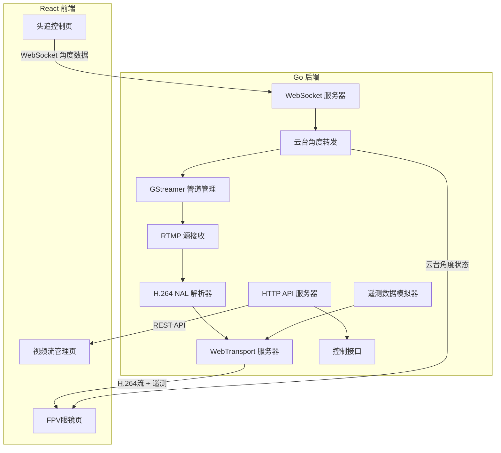
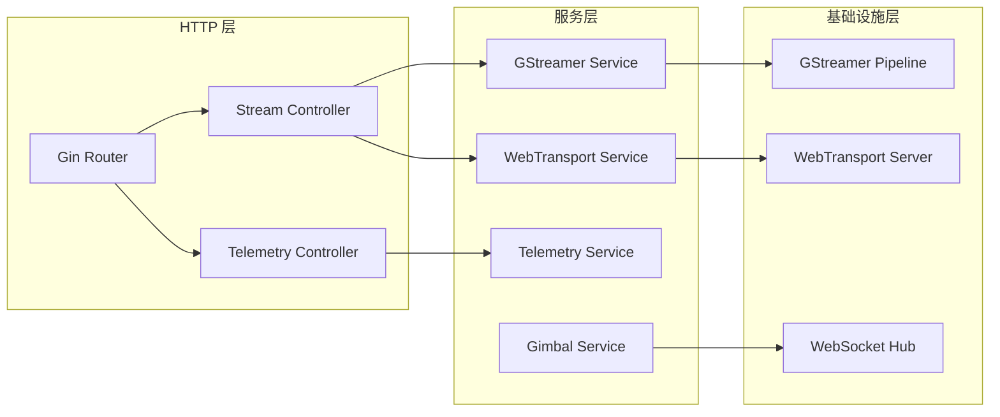
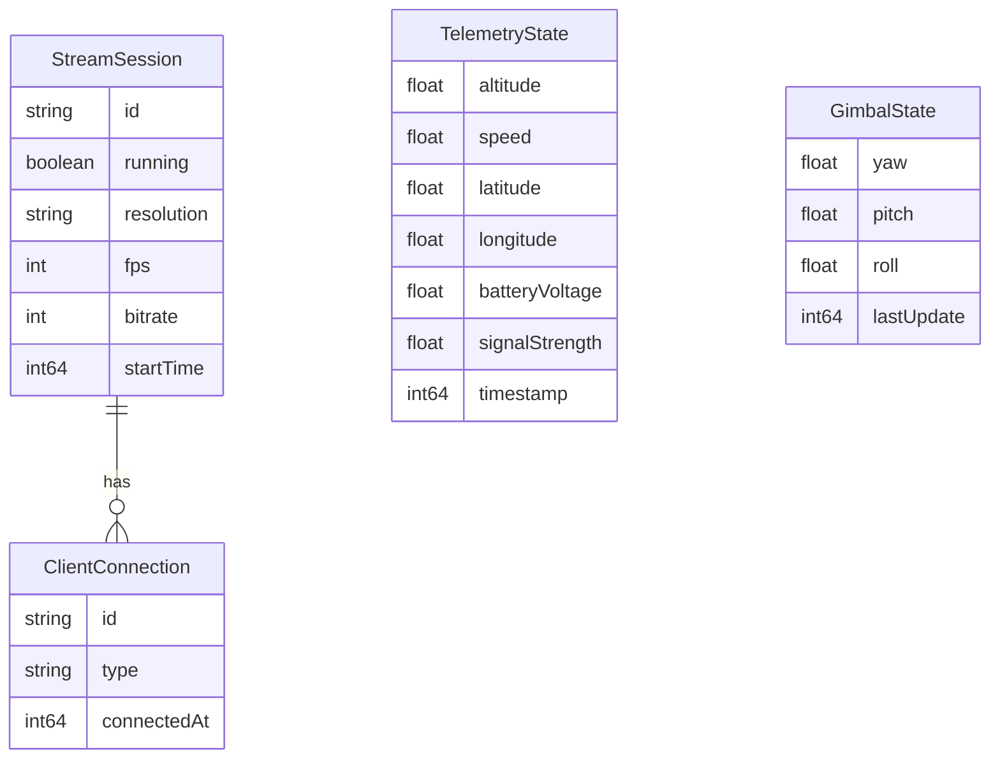

## 1. 架构设计



## 2. 技术说明

- **前端**：React@18 + TypeScript + Tailwind CSS@3 + Vite
- **初始化工具**：Vite (create-vite)
- **后端**：Go 1.22+
- **视频编解码**：H.264 (GStreamer编码) → WebCodecs API解码
- **实时通信**：WebTransport (视频流+遥测) + WebSocket (头追角度)
- **录制**：MediaRecorder API → MP4
- **数据库**：无（内存状态管理）

### 关键Go依赖

- `github.com/quic-go/webtransport-go`：WebTransport服务器
- `github.com/gorilla/websocket`：WebSocket服务器
- `github.com/gin-gonic/gin`：HTTP API框架
- GStreamer C绑定（CGO）：视频管道控制

### 关键前端依赖

- `react` / `react-dom`：UI框架
- `tailwindcss`：样式
- `framer-motion`：OSD动画
- `lucide-react`：图标

## 3. 路由定义

| 路由 | 用途 |
|------|------|
| `/` | 视频流管理页（控制台首页） |
| `/fpv` | FPV眼镜页（全屏视频+OSD） |
| `/headtrack` | 头追控制页（手机端陀螺仪） |

## 4. API定义

### 4.1 HTTP REST API

```typescript
interface StartStreamRequest {
  resolution: "720p" | "1080p";
  fps: 30 | 60;
  bitrate: number;
}

interface StreamStatus {
  running: boolean;
  resolution: string;
  fps: number;
  bitrate: number;
  uptime: number;
  clientCount: number;
}

interface TelemetryData {
  altitude: number;
  speed: number;
  latitude: number;
  longitude: number;
  batteryVoltage: number;
  signalStrength: number;
  timestamp: number;
}

interface GimbalAngles {
  yaw: number;
  pitch: number;
  roll: number;
}

// GET /api/stream/status → StreamStatus
// POST /api/stream/start → { success: boolean }
// POST /api/stream/stop → { success: boolean }
// GET /api/telemetry → TelemetryData
// GET /api/gimbal → GimbalAngles
```

### 4.2 WebTransport 协议

- 连接地址：`webtransport://<host>:<port>/wt/stream`
- 视频流单向通道（服务器→客户端）：发送H.264 NAL单元，每帧前4字节为NAL长度（大端序）
- 遥测数据单向通道（服务器→客户端）：发送JSON编码的TelemetryData，每条消息一条遥测帧

### 4.3 WebSocket 协议

- 连接地址：`ws://<host>:<port>/ws/headtrack`
- 客户端→服务器：JSON `{ "type": "gimbal", "yaw": number, "pitch": number, "roll": number }`
- 服务器→客户端：JSON `{ "type": "gimbal_status", "yaw": number, "pitch": number, "roll": number, "applied": boolean }`

## 5. 服务器架构



## 6. 数据模型

### 6.1 核心数据结构



### 6.2 GStreamer 管道描述

```bash
# 模拟RTMP源（测试模式，不依赖真实摄像头）
videotestsrc pattern=ball ! \
  video/x-raw,width=1280,height=720,framerate=30/1 ! \
  x264enc bitrate=2000 key-int-max=30 ! \
  h264parse ! \
  flvmux ! \
  rtmpsink location="rtmp://localhost/live/drone"

# 后端接收RTMP并提取H.264
rtmpsrc location="rtmp://localhost/live/drone" ! \
  flvdemux ! \
  h264parse ! \
  appsink name=wsink
```

**注意**：为简化部署，实际实现中使用GStreamer的`videotestsrc`直接生成H.264数据，跳过RTMP中转，但保留RTMP接口供未来扩展真实摄像头接入。

## 7. 项目目录结构

```
sp42/
├── backend/
│   ├── main.go              # 入口
│   ├── go.mod
│   ├── go.sum
│   ├── handler/
│   │   ├── stream.go        # 流控制HTTP处理
│   │   └── telemetry.go     # 遥测HTTP处理
│   ├── service/
│   │   ├── gstreamer.go     # GStreamer管道管理
│   │   ├── webtransport.go  # WebTransport服务
│   │   ├── telemetry.go     # 遥测数据模拟
│   │   └── gimbal.go        # 云台/头追服务
│   └── ws/
│       └── hub.go           # WebSocket连接管理
├── frontend/
│   ├── package.json
│   ├── vite.config.ts
│   ├── index.html
│   ├── src/
│   │   ├── App.tsx
│   │   ├── main.tsx
│   │   ├── pages/
│   │   │   ├── ConsolePage.tsx    # 视频流管理页
│   │   │   ├── FPVPage.tsx        # FPV眼镜页
│   │   │   └── HeadTrackPage.tsx  # 头追控制页
│   │   ├── hooks/
│   │   │   ├── useWebTransport.ts # WebTransport连接
│   │   │   ├── useH264Decoder.ts  # H.264 WebCodecs解码
│   │   │   ├── useTelemetry.ts    # 遥测数据
│   │   │   ├── useRecorder.ts     # 录制功能
│   │   │   └── useHeadTracking.ts # 头追陀螺仪
│   │   ├── components/
│   │   │   ├── OSDOverlay.tsx     # OSD叠加层
│   │   │   ├── VideoCanvas.tsx    # 视频画布
│   │   │   ├── RecordButton.tsx   # 录制按钮
│   │   │   ├── GimbalIndicator.tsx# 云台角度指示
│   │   │   └── StreamControl.tsx  # 流控制面板
│   │   └── styles/
│   │       └── globals.css
│   └── public/
└── .trae/
    └── documents/
```
