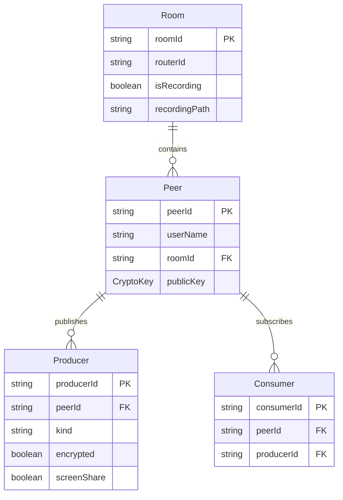

## 1. 架构设计

```mermaid
flowchart TB
    subgraph "前端 React"
        "会议页面" --> "mediasoup-client"
        "会议页面" --> "Web Crypto API 加密模块"
        "会议页面" --> "TensorFlow.js 虚拟背景"
        "会议页面" --> "getDisplayMedia 屏幕共享"
    end

    subgraph "后端 Node.js"
        "Express 信令服务器" --> "mediasoup SFU Worker"
        "mediasoup SFU Worker" --> "Router"
        "Router" --> "WebRtcTransport"
        "Router" --> "PlainTransport"
        "PlainTransport" --> "FFmpeg 录制服务"
    end

    "前端 React" <--> "WebSocket 信令" <--> "Express 信令服务器"
    "前端 React" <--> "WebRTC DTLS" <--> "mediasoup SFU Worker"
```

## 2. 技术说明

- 前端：React@18 + tailwindcss@3 + vite + TypeScript
- 初始化工具：vite-init（react-express-ts 模板）
- 后端：Express@4 + mediasoup@3 + TypeScript (ESM)
- 数据库：无（会议状态内存管理，录制文件本地存储）
- 信令：WebSocket (ws库)
- 加密：Web Crypto API (ECDH + AES-GCM)
- 虚拟背景：@mediapipe/selfie_segmentation + Canvas
- 录制：FFmpeg (PlainTransport → FFmpeg混流录制)

## 3. 路由定义

| 路由 | 用途 |
|------|------|
| / | 大厅页面，会议创建/加入/设备预览 |
| /room/:roomId | 会议房间页面，音视频通话/屏幕共享/聊天 |

## 4. API 定义

### 4.1 WebSocket 信令事件

```typescript
interface SignalingEvents {
  "create-room": { roomId: string; userName: string };
  "join-room": { roomId: string; userName: string };
  "room-created": { roomId: string };
  "room-joined": { peers: PeerInfo[]; roomId: string };
  "new-peer": { peerId: string; userName: string };
  "peer-left": { peerId: string };

  "get-router-rtp-capabilities": {};
  "router-rtp-capabilities": { rtpCapabilities: RtpCapabilities };

  "create-webrtc-transport": { forceTcp?: boolean };
  "webrtc-transport-created": {
    id: string;
    iceParameters: IceParameters;
    iceCandidates: IceCandidate[];
    dtlsParameters: DtlsParameters;
  };

  "connect-transport": {
    transportId: string;
    dtlsParameters: DtlsParameters;
  };
  "transport-connected": { transportId: string };

  "produce": {
    transportId: string;
    kind: "audio" | "video";
    rtpParameters: RtpParameters;
    appData: { encrypted?: boolean; screenShare?: boolean };
  };
  "produced": { id: string; kind: string };
  "new-producer": { producerId: string; peerId: string; kind: string };
  "consume": {
    producerId: string;
    rtpCapabilities: RtpCapabilities;
  };
  "consumed": {
    id: string;
    producerId: string;
    kind: string;
    rtpParameters: RtpParameters;
  };

  "exchange-key": { peerId: string; publicKey: JsonWebKey };
  "key-exchanged": { peerId: string; publicKey: JsonWebKey };

  "chat-message": { message: string; userName: string };
  "recording-started": { roomId: string };
  "recording-stopped": { roomId: string; filePath: string };
}

interface PeerInfo {
  id: string;
  userName: string;
}
```

### 4.2 HTTP API

| 方法 | 路径 | 用途 |
|------|------|------|
| GET | /api/rooms/:roomId | 获取房间信息 |
| GET | /api/recordings/:fileId | 下载录制文件 |
| POST | /api/rooms | 创建房间 |
| DELETE | /api/rooms/:roomId | 关闭房间 |

## 5. 服务器架构图

```mermaid
flowchart LR
    "Express HTTP Server" --> "WebSocket 信令处理"
    "WebSocket 信令处理" --> "mediasoup Room Manager"
    "mediasoup Room Manager" --> "Worker 管理"
    "Worker 管理" --> "Router"
    "Router" --> "Producer"
    "Router" --> "Consumer"
    "Router" --> "PlainTransport"
    "PlainTransport" --> "FFmpeg 录制进程"
```

## 6. 数据模型

### 6.1 内存数据模型



## 7. 端到端加密设计

### 7.1 密钥协商

1. 每个参与者加入会议时生成 ECDH P-256 密钥对
2. 通过信令通道交换公钥
3. 使用 ECDH 派生共享密钥
4. 使用 HKDF 从共享密钥派生 AES-256-GCM 加密密钥

### 7.2 帧加密

- 在插入 mediasoup 传输前，使用 AES-GCM 对视频帧进行加密
- 每帧使用随机 IV，确保语义安全
- 加密元数据通过 SRTP 扩展头传输
- 接收端使用对应共享密钥解密

## 8. 虚拟背景设计

### 8.1 分割模型

- 使用 @mediapipe/selfie_segmentation 进行人像分割
- Canvas 2D 合成：分割遮罩 + 自定义背景图

### 8.2 处理流水线

摄像头帧 → MediaPipe 分割 → 遮罩提取 → Canvas合成背景 → MediaStream输出 → mediasoup发布

## 9. 录制设计

### 9.1 服务器端录制

- mediasoup PlainTransport 接收所有参与者的 RTP 流
- FFmpeg 进程将多个音视频流混流为一个文件
- 录制文件格式：MP4 (H.264 + AAC)
- 录制完成后可通过 HTTP API 下载
