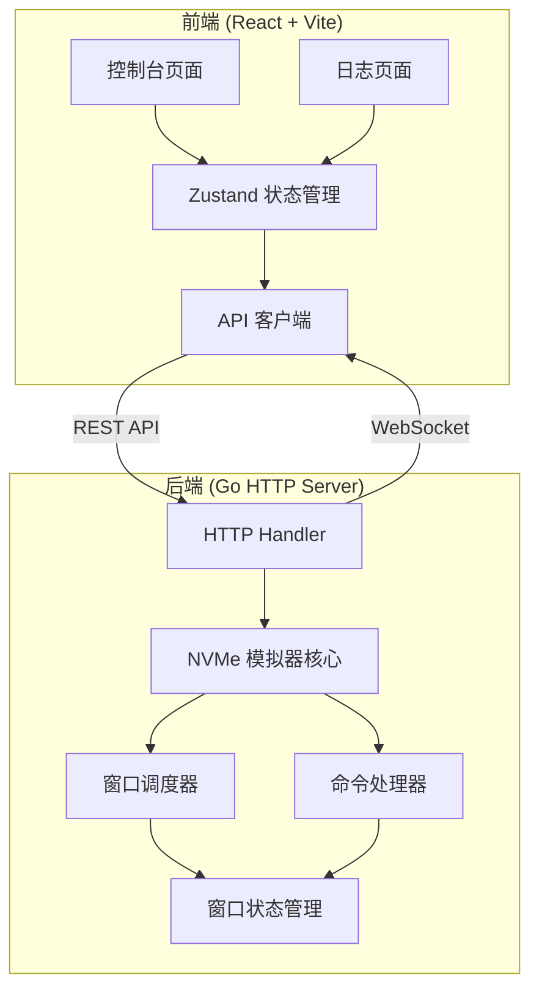
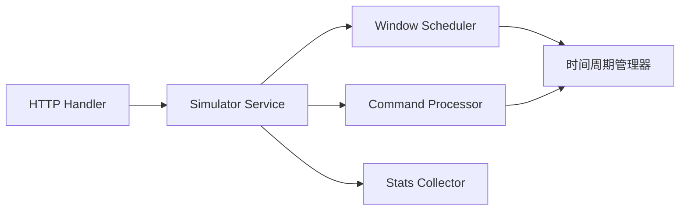
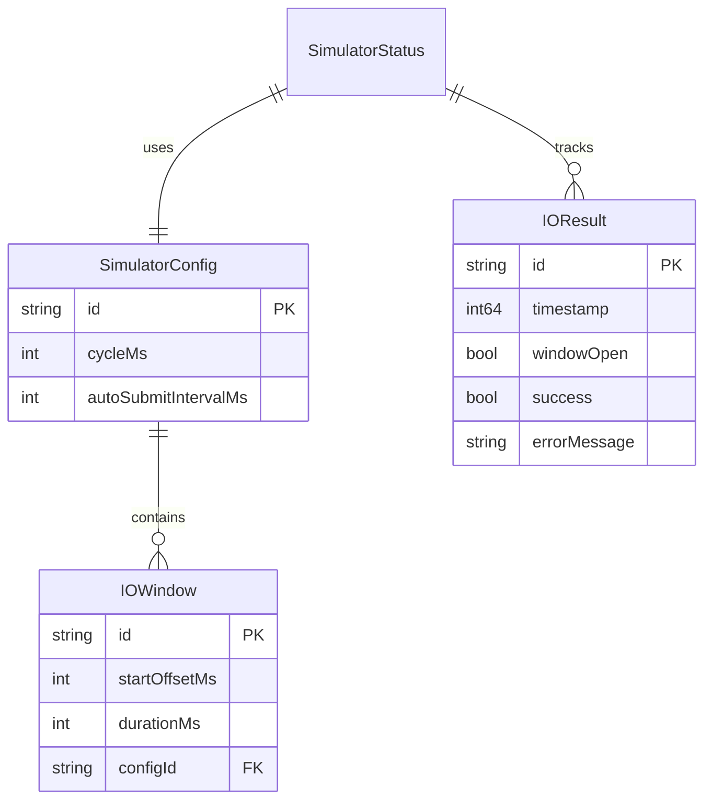

## 1. 架构设计



## 2. 技术说明

- 前端: React@18 + TypeScript + TailwindCSS@3 + Vite
- 状态管理: Zustand
- 后端: Go 1.22+ (net/http 标准库 + gorilla/websocket)
- 初始化工具: vite-init
- 通信方式: REST API + WebSocket (实时状态推送)
- 数据存储: 内存数据结构（模拟器状态）

## 3. 路由定义

| 路由 | 用途 |
|------|------|
| / | 控制台主页面（窗口配置+状态监控+IO提交+统计） |
| /logs | 命令执行日志页面 |

## 4. API 定义

### 4.1 REST API

```typescript
interface IOWindow {
  id: string;
  startOffsetMs: number;
  durationMs: number;
}

interface SimulatorConfig {
  cycleMs: number;
  windows: IOWindow[];
  autoSubmitIntervalMs: number;
}

interface IOResult {
  id: string;
  timestamp: number;
  windowOpen: boolean;
  success: boolean;
  errorMessage?: string;
}

interface SimulatorStatus {
  running: boolean;
  currentWindowOpen: boolean;
  nextWindowOpenInMs: number;
  cyclePositionMs: number;
  stats: {
    totalAttempts: number;
    successCount: number;
    rejectedCount: number;
  };
  recentResults: IOResult[];
}
```

| 方法 | 路径 | 说明 |
|------|------|------|
| GET | /api/status | 获取模拟器当前状态 |
| POST | /api/config | 更新窗口配置 |
| POST | /api/start | 启动模拟器 |
| POST | /api/stop | 停止模拟器 |
| POST | /api/io/submit | 手动提交 IO 命令 |
| GET | /api/logs | 获取命令执行日志 |

### 4.2 WebSocket

| 端点 | 说明 |
|------|------|
| /ws | 实时推送模拟器状态变更（窗口开关、IO 结果） |

WebSocket 消息格式:
```typescript
interface WSMessage {
  type: "status" | "io_result" | "window_change";
  payload: SimulatorStatus | IOResult | { windowOpen: boolean };
}
```

## 5. 服务器架构



## 6. 数据模型

### 6.1 核心数据结构



### 6.2 Go 核心结构

```go
type IOWindow struct {
    ID            string
    StartOffsetMs int64
    DurationMs    int64
}

type SimulatorConfig struct {
    CycleMs               int64
    Windows               []IOWindow
    AutoSubmitIntervalMs  int64
}

type Simulator struct {
    config     SimulatorConfig
    running    bool
    startTime  time.Time
    stats      Stats
    results    []IOResult
    mu         sync.RWMutex
}

type Stats struct {
    TotalAttempts int64
    SuccessCount  int64
    RejectedCount int64
}

type IOResult struct {
    ID           string
    Timestamp    int64
    WindowOpen   bool
    Success      bool
    ErrorMessage string
}
```
