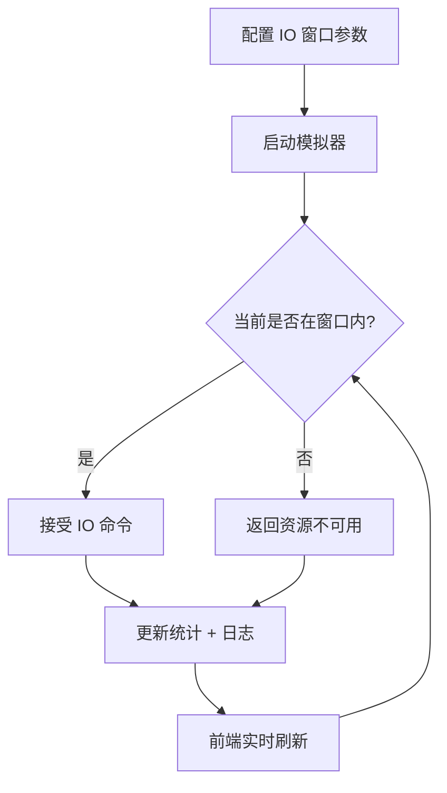

## 1. 产品概述

NVMe IO Determinism 模拟器是一个用于模拟和可视化 NVMe 存储 IO 确定性特征的工具。它定义 IO 时间窗口（开始时间+持续时长），在窗口内允许下发命令，窗口外返回"资源不可用"错误。面向存储工程师、固件开发者和测试人员，帮助他们理解和验证 IO Determinism 行为。

## 2. 核心功能

### 2.1 功能模块

1. **控制台页面**: IO 窗口配置、实时窗口状态监控、IO 命令提交、IO 尝试次数统计
2. **日志页面**: IO 命令执行历史、窗口切换事件记录

### 2.2 页面详情

| 页面名称 | 模块名称 | 功能描述 |
|----------|----------|----------|
| 控制台 | 窗口配置面板 | 配置 IO 窗口的开始时间和持续时长（毫秒），支持添加/删除/编辑多个窗口 |
| 控制台 | 实时状态指示器 | 显示当前窗口状态（开启/关闭），倒计时到下一个窗口开启时间 |
| 控制台 | IO 命令提交面板 | 手动或自动发送 IO 命令，实时返回成功/资源不可用结果 |
| 控制台 | 统计仪表盘 | IO 尝试总次数、成功次数、拒绝次数、成功率，实时更新 |
| 控制台 | 时间轴可视化 | 可视化展示窗口开关周期的时间轴，当前时间指针 |
| 日志 | 命令执行日志 | 按时间排序的 IO 命令执行记录，包含时间戳、窗口状态、结果 |

## 3. 核心流程

用户配置 IO 窗口参数（开始偏移+持续时长），启动模拟器后，系统按周期执行窗口调度。用户可手动/自动发送 IO 命令，系统根据当前窗口状态决定接受或拒绝命令，并将结果实时反馈到前端。

## 4. 用户界面设计

### 4.1 设计风格

- 主色调：深色工业风（#0a0e17 背景 + #00e5ff 青色高亮 + #ff3d71 警告红）
- 按钮风格：圆角矩形，带发光效果
- 字体：JetBrains Mono（代码/数据）+ Noto Sans SC（中文文本）
- 布局风格：深色仪表盘，卡片式模块布局
- 图标风格：线性图标，科技感

### 4.2 页面设计概览

| 页面名称 | 模块名称 | UI 元素 |
|----------|----------|---------|
| 控制台 | 窗口配置面板 | 深色卡片，输入框+滑块，青色边框高亮 |
| 控制台 | 实时状态指示器 | 大型圆形指示灯（绿=开启/红=关闭），倒计时数字 |
| 控制台 | IO 命令提交面板 | 提交按钮+自动发送开关，结果实时闪烁反馈 |
| 控制台 | 统计仪表盘 | 数字卡片，渐变进度条，成功率环形图 |
| 控制台 | 时间轴可视化 | 横向时间轴，窗口区间高亮色块，移动时间指针 |
| 日志 | 命令执行日志 | 深色表格，成功行绿色标记，拒绝行红色标记 |

### 4.3 响应式设计

桌面优先设计，确保在 1280px+ 宽度下最佳展示。中等屏幕自适应缩放卡片布局，小屏幕垂直堆叠。
